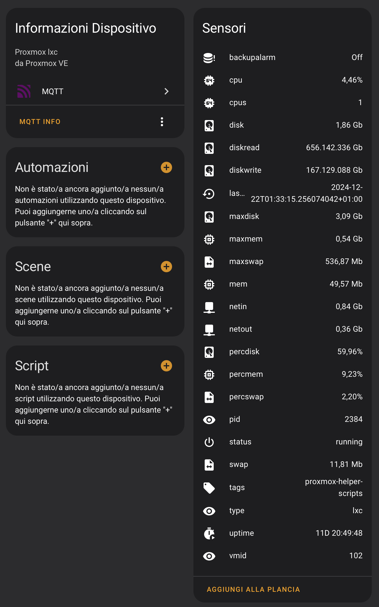
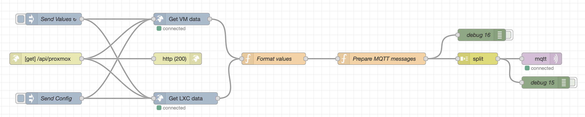
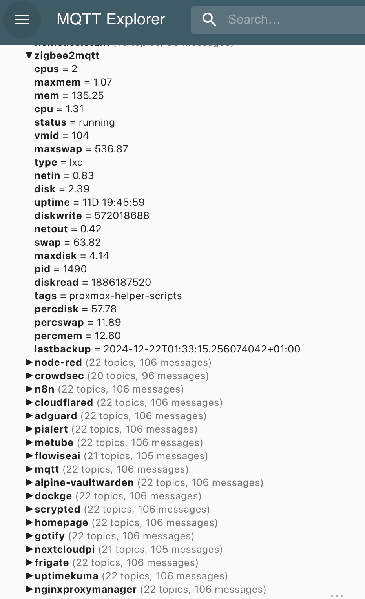
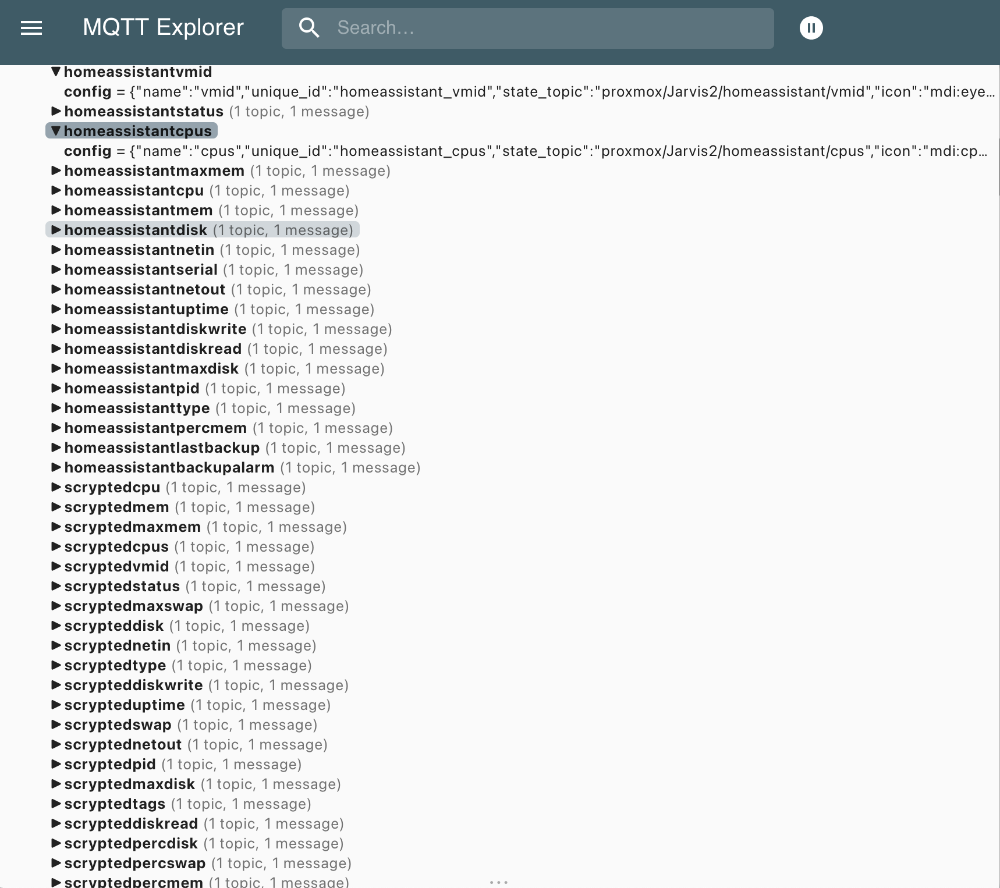
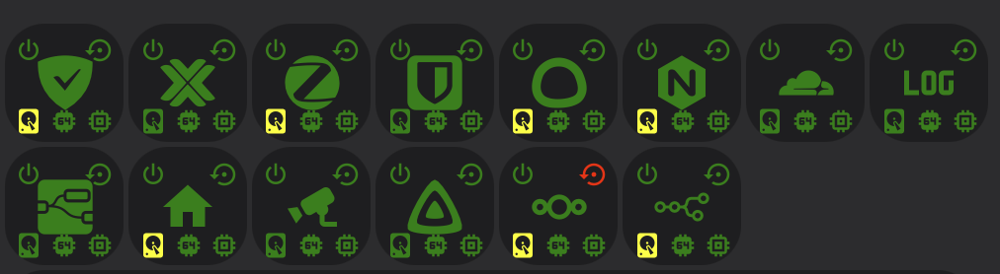
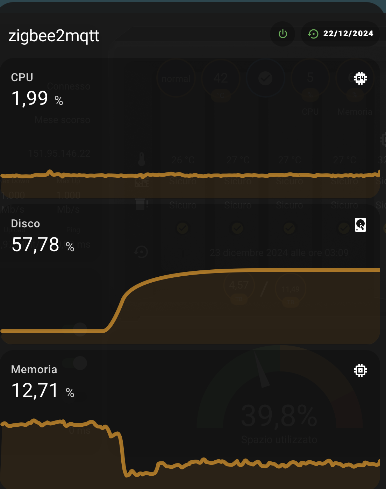

# Proxmox resources monitoring 
## (aka Exposing Proxmox LXC/VM data via MQTT to Home Assistant and others)

<p></p>

It is essential to keep track of and monitor the containers and virtual machines managed by Proxmox. There are several tools that can help achieve this goal, such as **Uptime Kuma**, which provides real-time notifications if any service becomes unreachable, or integrations with **Grafana**, allowing you to always have a comprehensive dashboard displaying all critical parameters. 

In my case, I wasn't interested in continuously monitoring a dashboard. Instead, I focused on receiving notifications or alerts whenever a parameter exceeded the defined thresholds. This approach enables timely analysis and management of issues related to abnormal CPU usage or the saturation of available disk space.

Using Proxmox's APIs, I exposed all the sensors from LXC containers or VMs to **Home Assistant**, where I configured alarms and notifications. Unfortunately, the native Proxmox integration only provides basic information, such as the container/VM state (running, stopped, etc.), which is far from sufficient. 

To simplify the configuration on the Home Assistant side and create an integration that doesn't require constant maintenance whenever new containers are added (as is the case with the official integration), I developed a flow in **Node-RED**. This flow acts as a proxy between Proxmox and Home Assistant by accessing the APIs to retrieve all the necessary values, converting them into a readable format, and exposing them to Home Assistant via MQTT.

Additionally, to avoid manually configuring each sensor in Home Assistant, I leveraged the **MQTT Discovery** feature. This allows the Node-RED flow to dynamically generate the configuration for each sensor, making the setup fully automated and maintenance-free.

Another advantage of using MQTT is that the same pattern can be applied with other Home Automation hubs/controllers such as Homey, Open Hab, Smartthings, and so on.

The notification part is managed by Home Assistant like I do for other notifications and It won't be covered by this note. By the way, It's not mandatory to expose all the sensor to Home Assistant: you can esaily get notified by **Telegram**, **Ntfy** or other notification services directly from Node-RED.


<br/><br/>

# Step 1: Install and configure Node-RED 
Node-RED is a flow-based development tool for wiring together hardware devices, APIs, and online services using a browser-based visual editor. It enables users to create and deploy automation workflows with ease, leveraging a wide range of built-in nodes and community-contributed extensions. It allows users to write complex automation with ease.
As with MQTT, it can be installed in a Proxmox LXC container through a community script, rather than directly in Home Assistant through an addon. For further information pleas refer to [Node-RED official site](https://nodered.org/).

Instead of re-implementing the authentication handling for Proxmox APIs and the token lifecycle management from scratch, we will leverage the additional module [node-red-contrib-proxmox](https://flows.nodered.org/node/node-red-contrib-proxmox), so please install it from the `Manage palette` menu. 

By the way, If you want to explore further how Proxmox API works, please take a look to the official [API documentation](https://pve.proxmox.com/wiki/Proxmox_VE_API#Authentication).

<br/><br/>

# Step 2: Import my Node-RED flow and configure It

<p></p>

Import the flow into Node-RED using the [Proxmox resources monitoring](./Proxmox_resources_monitoring.json) JSON provided.


## **Flow Overview**
1. **Data Injection and Scheduling**:
   - There are two different functionalities managed by the same flow, so two different **inject node** to trigger each functionality:
     - A scheduled `Send Values` node, configured to trigger every 60 seconds (you can modify this schedule following your specific needs), to send the updated value of all the sensors. You can also achieve the same goal on demand by calling the GET API at the endpoint `<nodered_ip>/api/proxmox`
     - A manually triggered `Send Config` node, used one time only to send all the sensor definition to Home Assistant (see Step 3) 

2. **Proxmox API Integration**:
   - There are two **Proxmox API nodes** since there are two different API calls to query information about LXC containers (`nodes/<YourNodeName>/lxc` endpoint) and QEMU virtual machines (`nodes/<YourNodeName>/qemu`). You have to configure it once by setting the Proxmox server and the user/password to be used.

3. **Data Transformation**:
   - The **Format Values** node processes the data payloads from the Proxmox API; It converts raw metrics expressed in bytes, into values in the most suitable unit of measurement for that specific value (e.g., Mb, Gb). If you prefer you can also convert them into human-readable values with units, similar to the Proxmox VE user interface, but this would lose the ability to monitor their trends through Home Assistant's sensor history.
   - It also adds some attributes not provided by the API:
     - `percdisk`, `percmem`, `percswap`: respectively the percentages of disk usage, memory occupancy, and swap file utilization, calculated based on other exposed sensors.
     - `lastbackup`: a marker for the last succesfully backup date; It's is not provided by this trick but from the [Expose the date of Proxmox and Sinology backups in Home Assistant](../Proxmox-Sinology%20backup%20sensor/README.md) one. You can remove it if not interested, but If you want it, you have to define It here even if not provided as sensor value, because this transformation node is also used by the **MQTT Discovery** configuration part.
     - `backupalarm`: related to the previous one: I will explain more about it later.
   - Since the data returned for LXC and VM are different, It defines the output object accordingly 
  
4. **MQTT Messages definition**:
   - The **Prepare MQTT messages** is divided in two parts, depending on which was the trigger of the flow: the `Send Values` node, or the `Send Config` one, which has a specific `topic` (`Config`).
   - For the values, reading all the attributes provided by the previous node, it generates MQTT messages for each attribute of every container or virtual machine, such as:
     - `proxmox/<YourNodeName>/<VM/Container Name>/memory`
     - `proxmox/<YourNodeName>/<VM/Container Name>/disk`
     - `proxmox/<YourNodeName>/<VM/Container Name>/uptime`
    
        (Replace `<YourNodeName>` in the code with the name of the node in your Proxmox VE setup)
   - For the config part, see next step.


5. **Split node** 
   - It divides the array of MQTT messages into individual topic-payload pairs for publishing.


If everything worked, you will find all the sensor published with the topic above:

<p></p>

<br/>

If you don't plan to use all the sensor exposed in **Home Assistant** or if you want to configure them indipendently, you can stop here. If you wnt to try the **MQTT Discovery** feature, instead, move to next step.

<br/><br/>

# Step 3: Configure MQTT Discovery
The **MQTT Discovery** functionality in Home Assistant automates the process of adding devices, sensors, and other entities to your Home Assistant setup using the MQTT protocol, since It allows devices or integrations to communicate their configuration data to Home Assistant using MQTT topics. When enabled, Home Assistant listens for these configuration messages and automatically creates entities based on the received data. This simplifies the configuration of devices and integrations by enabling them to dynamically announce their presence and configuration without requiring manual YAML entries.

## Enabling MQTT Discovery in Home Assistant
To use MQTT Discovery, the MQTT integration in Home Assistant must be set up, and discovery must be enabled. Here’s how to enable it:
   - Go to Settings > Integrations > MQTT.
   - Click on the MQTT integration and ensure the Enable discovery checkbox is checked.
  

## How It Works
1. **Devices Publish Configuration Topics**:
   - Devices or services publish messages to specific MQTT topics in a predefined format.
   - These topics typically follow the structure:  
     `homeassistant/<component>/<object_id>/config`
   - For example:
     - A temperature sensor might publish its configuration to:
       `homeassistant/sensor/temperature_sensor/config`.

2. **Payload Format**:
   - The configuration message (payload) is in JSON format and contains all the metadata required for Home Assistant to create the entity, such as:
     - `name` - The friendly name of the entity.
     - `state_topic` - The MQTT topic where the device publishes its data.
     - `unique_id` - A unique identifier for the entity.
     - `unit_of_measurement` - Units like °C, %, or seconds.
     - `value_template` - A template to process the received payload.
   - Example payload:
     ```json
     {
       "name": "Temperature Sensor",
       "state_topic": "home/livingroom/temperature",
       "unit_of_measurement": "°C",
       "value_template": "{{ value_json.temperature }}",
       "unique_id": "sensor_temp_livingroom"
     }
     ```

3. **Home Assistant Processes the Message**:
   - Once the configuration payload is received, Home Assistant automatically:
     - Adds the entity to the dashboard.
     - Sets up the correct entity type (e.g., sensor, switch, light).
   - Updates are reflected dynamically whenever the device publishes a new configuration payload.

4. **Device Data Updates**:
   - After configuration, the device continues publishing its state updates to the `state_topic` defined in the payload.
   - Home Assistant listens to these state updates and updates the UI accordingly.


## Advantages of MQTT Discovery
- **Automation**: No need for manual YAML configurations for every new device or sensor.
- **Dynamic Updates**: If a device's configuration changes, it can publish an updated payload to reconfigure itself in Home Assistant.
- **Cross-Compatibility**: Works seamlessly with any device or service that supports MQTT.


## MQTT Discovery Node-RED Flow
- Instead of configuring each device independently, I used the same script above to generate a common configuration for all the sensors and devices.
- Each LXC/VM is a **device**, and each property exposed by MQTT is a **sensor**
- Instead of manually customize entities in the Home Assistant UI once discovered, I customized each sensor with unit of measure and custom icon.
- The configuration flow has to be injected once; It's not necessary to schedule it. This because configuration topics are typically retained to ensure new Home Assistant instances can discover devices without requiring the devices to republish their configuration.

In the **MQTT Messages definition** node, if the `msg.topic` is `Config`, ths script:
- Builds a Home Assistant configuration topic for the key.
- Uses attributes to add metadata such as icon, unit_of_measurement, or value_template for specific keys:
- Excludes the `name` property since it's used only for identification
- Creates a structured MQTT payload with configuration details for Home Assistant.
    ```javascript
    {
        topic: `${baseTopic}${obj.name}${key}/config`,
        payload: JSON.stringify({
            name: `${key}`,
            unique_id: `${obj.name}_${key}`,
            state_topic: `proxmox/<YourNodeName>/${obj.name}/${key}`,
            icon: att.icon || "mdi:eye",
            ...(att.unit_of_measurement && { unit_of_measurement: att.unit_of_measurement }),
            ...(att.value_template && { value_template: att.value_template }),
            device: {
                identifiers: [`${obj.name}`],
                name: `${obj.name}`,
                model: `Proxmox ${obj.type}`,
                manufacturer: "Proxmox VE"
            },
        }),
        retain: true
    }
    ```
- At the end iterate over each object in `msg.payload` and maps it to a list of MQTT configuration messages; the `flatMap` ensures that the resulting array is flattened (i.e., not nested).

   - **`baseTopic`**:  
     Defines the root MQTT topic for Home Assistant discovery. Replace `<YourNodeName>` with the real name of your Proxmox VE node.
     Example: `"homeassistant/sensor/<YourNodeName>/"`
   - **`topic`**:  
     The MQTT discovery topic where this configuration will be published, following the format:  
     `homeassistant/sensor/<YourNodeName>/<device_name><attribute>/config`
   - **`payload`**:  
     A JSON string describing the entity for Home Assistant:
     - **`name`**: A user-friendly name, e.g., `CPU`. Starting from mid 2023 Home Assistant concatenates by design the name of the device and the attribute one, so at the end it will appear as `Server1 CPU`
     - **`unique_id`**: A unique identifier for Home Assistant, e.g., `server1_cpu`.
     - **`state_topic`**: The MQTT topic where the device publishes state updates.  
       Example: `proxmox/<YourNodeName>/Server1_cpu`
     - **`icon`**: Specific icon defined for that attributes; if not provided, it will be used the default sensor icon (`mdi:eye`).
     - **`unit_of_measurement`** and **`value_template`**: only if defined in the specific attributes
     - **`device`**: Metadata about the device:
       - Identifiers: A unique identifier for the device (e.g., its name).
       - Name: The device's friendly name.
       - Model: Includes the device type (e.g., "Proxmox LXC").
       - Manufacturer: Hardcoded as "Proxmox VE".
   - **`retain`**: Ensures the message is retained on the MQTT broker.

As said before, instead of using default sensors definition, all with the same specs, values and icons, I customized each one thanks to the `attributes` object, defined by:
- **`icon`**: the specific icon for the sensor
- **`unit_of_measurement`**: used only with percentage sensors or numeric ones that have been formatted in the previous node by converting original byte value in a more readable Mb or Gb value accordingly.
- **`value_template`**: used only by one sensor, `backupalarm` for which no values will be ever sent by this flow (filtered because always null): this because it's a `template sensor` that will provide a dynamic value based on the `lastbackup` sensor. For this reason I had to define the `lastBackupSensorName` by using Home Assistant naming convention: `sensor.<device name>_<sensor name>`. This sensor will be used in Home Assistant lovelace board to change the behaviour of a card that doesn't allow templating.

If everything worked, after triggering the injection node, you will find all the sensor definituon published with the topic above:

<p></p>

and in Home Assistant would appear the device with all it's sensor under **MQTT integration**. 

<p></p>


<br/><br/>

# Step 4: Use the sensors according to your needs
Now you can configure push notifications in **Home Assistant Campanion App**, **Telegram** or whatever you want when a sensor exceeds a certain threshold. For example, I have set up notifications for when the disk reaches 90% usage or the CPU or memory remains above 85% for more than 10 minutes. Additionally, I have configured cards on the Lovelace dashboard to monitor some of the main services, with an icon that changes color based on the value of the relevant sensors. In this case, I wanted to monitor the service's availability (via **Uptime Kuma** service), its status (running/stopped/…), the 'freshness' of the last backup, and the percentages of disk, CPU, and memory usage. Apart from availability, all the parameters were obtained from the sensors just configured.
<p>
</p>
The second image is a popup that appears when clicking on each icon.
<br/><br/>

# Step 5: Enjoy
Even if I'll try to keep all this pages updated, products change over time, technologies evolve... so some use cases may no longer be necessary, some syntax may change, some technologies or products may no longer be available. Remember to make a backup before modifying configuration files and consult the official documentation if any concept is unclear or unfamiliar. <br/>
*Use this guide under your own responsibility.*<br/>

<div class="myWrapper" style="text-align: center;" markdown="1">
If this trick has been helpful, you can  <br/>

<a href="https://www.buymeacoffee.com/moreno.sirri" target="_blank"></a>
</div>

<br/>
<sub>This work and all the contents of this website are licensed under a **Creative Commons Attribution-NonCommercial-ShareAlike 4.0 International License (CC BY-NC-SA 4.0)**.
You can distribute, remix, adapt, and build upon the material in any medium or format, <u>for noncommercial purposes only by giving credit to the creator</u>. Modified or adapted material must be licensed under identical terms.
You can find the full license terms [here](https://creativecommons.org/licenses/by-nc-sa/4.0/?ref=chooser-v1)</sub>
