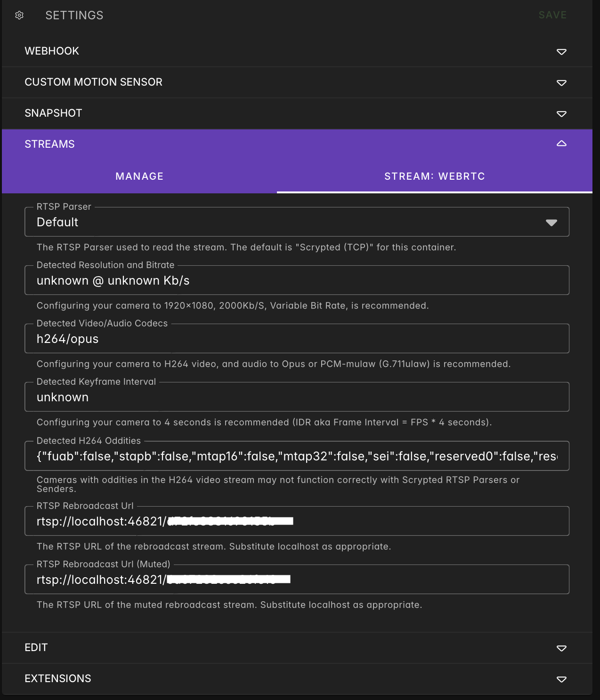

# Connect a Ring Video Doorbell camera in Frigate

The most obvious drawback of battery-powered cameras is the inability to provide constant streaming, which is necessary for NVR systems like Frigate, ZoneMinder, Shinobi, and others. Continuous streaming would inevitably drain the battery in a couple of hours.

In this guide, we will enable on-demand streaming, triggered only by specific events (such as the doorbell ringing, a gate opening, or motion detected by the camera itself). This allows our NVR software to manage recordings just like with other cameras and leverage additional NVR features, such as BirdsEye, the heads-up view provided by Frigate.

With appropriate adjustments, this pattern can also be reused with other cameras, NVR softwares, and Home Automation controllers.


<br/><br/>


# Step 1: Scrypted configuration

## Installation:
Please refer to [Scrypted](https://docs.scrypted.app) official documentation for installing and configuring. I installed it in a Proxmox LCX by using the helper script provided by <a href="https://community-scripts.github.io/ProxmoxVE">Community-Scripts</a>: this is a very useful Community with many script that will help you many times: if you like them, consider donating to support Angie, tteckster's wife - the founder and best supporter of the community - too early passed away.

After the main software you will need to install the following plugins:
- **RING**: configure it with your RING account, choose the cam you want to use (for example `Door cam`) and try that everything works fine. If your need further assistance, please refer to the [plugin docs](https://www.npmjs.com/package/@scrypted/ring). When completed you will be able to see the snapshot and the live stream of your Ring Video Doorbell cam in Scrypted window.
- **WebRTC**: mandatory for retrieve video feeds from WebRTC cameras like RING into Scrypted.
- **Rebroadcast**: we will use later to broadcast a RTSP stream of the cam.
- **Webhook**: we will use it at the end for activating the streaming from remote.

## Prepare the streaming:
Select your `Door cam` and in the **Extensions** tab enable first `WebRTC` then `Rebroadcast` plugins; another tab **Stream** will appear, with the configuration of the `RTSP stream`:
<p></p>

> [!WARNING]  
> Now the cam is streaming, so the battery is draining fast: complete next steps as soon as possibile or temporary disable the Rebroadcast extension.

<br/><br/>

# Step 2: Configure the cam in Frigate
We don't cover Frigate installation and configuration, so please be sure to have it up&running. If you need help, please take a look at [Frigate](https://frigate.video) official documentation.

Take note of the `RTSP Rebroadcast Url` and replace `localhost` with the IP of Scrypted server, then, in Frigate config, add the `Door cam` configuration with both `detect` and `record` roles if you want to setup object detection and feeds saving:

```yaml
 doorcam:
    enabled: True
    ffmpeg:
      inputs:
        - path: rtsp://[RTSP_Rebroadcast_Url]
          roles:
            - detect
            - record
```
When you restart Frigate with the new configuration, you will be able to see and record the doorbell cam.

<br/><br/>

# Step 3: Enable on demand streaming
> [!IMPORTANT]  
> Now that the RTSP stream works, it's time to go back to Scrypted and stop the Rebroadcast extension to preserve battery life.

Scrypted does not natively offer the ability to disable an extension, but in addition to plugins, it provides the option to create virtual entities through scripting. To achieve this, I found the **Extension toggle** script in the [official repo](https://github.com/scryptedapp/scripts.scrypted.app/blob/main/extension-toggle.md).

Create a new script in Scrypted (menu on the left), give it a relevant name like `Door cam Restream switch` and paste the code copied above.
Save and restart Scrypted: I don't know why... I lost a lot of time at this point, but to make the **General** tab appear with the option to specify the device and the extension to enable, a restart is required. Once restarted, set the device to `Door cam` and the extension to `Rebroadcast Plugin`, then save again. 
<p></p>


By turning on the switch, the plugin should appear as enabled on the `Door cam` page, and a live stream should be visible on Frigate. Disabling it, on the other hand, should cause Frigate to display the typical error message: *No frames have been received, check error logs* typical for an offline camera.

Now that we have a switch, let's create a **webhook** for remote activation. In `Door cam Restream switch` page, select **webhook**, set the type to `OnOff` and save. On the log you will find something like:

```
[Webhook Plugin]: ##################################################
[Webhook Plugin]: Local Base URL
[Webhook Plugin]: .      https://[ip_address:port]/endpoint/@scrypted/webhook/public/61/[webhook_id]
[Webhook Plugin]: 
[Webhook Plugin]: Insecure Local Base URL
[Webhook Plugin]: .      http://[ip_address:port]/endpoint/@scrypted/webhook/public/61/[webhook_id]
[Webhook Plugin]: 
[Webhook Plugin]: 
[Webhook Plugin]: Webhook Get States:
[Webhook Plugin]: .     /on
[Webhook Plugin]: 
[Webhook Plugin]: Webhook Invoke Actions:
[Webhook Plugin]: .     /turnOff
[Webhook Plugin]: .     /turnOn
[Webhook Plugin]: Webhook Actions can receive parameters via a JSON array query parameter "parameters".
[Webhook Plugin]: For example:
[Webhook Plugin]: .     curl 'http://<your-host-and-port>/endpoint/@scrypted/webhook/<id>/<token>/setBrightness?parameters=[30]'
[Webhook Plugin]: ##################################################
```

with `[ip_address:port]` the IP of Scrypted host and port (usually `10443` for https and `11080` for http) and `[webhook_id]` an alphanumeric uid specific to that webhook.
In the log, there are also examples of calls: for instance, to turn the switch on or off, you will need to append either `/turnOn` or `/turnOff` to the `local base URL` respectively.

You can implement this API call to Home Assistant, Homey, Node-RED or your favourite Home Automation hub.
Here is a configuration example for home assistant `configuration.yaml`:

```yaml
rest_command:
  doorcam_switch:
    url: "http://192.168.0.23:11080/endpoint/@scrypted/webhook/public/61/e225f1da27df89de/turn{{ states('input_boolean.doorcam_switch').capitalize() }}"

input_boolean:
  doorcam_switch:
  name: "Dooorcam switch"
```

The `[input_boolean.doorcam_switch]` is useful for preserving the state of the switch even after a restart and for use in automations, adding it to a Lovelace dashboard, etc.

Instead of creating two separate rest commands for On and Off, I created only one, templating it based on the value of the input_boolean. 

Try toggling it to verify that everything is working as expected.

<br/><br/>

# Step 4: Configure Scrypted to stream only during motion detection

Now you can create your favorite automations, activating the stream only when certain conditions are met, such as a motion sensor being triggered, a gate opening, or a light turning on. However, we can also take advantage of the motion alarm generated by the camera itself. This has the advantage of not necessarily requiring an additional sensor or external trigger but comes with the drawback of being generated by the official Ring cloud integration in the exact moment of the motion event: the activation may have a delay of a few seconds, plus a few more seconds for the RTSP stream to start and for Frigate to connect. This could result in a partial recording rather than capturing the entire scene. For greater efficiency, I recommend using an external trigger and, to preserve battery life, limiting the recording duration to the event's persistence.

To use the onboard motion detection as a trigger, select **Automations** from the menu on the left and create a new automation named `Enable door cam restream on motion`. Set the following parameters:
- **Trigger:**
    - **Trigger Type:** `Device Event`
    - **Device Event:** `Door cam (MotionSensor)`
    - **Trigger Condition:** `eventData === true`
- **Action:**
    - **Device Type:** `Device Action`
    - **Device:** `Door cam Restream switch (OnOff)`

Turn on the automation, save and create a similar one for disabling it, by setting **Trigger Condition** to `eventData === false`. 

In this way, the stream will be deactivated as soon as the motion event ends. On the Ring app, if you have the option to set a maximum recording duration (available with paid plans), keep it as short as possible to optimize battery life. I use the default 30 seconds provided by the free version.

Now you can test the automation by triggering the motion sensor and waiting a couple of second; since recording is active in Frigate, you will find it under **Recordings** and **Events**.

<br/><br/>

# Step 5: Enjoy
Remember to make a backup before modifying configuration files and consult the official documentation if any concept is unclear or unfamiliar. All changes are made at your own responsibility. If this trick has been helpful, you can [](https://buymeacoffee.com/moreno.sirri)
