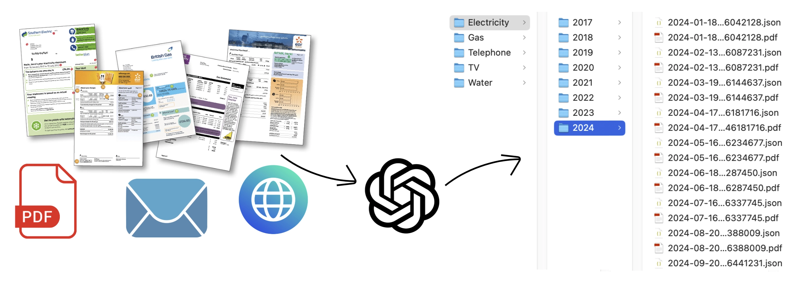
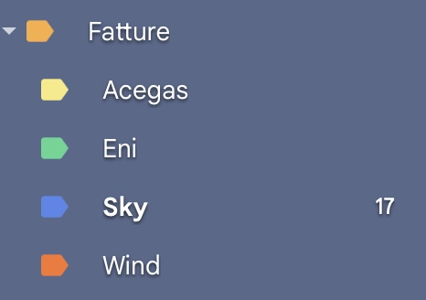
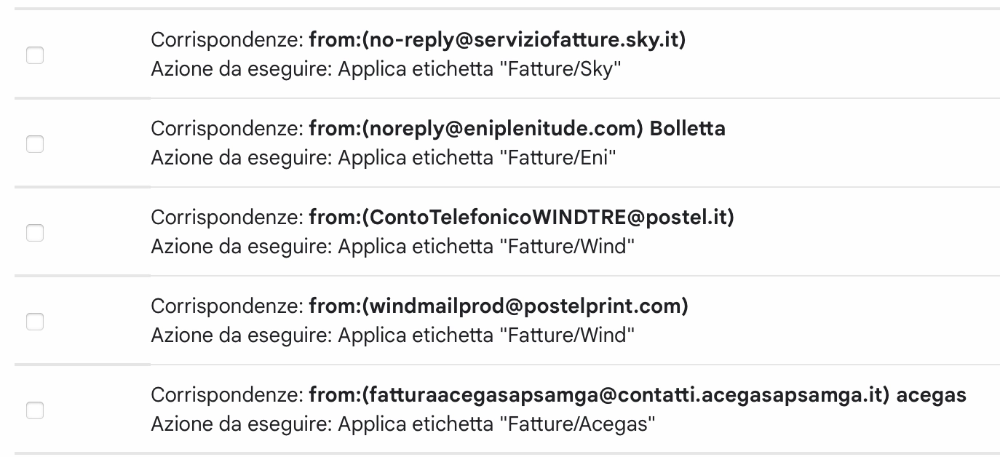
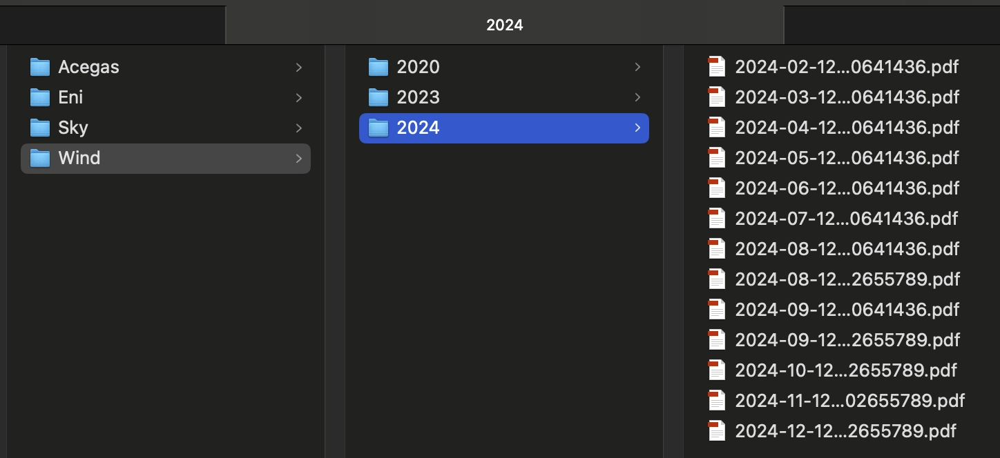
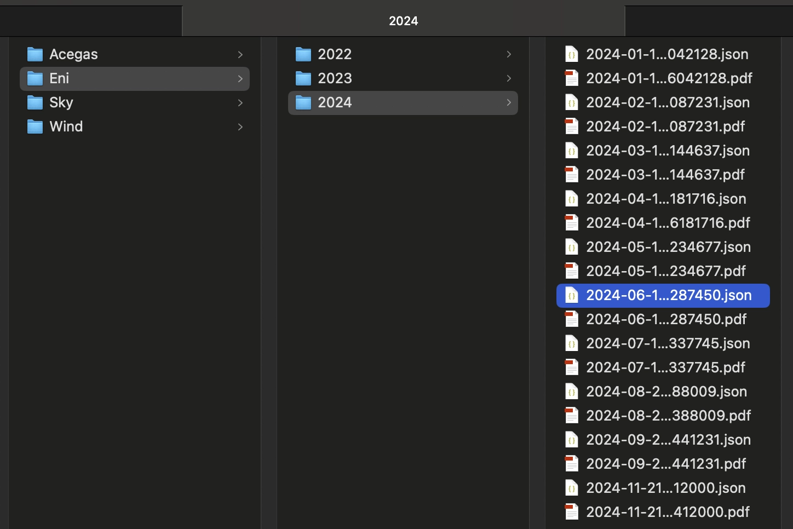

Forget about spending time to save and organize your bills, an AI based workflow will do it for you! This workflow read your bill related email, identify where the PDF bill is stored (it doesn't matter if attached to the email, linked in the email body or in a personal area website), extract main info (like the amount, reference period, etc)  and save the PDF and also structured bill's data in a shared folder.<br/>
It uses `n8n`, `Open AI`, `REST API` and almost no programming.

===

<script src="https://cdn.jsdelivr.net/npm/@webcomponents/webcomponentsjs@2.0.0/webcomponents-loader.js"></script>
<script src="https://www.unpkg.com/lit@2.0.0-rc.2/polyfill-support.js"></script>
<script type="module" src="https://cdn.jsdelivr.net/npm/@n8n_io/n8n-demo-component/n8n-demo.bundled.js"></script>

{assets:inline_css}
n8n-demo {
	--n8n-workflow-min-height: 500px;
}
{/assets}

# AI bill assistant 
### (aka why spend time for downloading and organizing recurring bill when an AI can do It for you?)

I hate recurring manual tasks... I consider them a waste of time, and whenever possible, I try to automate them as much as I can; that way, I can invest that time in something more productive and interesting. One of these tasks is undoubtedly filing the various utility bills each month: I always use direct debit and opt for digital billing, which makes the environment happier by saving paper and saves me from having to manually scan paper documents. The problem is that every month, when I receive the email notification about a new bill, I have to:
- open the email
- find where is the bill, since it depends on the cases:
  - if the bill is attached, it's easy: just save it
  - sometimes there is a link to the bill instead,so in that case, I just need to find it by reading the email and save the PDF
  - other times, however, there is a link to the reserved area, so I have to navigate the site, identify the bill, and save it from there
- in any case, the file then needs to be renamed according to my preferred naming convention (usually using the issue date or reference period to make it more readable than just the document number) and moved to the specific folder on the cloud.

With this trick, I have completely automated the entire process… so I have the emails neatly organized in their folder whenever I need them. Additionally, if necessary, the main information is automatically extracted, allowing it to be saved in an Excel sheet or used in another process/software/tool that requires raw data for monitoring consumption and/or expenses. 


# Step 1: Organize e-mails
This is an optional step but I recommend following it to simplify the process later.
I use Gmail as my main email address, so I simply defined different labels to mark all the bills I want to manage. Below you can find the instructions to configure Gmail as I did but the process may differ for other e-mail providers.

1. **Create a label for each service provider**
You can do it directly from the left-hand sidebar or by the **all settings** menu by clicking the gear icon in the top-right corner of Gmail web interface. If you want to nest this label under an existing one, check the box **"Nest label under"** and choose the parent label.
This is the label structure for my service providers:


2. **Define a filter for each label**:
   - Click on the gear icon in the top-right corner of Gmail and select **"See all settings"**.
   - Go to the **"Filters and Blocked Addresses"** tab.
   - Click **"Create a new filter"**.
   - A dialog box will appear where you can define the criteria for the filter, for example filtering by sender email address or domain, keywords in the subject line, specific words in the email body, and so on...
   - Choose the best filter for your specific needs: it may vary between two different providers, but usually sender and/or subject does the job well.
   - Choose what happens to emails matching the criteria: in this case we want to apply the label just defined
   - Apply the filter also to existing emails, by checking the box **"Also apply filter to matching conversations"**.


3. **Check the filters**
If everything worked, you will find all the emails with invoices under the label corresponding to each supplier. If not, check the filter configuration.  
Make sure the emails to be processed are marked as "unread," as this will be necessary for setting up the next step.

<br/><br/>

# Step 2: Set-Up Open AI API
We will use a **GPT LLM** for parsing e-mails, personal area websites and also PDFs. In this way, we are not tied to the format of the email/website/pdf, and if it changes in the future, we would only need to make minimal adjustments, if any, since the AI will always interpret the text to identify the parts we are interested in, based on our instructions.
I used **Open AI GPT models** but you can choose other AI LLMs: regardless of which LLM you use, to use it from another software, like n8n, it is necessary to use the exposed APIs and to do so, an authorised token must be defined. These are the steps to create it with OpenAI:

### **1. Create an OpenAI Account**
- **Sign Up or Log In**: If you don't already have an OpenAI account, go to [OpenAI's website](https://platform.openai.com/signup) and sign up. If you already have an account, simply log in at [OpenAI Login](https://platform.openai.com/login).

### **2. Access the API Dashboard**
- **Go to the API section**: After logging in, navigate to the OpenAI API dashboard. You can find this by going to [OpenAI Platform Dashboard](https://platform.openai.com/account/api-keys).
   
### **3. Generate an API Key**
- **Create a New API Key**: 
   - Once you're in the API keys section, click on **“Create new secret key”** or **“Create new API key”**.
   - OpenAI will generate a new API key for you. This key is the API token you'll use to authenticate requests to the OpenAI API.
- **Copy the Key**: After the key is generated, **copy it immediately** because it will not be shown again for security reasons.

### **4. Store the API Key Securely**
   - **Secure Storage**: Store the API key in a safe place like in a password manager.

### **5. Monitor Usage and Billing**
1. **Monitor API Usage**: OpenAI provides detailed usage analytics on your dashboard. You can monitor the number of tokens you’ve used and manage your spending.
2. **Manage Quotas**: If needed, you can set limits or alerts for your API usage to avoid unexpected charges.

<br/><br/>

# Step 3: Create the automation flow
For this process, I used **n8n**: n8n is an open-source workflow automation tool that allows you to connect various applications and services to automate repetitive tasks without manual intervention. It provides a visual interface where you can design workflows by linking different nodes that represent actions, triggers, or data processing steps. 

I installed it in a Proxmox LXC by using the helper script provided by <a href="https://community-scripts.github.io/ProxmoxVE">Community-Scripts</a>: this is a very useful Community with many script that will help you many times: if you like them, consider donating to support Angie, tteckster's wife - the founder and best supporter of the community - too early passed away.

I created three different workflows for three different suppliers; each one uses a unique approach and applies different solutions, based on my needs as well as to provide various ideas for study and exploration.  

Of course, your needs might differ, as well as the structure of the emails from your suppliers. However, you can draw inspiration from the three workflows and the solutions implemented to build one that best suits your requirements and adapts to your specific case.

1. **Bill included as an email attachment**: the simpliest case ☺️: the attachment will be renamed and saved to a shared folder. But to make it more interesting, it processes all unread email and extracts and organizes relevant details (e.g., bill number, dates, and phone number) from the attached PDF.
2. **Bill downloadable via a link contained in the email body**: in this case we don't need to retrieve additional information from the PDF. The attachment will be renamed and saved to a shared folder; the difference from the previous case lies in the method of retrieving the PDF, by parsing the email content to extract the link of the PDF. Unlike the other workflows, this one processes just a single email, since the link provided has an expiration date and for older emails it doesn't work.
3. **Bill downloadable via a link from the personal area, which is accessible through a link contained in the email body** : this is the most complete case that groups all the solutions used by the previous ones, including the extraction of key information, which this time will be also saved in a JSON file for further applications. 

<br/>

## **Workflow description: nodes common to each solution**

- **Trigger**
   - In addition to the webhook, there is a scheduled trigger to process new emails and bills automatically on the last days of every month.

- **Fetch Unread Emails**
   - Connects to a Gmail account and retrieves unread emails tagged with the label defined during the first step.
   - Uncheck **Simplify** in order to retrieve all the raw data
   - Uncheck **Downloads attachments**, except the first case when the bill is effectively attached to the email

- **Loop Over Items**
   - Iterates over each email retrieved, processing them individually.
   - At the end give response to webhook with the result of the loop (you can improve this part with a more detailed json output and error management)

- **Convert PDF to JSON**
   - Downloads and parses the PDF content into JSON format.
   - Prepares the extracted text for further analysis, such as date and bill information.

- **Create subfolder**
    - Creates a subfolder on a NAS based on the supplier and emission year (e.g., `/nas/<supplier_name>/2024/`).
    ``` 
    mkdir -p /nas/<supplier_name>/{{ $json.message.content.emission_date.substring(0,4) }}
    ```
    - `<supplier_name>` will change for each case
    - The main path `/nas` is a remote folder previously mounted in the n8n server with one subfolder for each supplier already created

- **Mark Email as Read**
   - At the end it marks the processed email as read to prevent reprocessing in subsequent runs, keeping the workflow efficient.

<br/>

## 1. Bill included as an email attachment

<n8n-demo workflow='%7B%22name%22%3A%22Salva%20bollette%20Wind%22%2C%22nodes%22%3A%5B%7B%22parameters%22%3A%7B%22operation%22%3A%22pdf%22%2C%22binaryPropertyName%22%3A%22attachment_0%22%2C%22options%22%3A%7B%7D%7D%2C%22type%22%3A%22n8n-nodes-base.extractFromFile%22%2C%22typeVersion%22%3A1%2C%22position%22%3A%5B60%2C-720%5D%2C%22id%22%3A%22987605f1-cf07-4a39-b4f0-0edd83447735%22%2C%22name%22%3A%22Convert%20PDF%20to%20JSON%22%7D%2C%7B%22parameters%22%3A%7B%22modelId%22%3A%7B%22__rl%22%3Atrue%2C%22value%22%3A%22gpt-3.5-turbo%22%2C%22mode%22%3A%22list%22%2C%22cachedResultName%22%3A%22GPT-3.5-TURBO%22%7D%2C%22messages%22%3A%7B%22values%22%3A%5B%7B%22content%22%3A%22%3Dextract%20from%20%7B%7B%20%24json.text%20%7D%7D%20the%20telephone%20number%20(tel_num)%2C%20the%20bill%20number%20(bill_number)%2C%20the%20emission%20date%20(emission_date)%20and%20the%20reference%20period%20(start_date%2C%20end_date).%20All%20the%20dates%20in%20ISO%20format%20and%20all%20the%20properties%20must%20be%20at%20root%20level.%22%7D%5D%7D%2C%22jsonOutput%22%3Atrue%2C%22options%22%3A%7B%7D%7D%2C%22type%22%3A%22%40n8n%2Fn8n-nodes-langchain.openAi%22%2C%22typeVersion%22%3A1.7%2C%22position%22%3A%5B400%2C-720%5D%2C%22id%22%3A%22bc6f4c85-6a48-434b-96b3-392f56455dbf%22%2C%22name%22%3A%22Retrieve%20info%22%2C%22credentials%22%3A%7B%22openAiApi%22%3A%7B%22id%22%3A%2269QZlxxBRyU7gp8p%22%2C%22name%22%3A%22OpenAi%20account%22%7D%7D%7D%2C%7B%22parameters%22%3A%7B%22options%22%3A%7B%22reset%22%3Afalse%7D%7D%2C%22type%22%3A%22n8n-nodes-base.splitInBatches%22%2C%22typeVersion%22%3A3%2C%22position%22%3A%5B-240%2C-740%5D%2C%22id%22%3A%22d69835b2-1ee8-49dd-8c58-5cde530135f5%22%2C%22name%22%3A%22Loop%20Over%20Items%22%7D%2C%7B%22parameters%22%3A%7B%22path%22%3A%22a1c9a908-c7b7-4d58-983d-952e8d73ff93%22%2C%22responseMode%22%3A%22responseNode%22%2C%22options%22%3A%7B%7D%7D%2C%22type%22%3A%22n8n-nodes-base.webhook%22%2C%22typeVersion%22%3A2%2C%22position%22%3A%5B-760%2C-640%5D%2C%22id%22%3A%22b9d8d0cf-0d75-40be-b73a-28895ff0ca3d%22%2C%22name%22%3A%22Webhook%22%2C%22webhookId%22%3A%22a1c9a908-c7b7-4d58-983d-952e8d73ff93%22%7D%2C%7B%22parameters%22%3A%7B%22respondWith%22%3A%22allIncomingItems%22%2C%22options%22%3A%7B%7D%7D%2C%22type%22%3A%22n8n-nodes-base.respondToWebhook%22%2C%22typeVersion%22%3A1.1%2C%22position%22%3A%5B60%2C-920%5D%2C%22id%22%3A%22c4a5dbd4-14b1-46b6-ab8e-1e1d0a555632%22%2C%22name%22%3A%22Respond%20to%20Webhook%22%7D%2C%7B%22parameters%22%3A%7B%22mode%22%3A%22combine%22%2C%22combineBy%22%3A%22combineByPosition%22%2C%22options%22%3A%7B%7D%7D%2C%22type%22%3A%22n8n-nodes-base.merge%22%2C%22typeVersion%22%3A3%2C%22position%22%3A%5B60%2C-520%5D%2C%22id%22%3A%221ebfcdd8-0b22-4d43-8972-a5c200765a30%22%2C%22name%22%3A%22Merge%20Info%20with%20PDF%22%7D%2C%7B%22parameters%22%3A%7B%22operation%22%3A%22write%22%2C%22fileName%22%3A%22%3D%2Fnas%2FWind%2F%7B%7B%20%24json.message.content.emission_date.substring(0%2C4)%20%7D%7D%2F%7B%7B%20%24json.message.content.emission_date%20%7D%7D%20-%20%7B%7B%20%24json.message.content.bill_number%20%7D%7D%20-%20%7B%7B%20%24json.message.content.tel_num%20%7D%7D.pdf%22%2C%22dataPropertyName%22%3A%22attachment_0%22%2C%22options%22%3A%7B%22append%22%3Afalse%7D%7D%2C%22type%22%3A%22n8n-nodes-base.readWriteFile%22%2C%22typeVersion%22%3A1%2C%22position%22%3A%5B400%2C-520%5D%2C%22id%22%3A%22f71902b7-4b85-4a3f-a088-b23a07b820a0%22%2C%22name%22%3A%22Save%20PDF%20to%20NAS%20share%22%7D%2C%7B%22parameters%22%3A%7B%22operation%22%3A%22markAsRead%22%2C%22messageId%22%3A%22%3D%7B%7B%20%24(%27Get%20unread%20Wind%20messages%27).item.json.id%20%7D%7D%22%7D%2C%22type%22%3A%22n8n-nodes-base.gmail%22%2C%22typeVersion%22%3A2.1%2C%22position%22%3A%5B820%2C-520%5D%2C%22id%22%3A%225b4f8742-3aea-482b-9243-dae33d57e353%22%2C%22name%22%3A%22Mark%20message%20as%20read%22%2C%22webhookId%22%3A%221e73f766-0637-43cd-ba4e-8cc274043978%22%2C%22credentials%22%3A%7B%22gmailOAuth2%22%3A%7B%22id%22%3A%22SgDgRugl0exb8Xua%22%2C%22name%22%3A%22Gmail%20account%22%7D%7D%7D%2C%7B%22parameters%22%3A%7B%22command%22%3A%22%3Dmkdir%20-p%20%2Fnas%2FWind%2F%7B%7B%20%24json.message.content.emission_date.substring(0%2C4)%20%7D%7D%22%7D%2C%22type%22%3A%22n8n-nodes-base.executeCommand%22%2C%22typeVersion%22%3A1%2C%22position%22%3A%5B820%2C-720%5D%2C%22id%22%3A%2221bb0eeb-553c-495b-b67f-8e3f4af7fc74%22%2C%22name%22%3A%22Execute%20Command%22%2C%22alwaysOutputData%22%3Afalse%7D%2C%7B%22parameters%22%3A%7B%22rule%22%3A%7B%22interval%22%3A%5B%7B%22field%22%3A%22months%22%2C%22triggerAtDayOfMonth%22%3A28%7D%5D%7D%7D%2C%22type%22%3A%22n8n-nodes-base.scheduleTrigger%22%2C%22typeVersion%22%3A1.2%2C%22position%22%3A%5B-760%2C-840%5D%2C%22id%22%3A%224cfd9212-d250-40c3-ac47-ed1b638807fc%22%2C%22name%22%3A%22Schedule%20Trigger%22%7D%2C%7B%22parameters%22%3A%7B%22operation%22%3A%22getAll%22%2C%22limit%22%3A5%2C%22simple%22%3Afalse%2C%22filters%22%3A%7B%22labelIds%22%3A%5B%22Label_1200866408412690646%22%5D%2C%22readStatus%22%3A%22unread%22%7D%2C%22options%22%3A%7B%22downloadAttachments%22%3Atrue%7D%7D%2C%22type%22%3A%22n8n-nodes-base.gmail%22%2C%22typeVersion%22%3A2.1%2C%22position%22%3A%5B-480%2C-740%5D%2C%22id%22%3A%22153e224a-9035-4a27-bc0f-df885107a746%22%2C%22name%22%3A%22Get%20unread%20Wind%20messages%22%2C%22webhookId%22%3A%22a1ffd3ed-3e3b-4c27-b74d-a25fd9eb2f43%22%2C%22credentials%22%3A%7B%22gmailOAuth2%22%3A%7B%22id%22%3A%22SgDgRugl0exb8Xua%22%2C%22name%22%3A%22Gmail%20account%22%7D%7D%7D%5D%2C%22pinData%22%3A%7B%7D%2C%22connections%22%3A%7B%22Convert%20PDF%20to%20JSON%22%3A%7B%22main%22%3A%5B%5B%7B%22node%22%3A%22Retrieve%20info%22%2C%22type%22%3A%22main%22%2C%22index%22%3A0%7D%5D%5D%7D%2C%22Retrieve%20info%22%3A%7B%22main%22%3A%5B%5B%7B%22node%22%3A%22Merge%20Info%20with%20PDF%22%2C%22type%22%3A%22main%22%2C%22index%22%3A0%7D%2C%7B%22node%22%3A%22Execute%20Command%22%2C%22type%22%3A%22main%22%2C%22index%22%3A0%7D%5D%5D%7D%2C%22Loop%20Over%20Items%22%3A%7B%22main%22%3A%5B%5B%7B%22node%22%3A%22Respond%20to%20Webhook%22%2C%22type%22%3A%22main%22%2C%22index%22%3A0%7D%5D%2C%5B%7B%22node%22%3A%22Convert%20PDF%20to%20JSON%22%2C%22type%22%3A%22main%22%2C%22index%22%3A0%7D%2C%7B%22node%22%3A%22Merge%20Info%20with%20PDF%22%2C%22type%22%3A%22main%22%2C%22index%22%3A1%7D%5D%5D%7D%2C%22Webhook%22%3A%7B%22main%22%3A%5B%5B%7B%22node%22%3A%22Get%20unread%20Wind%20messages%22%2C%22type%22%3A%22main%22%2C%22index%22%3A0%7D%5D%5D%7D%2C%22Merge%20Info%20with%20PDF%22%3A%7B%22main%22%3A%5B%5B%7B%22node%22%3A%22Save%20PDF%20to%20NAS%20share%22%2C%22type%22%3A%22main%22%2C%22index%22%3A0%7D%5D%5D%7D%2C%22Save%20PDF%20to%20NAS%20share%22%3A%7B%22main%22%3A%5B%5B%7B%22node%22%3A%22Mark%20message%20as%20read%22%2C%22type%22%3A%22main%22%2C%22index%22%3A0%7D%5D%5D%7D%2C%22Mark%20message%20as%20read%22%3A%7B%22main%22%3A%5B%5B%7B%22node%22%3A%22Loop%20Over%20Items%22%2C%22type%22%3A%22main%22%2C%22index%22%3A0%7D%5D%5D%7D%2C%22Execute%20Command%22%3A%7B%22main%22%3A%5B%5B%5D%5D%7D%2C%22Schedule%20Trigger%22%3A%7B%22main%22%3A%5B%5B%7B%22node%22%3A%22Get%20unread%20Wind%20messages%22%2C%22type%22%3A%22main%22%2C%22index%22%3A0%7D%5D%5D%7D%2C%22Get%20unread%20Wind%20messages%22%3A%7B%22main%22%3A%5B%5B%7B%22node%22%3A%22Loop%20Over%20Items%22%2C%22type%22%3A%22main%22%2C%22index%22%3A0%7D%5D%5D%7D%2C%22Respond%20to%20Webhook%22%3A%7B%22main%22%3A%5B%5B%5D%5D%7D%7D%2C%22active%22%3Atrue%2C%22settings%22%3A%7B%22executionOrder%22%3A%22v1%22%7D%2C%22versionId%22%3A%22ba135daf-282b-4ed5-84a9-00001e18c9b8%22%2C%22meta%22%3A%7B%22instanceId%22%3A%223fcc6eee677c300ba0b5614032a2433e31f2caa880f58e091794890cc36d0481%22%7D%2C%22id%22%3A%22sDIPJBEWLXz6nNbp%22%2C%22tags%22%3A%5B%5D%7D' frame=true></n8n-demo>

<br/>

This is the automation I use with **Wind** mobile and internet provider; the flow:
1. Processes unread emails containing Wind bills.
2. Extracts and organizes relevant details (e.g., bill number, dates, and phone number) from the attached PDF.
3. Saves the processed PDF to a network drive (NAS) with a structured naming convention and directory organization.
4. Marks the email as read to avoid reprocessing.

<br/>

### **Workflow description**
In addition to the common part:

- **Fetch Unread Emails (`Get unread Wind messages`)**
   - Remember to check **Downloads attachments** this time

- **Extract Bill Details (`Retrieve info`)**
   - Uses GPT-3.5 to intelligently extract structured data from unstructured text in the PDF and retrieve key information:
     - Telephone number (`tel_num`).
     - Bill number (`bill_number`).
     - Emission date (`emission_date`).
     - Reference period (`start_date` and `end_date`).
   - Ensures all dates are in ISO format and places all extracted properties at the root level of the JSON.
  
    Here is the prompt I used; I specified the name of the fields and the date format in order to have an output consistent and equal between each run:
    ```
    extract from {{ $json.text }} the telephone number (tel_num), the bill number (bill_number), the emission date (emission_date) and the reference period (start_date, end_date). 
    All the dates in ISO format and all the properties must be at root level.
    ```

- **Organize and Save PDF (`Save PDF to NAS share`)**
   - Saves the PDF with a structured file name, including:
     - Emission date
     - Bill number
     - Telephone number
   - Example file path:
     ```
     /nas/Wind/2023/2023-12-24 - 123456789 - 1234567890.pdf
     ```

<br/>

This is how appears the NAS folder with all the bills extracted and organized by this flow. In my case this is not the target destination but a scheduled task move the bills from the network share to mi iCloud document folder.




<br/>

## 2. Bill downloadable via a link contained in the email body

<n8n-demo workflow='%7B%22name%22%3A%22Salva%20bollette%20Acegas%22%2C%22nodes%22%3A%5B%7B%22parameters%22%3A%7B%22url%22%3A%22%3D%7B%7B%20%24json.choices%5B0%5D.message.content%20%7D%7D%22%2C%22options%22%3A%7B%7D%7D%2C%22type%22%3A%22n8n-nodes-base.httpRequest%22%2C%22typeVersion%22%3A4.2%2C%22position%22%3A%5B-80%2C-800%5D%2C%22id%22%3A%22ad31e53b-fe12-4d90-9f3c-56096e6e3fee%22%2C%22name%22%3A%22Get%20html%20page%22%7D%2C%7B%22parameters%22%3A%7B%22operation%22%3A%22pdf%22%2C%22options%22%3A%7B%7D%7D%2C%22type%22%3A%22n8n-nodes-base.extractFromFile%22%2C%22typeVersion%22%3A1%2C%22position%22%3A%5B120%2C-580%5D%2C%22id%22%3A%2223faa7b2-3379-4c9f-96c9-d728db8df929%22%2C%22name%22%3A%22Convert%20PDF%20to%20JSON%22%7D%2C%7B%22parameters%22%3A%7B%22path%22%3A%22f5764b05-0eed-4e95-99aa-091768c2af68%22%2C%22responseMode%22%3A%22responseNode%22%2C%22options%22%3A%7B%7D%7D%2C%22type%22%3A%22n8n-nodes-base.webhook%22%2C%22typeVersion%22%3A2%2C%22position%22%3A%5B-840%2C-940%5D%2C%22id%22%3A%226bc1b3ab-11f2-4461-89b9-85f1ec197879%22%2C%22name%22%3A%22Webhook%22%2C%22webhookId%22%3A%22f5764b05-0eed-4e95-99aa-091768c2af68%22%7D%2C%7B%22parameters%22%3A%7B%22respondWith%22%3A%22allIncomingItems%22%2C%22options%22%3A%7B%7D%7D%2C%22type%22%3A%22n8n-nodes-base.respondToWebhook%22%2C%22typeVersion%22%3A1.1%2C%22position%22%3A%5B1020%2C-780%5D%2C%22id%22%3A%225fd31c3c-0d4f-4e0a-8d9e-24ba87bd9c3e%22%2C%22name%22%3A%22Respond%20to%20Webhook%22%7D%2C%7B%22parameters%22%3A%7B%22modelId%22%3A%7B%22__rl%22%3Atrue%2C%22value%22%3A%22gpt-3.5-turbo%22%2C%22mode%22%3A%22list%22%2C%22cachedResultName%22%3A%22GPT-3.5-TURBO%22%7D%2C%22messages%22%3A%7B%22values%22%3A%5B%7B%22content%22%3A%22%3Dselect%20the%20%5C%22Visualizza%20il%20documento%5C%22%20link%20in%20%20%7B%7B%20%24json.html%20%7D%7D%20and%20return%20just%20the%20link%20%22%7D%5D%7D%2C%22simplify%22%3Afalse%2C%22options%22%3A%7B%7D%7D%2C%22type%22%3A%22%40n8n%2Fn8n-nodes-langchain.openAi%22%2C%22typeVersion%22%3A1.7%2C%22position%22%3A%5B-420%2C-800%5D%2C%22id%22%3A%22e6de234b-a487-4db3-9f56-41495b49f97a%22%2C%22name%22%3A%22Retrieve%20%27area%20riservata%27%20link%22%2C%22credentials%22%3A%7B%22openAiApi%22%3A%7B%22id%22%3A%2269QZlxxBRyU7gp8p%22%2C%22name%22%3A%22OpenAi%20account%22%7D%7D%7D%2C%7B%22parameters%22%3A%7B%22mode%22%3A%22combine%22%2C%22combineBy%22%3A%22combineByPosition%22%2C%22options%22%3A%7B%7D%7D%2C%22type%22%3A%22n8n-nodes-base.merge%22%2C%22typeVersion%22%3A3%2C%22position%22%3A%5B480%2C-780%5D%2C%22id%22%3A%22bb7fe886-9186-45ce-b24c-45c54a814a08%22%2C%22name%22%3A%22Merge%20Info%20with%20PDF%22%7D%2C%7B%22parameters%22%3A%7B%22operation%22%3A%22write%22%2C%22fileName%22%3A%22%3D%2Fnas%2FAcegas%2F%7B%7B%20%24json.formattedDate.substring(0%2C4)%20%7D%7D%2F%7B%7B%20%24json.formattedDate%20%7D%7D.pdf%22%2C%22options%22%3A%7B%22append%22%3Afalse%7D%7D%2C%22type%22%3A%22n8n-nodes-base.readWriteFile%22%2C%22typeVersion%22%3A1%2C%22position%22%3A%5B660%2C-780%5D%2C%22id%22%3A%22851fe964-c032-4c1a-ae42-2d4efd3fa916%22%2C%22name%22%3A%22Save%20PDF%20to%20NAS%20share%22%7D%2C%7B%22parameters%22%3A%7B%22operation%22%3A%22markAsRead%22%2C%22messageId%22%3A%22%3D%7B%7B%20%24(%27Gmail%27).item.json.id%20%7D%7D%22%7D%2C%22type%22%3A%22n8n-nodes-base.gmail%22%2C%22typeVersion%22%3A2.1%2C%22position%22%3A%5B840%2C-780%5D%2C%22id%22%3A%222fa0ea6f-f28a-47d1-907e-4a753d111b93%22%2C%22name%22%3A%22Mark%20message%20as%20read%22%2C%22webhookId%22%3A%22f8a15ec8-cc6a-4f6a-b117-6f0bad1a964e%22%2C%22credentials%22%3A%7B%22gmailOAuth2%22%3A%7B%22id%22%3A%22SgDgRugl0exb8Xua%22%2C%22name%22%3A%22Gmail%20account%22%7D%7D%7D%2C%7B%22parameters%22%3A%7B%22command%22%3A%22%3Dmkdir%20-p%20%2Fnas%2FAcegas%2F%7B%7B%20%24json.formattedDate.substring(0%2C4)%20%7D%7D%22%7D%2C%22type%22%3A%22n8n-nodes-base.executeCommand%22%2C%22typeVersion%22%3A1%2C%22position%22%3A%5B480%2C-580%5D%2C%22id%22%3A%229234438d-14f0-434d-8250-71c6f9c836bc%22%2C%22name%22%3A%22Execute%20Command%22%2C%22alwaysOutputData%22%3Afalse%7D%2C%7B%22parameters%22%3A%7B%22operation%22%3A%22formatDate%22%2C%22date%22%3A%22%3D%7B%7B%20%24json.info.CreationDate.replace(%5C%22D%3A%5C%22%2C%5C%22%5C%22).substring(0%2C8)%20%7D%7D%22%2C%22format%22%3A%22yyyy-MM-dd%22%2C%22options%22%3A%7B%22fromFormat%22%3A%22yyyyMMdd%22%7D%7D%2C%22type%22%3A%22n8n-nodes-base.dateTime%22%2C%22typeVersion%22%3A2%2C%22position%22%3A%5B300%2C-580%5D%2C%22id%22%3A%225e7299e4-4546-43a7-8b98-3f19c9e04def%22%2C%22name%22%3A%22Date%20%26%20Time%22%7D%2C%7B%22parameters%22%3A%7B%22operation%22%3A%22getAll%22%2C%22limit%22%3A1%2C%22simple%22%3Afalse%2C%22filters%22%3A%7B%22labelIds%22%3A%5B%22Label_7635932101957378498%22%5D%2C%22readStatus%22%3A%22unread%22%7D%2C%22options%22%3A%7B%7D%7D%2C%22type%22%3A%22n8n-nodes-base.gmail%22%2C%22typeVersion%22%3A2.1%2C%22position%22%3A%5B-600%2C-800%5D%2C%22id%22%3A%220391d17e-5bbf-4600-abf2-48595f08d2a5%22%2C%22name%22%3A%22Gmail%22%2C%22webhookId%22%3A%22c55c3f18-55c7-4edc-8236-f349610c6a9b%22%2C%22credentials%22%3A%7B%22gmailOAuth2%22%3A%7B%22id%22%3A%22SgDgRugl0exb8Xua%22%2C%22name%22%3A%22Gmail%20account%22%7D%7D%7D%2C%7B%22parameters%22%3A%7B%22rule%22%3A%7B%22interval%22%3A%5B%7B%22field%22%3A%22months%22%2C%22triggerAtDayOfMonth%22%3A30%7D%5D%7D%7D%2C%22type%22%3A%22n8n-nodes-base.scheduleTrigger%22%2C%22typeVersion%22%3A1.2%2C%22position%22%3A%5B-840%2C-680%5D%2C%22id%22%3A%228c6d8061-cd59-483e-a277-4689fee87e09%22%2C%22name%22%3A%22Schedule%20Trigger%22%7D%5D%2C%22pinData%22%3A%7B%7D%2C%22connections%22%3A%7B%22Get%20html%20page%22%3A%7B%22main%22%3A%5B%5B%7B%22node%22%3A%22Convert%20PDF%20to%20JSON%22%2C%22type%22%3A%22main%22%2C%22index%22%3A0%7D%2C%7B%22node%22%3A%22Merge%20Info%20with%20PDF%22%2C%22type%22%3A%22main%22%2C%22index%22%3A0%7D%5D%5D%7D%2C%22Convert%20PDF%20to%20JSON%22%3A%7B%22main%22%3A%5B%5B%7B%22node%22%3A%22Date%20%26%20Time%22%2C%22type%22%3A%22main%22%2C%22index%22%3A0%7D%5D%5D%7D%2C%22Webhook%22%3A%7B%22main%22%3A%5B%5B%7B%22node%22%3A%22Gmail%22%2C%22type%22%3A%22main%22%2C%22index%22%3A0%7D%5D%5D%7D%2C%22Retrieve%20%27area%20riservata%27%20link%22%3A%7B%22main%22%3A%5B%5B%7B%22node%22%3A%22Get%20html%20page%22%2C%22type%22%3A%22main%22%2C%22index%22%3A0%7D%5D%5D%7D%2C%22Merge%20Info%20with%20PDF%22%3A%7B%22main%22%3A%5B%5B%7B%22node%22%3A%22Save%20PDF%20to%20NAS%20share%22%2C%22type%22%3A%22main%22%2C%22index%22%3A0%7D%5D%5D%7D%2C%22Save%20PDF%20to%20NAS%20share%22%3A%7B%22main%22%3A%5B%5B%7B%22node%22%3A%22Mark%20message%20as%20read%22%2C%22type%22%3A%22main%22%2C%22index%22%3A0%7D%5D%5D%7D%2C%22Mark%20message%20as%20read%22%3A%7B%22main%22%3A%5B%5B%7B%22node%22%3A%22Respond%20to%20Webhook%22%2C%22type%22%3A%22main%22%2C%22index%22%3A0%7D%5D%5D%7D%2C%22Execute%20Command%22%3A%7B%22main%22%3A%5B%5B%5D%5D%7D%2C%22Date%20%26%20Time%22%3A%7B%22main%22%3A%5B%5B%7B%22node%22%3A%22Execute%20Command%22%2C%22type%22%3A%22main%22%2C%22index%22%3A0%7D%2C%7B%22node%22%3A%22Merge%20Info%20with%20PDF%22%2C%22type%22%3A%22main%22%2C%22index%22%3A1%7D%5D%5D%7D%2C%22Gmail%22%3A%7B%22main%22%3A%5B%5B%7B%22node%22%3A%22Retrieve%20%27area%20riservata%27%20link%22%2C%22type%22%3A%22main%22%2C%22index%22%3A0%7D%5D%5D%7D%2C%22Schedule%20Trigger%22%3A%7B%22main%22%3A%5B%5B%7B%22node%22%3A%22Gmail%22%2C%22type%22%3A%22main%22%2C%22index%22%3A0%7D%5D%5D%7D%7D%2C%22active%22%3Atrue%2C%22settings%22%3A%7B%22executionOrder%22%3A%22v1%22%7D%2C%22versionId%22%3A%22bb87a91a-9d1e-4660-9af7-b6abb58b440d%22%2C%22meta%22%3A%7B%22instanceId%22%3A%223fcc6eee677c300ba0b5614032a2433e31f2caa880f58e091794890cc36d0481%22%7D%2C%22id%22%3A%22QhQQLlqFjMphV6cl%22%2C%22tags%22%3A%5B%5D%7D' frame=true></n8n-demo>

<br/>


This is the automation I use with **Acegas**, local water supplier; the flow:
1. Processes last unread emails containing Acegas bills. As I said before, the link to download the bill has an expiration date: it is no longer accessible once the next bill becomes available, so reading the latest one is sufficient.
2. Doesn't extract any data but it still uses AI to intelligently parse email content and locate the precise link for downloading the bill.
3. Saves the processed PDF to a network drive (NAS) with a structured naming convention and directory organization.
4. Marks the email as read to avoid reprocessing.

<br/>

### **Workflow description**
In addition to the common part:

- **Fetch Unread Emails (`Gmail`)**
   - Here the difference is that it limits the retrieval to one email at a time to process each bill individually.
   - You can skip **Downloads attachments** this time

- **Extract 'Area Riservata' Link (`Retrieve 'area riservata' link`)**
   - Uses OpenAI GPT-3.5 to parse the email's HTML content and extract the link labeled "Visualizza il documento."
   - Ensures that only the relevant PDF download link is returned for further processing.

      Here is the prompt I used, really really simple:
    ```
    select the "Visualizza il documento" link in  {{ $json.html }} and return just the link 
    ```

- **Download HTML Page (`Get html page`)**
   - Accesses the extracted link to retrieve the HTML content that contains the PDF document.

-  **Format Date (`Date & Time`)**
   - Extracts the creation date from the JSON content (using metadata like `CreationDate`).
   - Converts the date into a readable format (`yyyy-MM-dd`) for naming and organizing the files.

- **Merge Metadata with PDF (`Merge Info with PDF`)**
   - Combines the processed information (e.g., formatted date) with the PDF file data for structured handling.

- **Save PDF to NAS (`Save PDF to NAS share`)**
   - Renames and saves the PDF file in the created directory.
   - File naming convention includes the formatted date:
     ```
     /nas/Acegas/2023/2023-12-24.pdf
     ```


### **Margin Notes**
Thanks to AI, this automation is truly simple... without it, I would have had to analyze the document model of the email to identify the correct tag with the link... and redo everything if the format, layout, or structure of the email were to change.

<br/>

## **3. Bill downloadable via a link from the personal area, which is accessible through a link contained in the email body**

<n8n-demo workflow='%7B%22name%22%3A%22Salva%20bollette%20ENI%22%2C%22nodes%22%3A%5B%7B%22parameters%22%3A%7B%22url%22%3A%22%3D%7B%7B%20%24json.message.content.link%20%7D%7D%22%2C%22options%22%3A%7B%7D%7D%2C%22type%22%3A%22n8n-nodes-base.httpRequest%22%2C%22typeVersion%22%3A4.2%2C%22position%22%3A%5B340%2C-740%5D%2C%22id%22%3A%22a1390619-85a9-4305-a98e-7ecdc687c8bd%22%2C%22name%22%3A%22Get%20html%20page%22%7D%2C%7B%22parameters%22%3A%7B%22modelId%22%3A%7B%22__rl%22%3Atrue%2C%22value%22%3A%22gpt-4o-mini%22%2C%22mode%22%3A%22list%22%2C%22cachedResultName%22%3A%22GPT-4O-MINI%22%7D%2C%22messages%22%3A%7B%22values%22%3A%5B%7B%22content%22%3A%22%3Dget%20pdf%20link%20from%20%20%7B%7B%20%24json.data%20%7D%7D%22%7D%5D%7D%2C%22jsonOutput%22%3Atrue%2C%22options%22%3A%7B%7D%7D%2C%22type%22%3A%22%40n8n%2Fn8n-nodes-langchain.openAi%22%2C%22typeVersion%22%3A1.7%2C%22position%22%3A%5B540%2C-740%5D%2C%22id%22%3A%22253a982f-a234-4f70-ba26-1be557b3ef98%22%2C%22name%22%3A%22Retrive%20PDF%20link%22%2C%22credentials%22%3A%7B%22openAiApi%22%3A%7B%22id%22%3A%2269QZlxxBRyU7gp8p%22%2C%22name%22%3A%22OpenAi%20account%22%7D%7D%7D%2C%7B%22parameters%22%3A%7B%22url%22%3A%22%3D%7B%7B%20%24json.message.content.pdf_link%20%7D%7D%22%2C%22options%22%3A%7B%7D%7D%2C%22type%22%3A%22n8n-nodes-base.httpRequest%22%2C%22typeVersion%22%3A4.2%2C%22position%22%3A%5B-20%2C-340%5D%2C%22id%22%3A%2239673eca-6b09-4367-8d01-91f143dce116%22%2C%22name%22%3A%22Get%20PDF%20content%22%7D%2C%7B%22parameters%22%3A%7B%22operation%22%3A%22pdf%22%2C%22options%22%3A%7B%7D%7D%2C%22type%22%3A%22n8n-nodes-base.extractFromFile%22%2C%22typeVersion%22%3A1%2C%22position%22%3A%5B240%2C-520%5D%2C%22id%22%3A%222f0afa97-f03a-417b-bff7-c00d1eb57030%22%2C%22name%22%3A%22Convert%20PDF%20to%20JSON%22%7D%2C%7B%22parameters%22%3A%7B%22modelId%22%3A%7B%22__rl%22%3Atrue%2C%22value%22%3A%22gpt-3.5-turbo%22%2C%22mode%22%3A%22list%22%2C%22cachedResultName%22%3A%22GPT-3.5-TURBO%22%7D%2C%22messages%22%3A%7B%22values%22%3A%5B%7B%22content%22%3A%22%3Dextract%20from%20%7B%7B%20%24json.text%20%7D%7D%20the%20total%20amount%20(total_amount)%2C%20the%20reference%20period%20(reference_period.start_date%20and%20reference_period.end_date)%2C%20the%20amount%20of%20the%20%5C%22Conteggio%20luce%5C%22%20(electricity_usage.total_cost%20and%20electricity_usage.consumption)%20and%20%5C%22Conteggio%20gas%5C%22%20(gas_usage.total_cost%20and%20gas_usage.consumption)%2C%20the%20bill%20number%20(bill_number)%20and%20the%20emission%20date%20in%20both%20natural%20(emission_date)%20and%20ISO%20format%20(emission_date_ISO)%20and%20year%20(year).%20all%20the%20properties%20must%20be%20at%20root%20level.%22%7D%5D%7D%2C%22jsonOutput%22%3Atrue%2C%22options%22%3A%7B%7D%7D%2C%22type%22%3A%22%40n8n%2Fn8n-nodes-langchain.openAi%22%2C%22typeVersion%22%3A1.7%2C%22position%22%3A%5B540%2C-520%5D%2C%22id%22%3A%22a0d8ff61-a0e2-4ac0-9af5-b969f1b60f8e%22%2C%22name%22%3A%22Retrieve%20info%22%2C%22credentials%22%3A%7B%22openAiApi%22%3A%7B%22id%22%3A%2269QZlxxBRyU7gp8p%22%2C%22name%22%3A%22OpenAi%20account%22%7D%7D%7D%2C%7B%22parameters%22%3A%7B%22options%22%3A%7B%22reset%22%3Afalse%7D%7D%2C%22type%22%3A%22n8n-nodes-base.splitInBatches%22%2C%22typeVersion%22%3A3%2C%22position%22%3A%5B-280%2C-820%5D%2C%22id%22%3A%22577cea4c-ece3-4eee-8472-4b1637c1b06d%22%2C%22name%22%3A%22Loop%20Over%20Items%22%7D%2C%7B%22parameters%22%3A%7B%22path%22%3A%22ff3e5504-75df-4491-b1e5-764c44e5e7ca%22%2C%22responseMode%22%3A%22responseNode%22%2C%22options%22%3A%7B%7D%7D%2C%22type%22%3A%22n8n-nodes-base.webhook%22%2C%22typeVersion%22%3A2%2C%22position%22%3A%5B-760%2C-720%5D%2C%22id%22%3A%2232f6bfb0-364e-445e-91ba-d8c5398f6706%22%2C%22name%22%3A%22Webhook%22%2C%22webhookId%22%3A%22ff3e5504-75df-4491-b1e5-764c44e5e7ca%22%7D%2C%7B%22parameters%22%3A%7B%22respondWith%22%3A%22allIncomingItems%22%2C%22options%22%3A%7B%7D%7D%2C%22type%22%3A%22n8n-nodes-base.respondToWebhook%22%2C%22typeVersion%22%3A1.1%2C%22position%22%3A%5B-20%2C-900%5D%2C%22id%22%3A%228a5a5807-5b82-430b-9a29-47b2996e81fc%22%2C%22name%22%3A%22Respond%20to%20Webhook%22%7D%2C%7B%22parameters%22%3A%7B%22operation%22%3A%22getAll%22%2C%22limit%22%3A5%2C%22simple%22%3Afalse%2C%22filters%22%3A%7B%22labelIds%22%3A%5B%22Label_8189683671116128181%22%5D%2C%22readStatus%22%3A%22unread%22%7D%2C%22options%22%3A%7B%7D%7D%2C%22type%22%3A%22n8n-nodes-base.gmail%22%2C%22typeVersion%22%3A2.1%2C%22position%22%3A%5B-480%2C-820%5D%2C%22id%22%3A%2222d8b880-d981-40ad-a627-c787c60160f9%22%2C%22name%22%3A%22Get%20unread%20Eni%20messages%22%2C%22webhookId%22%3A%22e8a85da2-9ee2-49db-a56b-194923d35c66%22%2C%22credentials%22%3A%7B%22gmailOAuth2%22%3A%7B%22id%22%3A%22SgDgRugl0exb8Xua%22%2C%22name%22%3A%22Gmail%20account%22%7D%7D%7D%2C%7B%22parameters%22%3A%7B%22modelId%22%3A%7B%22__rl%22%3Atrue%2C%22value%22%3A%22gpt-3.5-turbo%22%2C%22mode%22%3A%22list%22%2C%22cachedResultName%22%3A%22GPT-3.5-TURBO%22%7D%2C%22messages%22%3A%7B%22values%22%3A%5B%7B%22content%22%3A%22%3Dselect%20the%20link%20in%20%20%7B%7B%20%24json.html%20%7D%7D%20that%20starts%20with%20%5C%22https%3A%2F%2Finterattiva.eniplenitude.com%5C%22%22%7D%5D%7D%2C%22jsonOutput%22%3Atrue%2C%22options%22%3A%7B%7D%7D%2C%22type%22%3A%22%40n8n%2Fn8n-nodes-langchain.openAi%22%2C%22typeVersion%22%3A1.7%2C%22position%22%3A%5B-20%2C-740%5D%2C%22id%22%3A%223e44ecb6-9937-4b9f-9893-a896fe43fc9a%22%2C%22name%22%3A%22Retrieve%20%27area%20riservata%27%20link%22%2C%22credentials%22%3A%7B%22openAiApi%22%3A%7B%22id%22%3A%2269QZlxxBRyU7gp8p%22%2C%22name%22%3A%22OpenAi%20account%22%7D%7D%7D%2C%7B%22parameters%22%3A%7B%22mode%22%3A%22combine%22%2C%22combineBy%22%3A%22combineByPosition%22%2C%22options%22%3A%7B%7D%7D%2C%22type%22%3A%22n8n-nodes-base.merge%22%2C%22typeVersion%22%3A3%2C%22position%22%3A%5B240%2C-180%5D%2C%22id%22%3A%22bfc160e8-018b-41cb-aeb7-925334aa6dfc%22%2C%22name%22%3A%22Merge%20Info%20with%20PDF%22%7D%2C%7B%22parameters%22%3A%7B%22operation%22%3A%22write%22%2C%22fileName%22%3A%22%3D%2Fnas%2FEni%2F%7B%7B%20%24(%27Merge%20Info%20with%20PDF%27).item.json.message.content.year%20%7D%7D%2F%7B%7B%20%24(%27Merge%20Info%20with%20PDF%27).item.json.message.content.emission_date_ISO%20%7D%7D%20%7B%7B%20%24(%27Merge%20Info%20with%20PDF%27).item.json.message.content.bill_number%20%7D%7D.pdf%22%2C%22options%22%3A%7B%22append%22%3Afalse%7D%7D%2C%22type%22%3A%22n8n-nodes-base.readWriteFile%22%2C%22typeVersion%22%3A1%2C%22position%22%3A%5B540%2C-80%5D%2C%22id%22%3A%22e8bcdbf3-9c19-4261-bb8b-471786d4ea99%22%2C%22name%22%3A%22Save%20PDF%20to%20NAS%20share%22%7D%2C%7B%22parameters%22%3A%7B%22operation%22%3A%22markAsRead%22%2C%22messageId%22%3A%22%3D%7B%7B%20%24(%27Get%20unread%20Eni%20messages%27).item.json.id%20%7D%7D%22%7D%2C%22type%22%3A%22n8n-nodes-base.gmail%22%2C%22typeVersion%22%3A2.1%2C%22position%22%3A%5B1000%2C-80%5D%2C%22id%22%3A%2287367f5d-0644-4599-a774-77a83ea525da%22%2C%22name%22%3A%22Mark%20message%20as%20read%22%2C%22webhookId%22%3A%229d96bee2-1870-4778-9664-461089afe909%22%2C%22credentials%22%3A%7B%22gmailOAuth2%22%3A%7B%22id%22%3A%22SgDgRugl0exb8Xua%22%2C%22name%22%3A%22Gmail%20account%22%7D%7D%7D%2C%7B%22parameters%22%3A%7B%22rule%22%3A%7B%22interval%22%3A%5B%7B%22field%22%3A%22months%22%2C%22triggerAtDayOfMonth%22%3A29%7D%5D%7D%7D%2C%22type%22%3A%22n8n-nodes-base.scheduleTrigger%22%2C%22typeVersion%22%3A1.2%2C%22position%22%3A%5B-760%2C-920%5D%2C%22id%22%3A%2250e02d37-5f13-4597-bfc5-721d4867a6d8%22%2C%22name%22%3A%22Schedule%20Trigger%22%7D%2C%7B%22parameters%22%3A%7B%22command%22%3A%22%3Dmkdir%20-p%20%2Fnas%2FEni%2F%7B%7B%20%24json.message.content.year%20%7D%7D%22%7D%2C%22type%22%3A%22n8n-nodes-base.executeCommand%22%2C%22typeVersion%22%3A1%2C%22position%22%3A%5B1000%2C-520%5D%2C%22id%22%3A%2274122483-a335-49c3-9c20-a1db33b008d1%22%2C%22name%22%3A%22Create%20subdir%22%2C%22alwaysOutputData%22%3Afalse%7D%2C%7B%22parameters%22%3A%7B%22operation%22%3A%22write%22%2C%22fileName%22%3A%22%3D%2Fnas%2FEni%2F%7B%7B%20%24(%27Retrieve%20info%27).item.json.message.content.year%20%7D%7D%2F%7B%7B%20%24(%27Retrieve%20info%27).item.json.message.content.emission_date_ISO%20%7D%7D%20%7B%7B%20%24(%27Retrieve%20info%27).item.json.message.content.bill_number%20%7D%7D.json%22%2C%22dataPropertyName%22%3A%22%3Ddata%22%2C%22options%22%3A%7B%22append%22%3Afalse%7D%7D%2C%22type%22%3A%22n8n-nodes-base.readWriteFile%22%2C%22typeVersion%22%3A1%2C%22position%22%3A%5B800%2C-280%5D%2C%22id%22%3A%22d845a324-82ba-429c-ab2f-6e064855bee0%22%2C%22name%22%3A%22Save%20JSON%20to%20NAS%20share%22%7D%2C%7B%22parameters%22%3A%7B%22operation%22%3A%22toJson%22%2C%22options%22%3A%7B%22fileName%22%3A%22%3D%7B%7B%20%24(%27Retrieve%20info%27).item.json.message.content.emission_date_ISO%20%7D%7D%7B%7B%20%24(%27Retrieve%20info%27).item.json.message.content.bill_number%20%7D%7D.json%22%7D%7D%2C%22type%22%3A%22n8n-nodes-base.convertToFile%22%2C%22typeVersion%22%3A1.1%2C%22position%22%3A%5B540%2C-280%5D%2C%22id%22%3A%2201224e9f-7dc1-4db8-b657-4928b2a529b4%22%2C%22name%22%3A%22Convert%20JSON%20to%20binary%22%7D%5D%2C%22pinData%22%3A%7B%7D%2C%22connections%22%3A%7B%22Get%20html%20page%22%3A%7B%22main%22%3A%5B%5B%7B%22node%22%3A%22Retrive%20PDF%20link%22%2C%22type%22%3A%22main%22%2C%22index%22%3A0%7D%5D%5D%7D%2C%22Retrive%20PDF%20link%22%3A%7B%22main%22%3A%5B%5B%7B%22node%22%3A%22Get%20PDF%20content%22%2C%22type%22%3A%22main%22%2C%22index%22%3A0%7D%5D%5D%7D%2C%22Get%20PDF%20content%22%3A%7B%22main%22%3A%5B%5B%7B%22node%22%3A%22Convert%20PDF%20to%20JSON%22%2C%22type%22%3A%22main%22%2C%22index%22%3A0%7D%2C%7B%22node%22%3A%22Merge%20Info%20with%20PDF%22%2C%22type%22%3A%22main%22%2C%22index%22%3A1%7D%5D%5D%7D%2C%22Convert%20PDF%20to%20JSON%22%3A%7B%22main%22%3A%5B%5B%7B%22node%22%3A%22Retrieve%20info%22%2C%22type%22%3A%22main%22%2C%22index%22%3A0%7D%5D%5D%7D%2C%22Retrieve%20info%22%3A%7B%22main%22%3A%5B%5B%7B%22node%22%3A%22Create%20subdir%22%2C%22type%22%3A%22main%22%2C%22index%22%3A0%7D%2C%7B%22node%22%3A%22Merge%20Info%20with%20PDF%22%2C%22type%22%3A%22main%22%2C%22index%22%3A0%7D%5D%5D%7D%2C%22Loop%20Over%20Items%22%3A%7B%22main%22%3A%5B%5B%7B%22node%22%3A%22Respond%20to%20Webhook%22%2C%22type%22%3A%22main%22%2C%22index%22%3A0%7D%5D%2C%5B%7B%22node%22%3A%22Retrieve%20%27area%20riservata%27%20link%22%2C%22type%22%3A%22main%22%2C%22index%22%3A0%7D%5D%5D%7D%2C%22Webhook%22%3A%7B%22main%22%3A%5B%5B%7B%22node%22%3A%22Get%20unread%20Eni%20messages%22%2C%22type%22%3A%22main%22%2C%22index%22%3A0%7D%5D%5D%7D%2C%22Get%20unread%20Eni%20messages%22%3A%7B%22main%22%3A%5B%5B%7B%22node%22%3A%22Loop%20Over%20Items%22%2C%22type%22%3A%22main%22%2C%22index%22%3A0%7D%5D%5D%7D%2C%22Retrieve%20%27area%20riservata%27%20link%22%3A%7B%22main%22%3A%5B%5B%7B%22node%22%3A%22Get%20html%20page%22%2C%22type%22%3A%22main%22%2C%22index%22%3A0%7D%5D%5D%7D%2C%22Merge%20Info%20with%20PDF%22%3A%7B%22main%22%3A%5B%5B%7B%22node%22%3A%22Convert%20JSON%20to%20binary%22%2C%22type%22%3A%22main%22%2C%22index%22%3A0%7D%2C%7B%22node%22%3A%22Save%20PDF%20to%20NAS%20share%22%2C%22type%22%3A%22main%22%2C%22index%22%3A0%7D%5D%5D%7D%2C%22Save%20PDF%20to%20NAS%20share%22%3A%7B%22main%22%3A%5B%5B%7B%22node%22%3A%22Mark%20message%20as%20read%22%2C%22type%22%3A%22main%22%2C%22index%22%3A0%7D%5D%5D%7D%2C%22Mark%20message%20as%20read%22%3A%7B%22main%22%3A%5B%5B%7B%22node%22%3A%22Loop%20Over%20Items%22%2C%22type%22%3A%22main%22%2C%22index%22%3A0%7D%5D%5D%7D%2C%22Schedule%20Trigger%22%3A%7B%22main%22%3A%5B%5B%7B%22node%22%3A%22Get%20unread%20Eni%20messages%22%2C%22type%22%3A%22main%22%2C%22index%22%3A0%7D%5D%5D%7D%2C%22Create%20subdir%22%3A%7B%22main%22%3A%5B%5B%5D%5D%7D%2C%22Save%20JSON%20to%20NAS%20share%22%3A%7B%22main%22%3A%5B%5B%7B%22node%22%3A%22Mark%20message%20as%20read%22%2C%22type%22%3A%22main%22%2C%22index%22%3A0%7D%5D%5D%7D%2C%22Convert%20JSON%20to%20binary%22%3A%7B%22main%22%3A%5B%5B%7B%22node%22%3A%22Save%20JSON%20to%20NAS%20share%22%2C%22type%22%3A%22main%22%2C%22index%22%3A0%7D%5D%5D%7D%7D%2C%22active%22%3Atrue%2C%22settings%22%3A%7B%22executionOrder%22%3A%22v1%22%7D%2C%22versionId%22%3A%22e9df9cd5-bc15-4ced-a012-009c0c1daa8d%22%2C%22meta%22%3A%7B%22instanceId%22%3A%223fcc6eee677c300ba0b5614032a2433e31f2caa880f58e091794890cc36d0481%22%7D%2C%22id%22%3A%22oiOcH4TeVyoI3w0m%22%2C%22tags%22%3A%5B%5D%7D' frame=true></n8n-demo>

<br/>


This is the automation I use with **Eni**, a big Italian gas and electricity supplier; the flow:
1. Fetches unread email messages with Eni label.
2. Extracts a PDF link from the email content.
3. Downloads and processes the PDF to extract structured data.
4. Saves the processed PDF to a network drive (NAS) with organized filenames and directories.
5. Marks the processed email as read to avoid reprocessing.

<br/>

### **Workflow description**
In addition to the common part:

- **Extract 'Area Riservata' Link (`Retrieve 'area riservata' link`)**
   - Uses OpenAI's GPT-3.5-Turbo to extract a specific link starting with `https://interattiva.eniplenitude.com` from the email content.

      Like the previous case, the prompt is really relly simple:
    ```
    select the link in  {{ $json.html }} that starts with "https://interattiva.eniplenitude.com" 
    ```

- **Retrieve HTML Page (`Get html page`)**
   - Downloads the HTML page linked in the email.

- **Extract PDF Link (`Retrive PDF link`)**
   - Analyzes the downloaded HTML using OpenAI GPT to locate the specific PDF link for the bill.
   - The prompt is, again, really simple but it uses `GPT-4O-MINI`, since the `3.5-TURBO`, used for all the other AI interactions, is not sufficient to elaborate all the data of the web page. 
    ```
    get pdf link from  {{ $json.data }}
    ```

- **Download and Process PDF (`Get PDF content` & `Convert PDF to JSON`)**
   - Downloads the PDF and converts its content into a JSON format for structured analysis.

- **Extract Detailed Bill Information (`Retrieve info`)**
   - Uses GPT models to parse the PDF content and extract key details:
     - Total amount (`total_amount`).
     - Reference period (`start_date` and `end_date`).
     - Costs and consumption for electricity and gas.
     - Bill number and emission date.
  
    Here is the prompt I used; Like in the first case I specified the name of the fields and the date format in order to have an output consistent and equal between each run. In this case :
    ```
    extract from {{ $json.text }} the total amount (total_amount), 
    the reference period (reference_period.start_date and reference_period.end_date), 
    the amount of the "Conteggio luce" (electricity_usage.total_cost and electricity_usage.consumption) and 
    "Conteggio gas" (gas_usage.total_cost and gas_usage.consumption), 
    the bill number (bill_number) and 
    the emission date in both natural (emission_date) and ISO format (emission_date_ISO) and year (year). 
    All the properties must be at root level.
    ```

-  **Save PDF and JSON to NAS (`Save PDF to NAS share`, `Save JSON to NAS share` and `Convert JSON to binary`)**
   - Organizes PDFs into directories on a NAS device, named by year and bill details, using a dynamic path like:
     ```
     /nas/Eni/{year}/{emission_date_ISO} {bill_number}.pdf
     ```
  - The same naming convention and path is also used for json file with all the structured data. This data can be used in another process/software/tool that requires raw data for monitoring consumption and/or expenses. Since the node require a binary data, a preemptive conversion of the json is needed (`Convert JSON to binary` step).
    Here is an example of the json generated (you can improve it by filtering also the message part):
    ```json
    [{
      "index":0,
      "message":{
        "role":"assistant",
        "content":{
          "total_amount":205.34,
          "reference_period":{
            "start_date":"2024-05-01",
            "end_date":"2024-05-31"
          },
          "electricity_usage":{
            "total_cost":181.49,
            "consumption":194
          },
          "gas_usage":{
            "total_cost":16.85,
            "consumption":6
          },
          "bill_number":"M246287450",
          "emission_date":"18.06.2024",
          "emission_date_ISO":"2024-06-18",
          "year":2024,
          "pdf_link":"https://interattiva.eniplenitude.com/55af7b8a6a5746ebb4da541e51d0e9b2"
        },
      "refusal":null},
      "logprobs":null,
      "finish_reason":"stop"
    }]
    ```

<br/>

This is how appears the NAS folder with all the bills extracted and organized by this flow, with both PDF and JSON files.


<br/><br/>


# Step 4: Think how to use all your saved time
You don't have to worry about bills anymore... forgot them! Your bank takes care of the payments, while AI saves your invoices, organizes them for you, and extracts the key information.
You have plenty of extra time to focus on what matters most or brings you satisfaction.

<br/><br/>

# Step 5: Possible additional extensions:  
1) Disable email notifications and instead configure a notification to receive structured data with amounts, consumption, and other relevant details.  
2) Leverage AI to extract additional important information from the bill, such as contract changes, price increases, or other details, and include them in the notifications."

<br/><br/>

# Step 6: Enjoy
Even if I'll try to keep all this pages updated, products change over time, technologies evolve... so some use cases may no longer be necessary, some syntax may change, some technologies or products may no longer be available. Remember to make a backup before modifying configuration files and consult the official documentation if any concept is unclear or unfamiliar. <br/>
*Use this guide under your own responsibility.*<br/>

<div class="myWrapper" style="text-align: center;" markdown="1">
If this trick has been helpful, you can  <br/>

<a href="https://www.buymeacoffee.com/moreno.sirri" target="_blank"></a>
</div>

<br/>
<sub>This work and all the contents of this website are licensed under a **Creative Commons Attribution-NonCommercial-ShareAlike 4.0 International License (CC BY-NC-SA 4.0)**.
You can distribute, remix, adapt, and build upon the material in any medium or format, <u>for noncommercial purposes only by giving credit to the creator</u>. Modified or adapted material must be licensed under identical terms.
You can find the full license terms [here](https://creativecommons.org/licenses/by-nc-sa/4.0/?ref=chooser-v1)</sub>