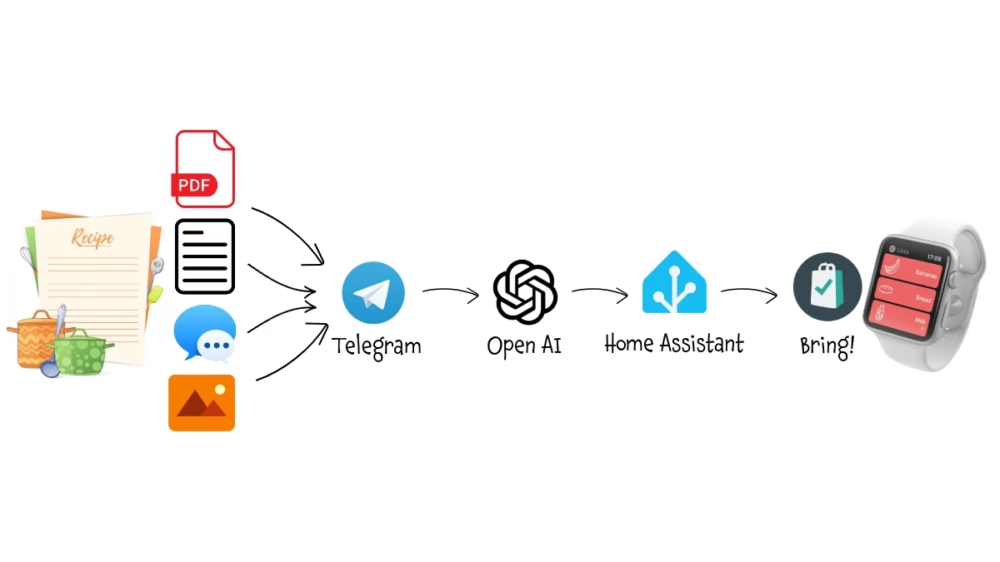
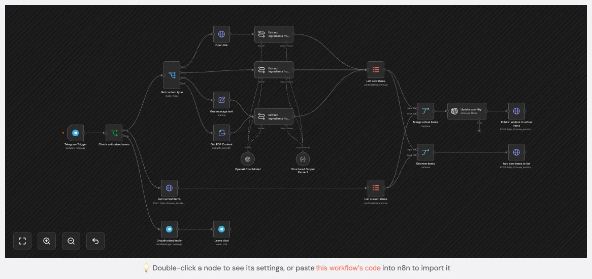

# AI Shopping Assistant

[](https://smarthometricks.sirri.it/use_cases/ai-shopping-assistant/)

With this trick, whenever you find a recipe you like on a website, a PDF, an image on Instagram, or even in a message from a friend, all you need to do is share the content on Telegram. An AI-based bot will analyze the recipe, identify the ingredients, add them to your shopping list—preserving the quantities of those already on the list—and make them easily accessible on your smartphone or smartwatch for your next trip to the supermarket.

<sub>***Date*:** *06/01/2025*<br/>***Tag:*** *Open AI, n8n, REST API, Telegram Bot, Home Assistant, Bring!*</sub>

---



Okay, I have to admit it, this trick was my wife's idea 😊

We use **[Bring!](https://www.getbring.com/en/home)** as our shared shopping list app. Thanks to the **Apple Watch** app, when we're at the supermarket, we can simply glance at our wrist to see the items on the list, and a single tap removes items we've added to the cart. To add items to the list, besides using the app on our smartphones, we use a voice assistant when we're at home. It's much more immediate since we can activate it the moment we realize we need something.

Unfortunately, for the past few months, **Amazon Echo** has no longer allowed the use of third-party apps to manage lists. So instead of saying, "Alexa, add tomatoes to the shopping list," we now say, "Alexa, open Bring and add tomatoes" (saying "to the shopping list" is redundant here because we only have one list). It's a minor inconvenience, but manageable.

Every now and then, we share recipes we find online, in our cooking robot's app, or on Instagram. But we almost always forget to save the ingredients and add them to the shopping list. Even if we do remember, it’s a tedious and repetitive task—manually adding each ingredient along with its quantity. So, we thought: why not let AI handle it?

## Process Description
- Whenever we come across a recipe — whether it's a link to a website, a screenshot from a video, a PDF document or a message from friends — we share it on our dedicated **Telegram channel**.
- A bot analyzes the shared content and, using AI, extracts the ingredients from the recipe. It then checks which items are already on the list to update their quantities and adds any new items.
- The Bring! app on our smartphones or Apple Watch is automatically synced with the updated or newly added items.


# Step 1: Create Telegram Bot
I chose **Telegram** for two reasons:
- One of my wife’s prerequisites was "no new apps" (we’re technologically complementary 😅)
- Telegram is easy to use for sharing from different apps and allows you to delete anything that’s no longer needed.


If you don't already have a Telegram bot, read the accordion below.

<details>
<summary>Set up the Telegram bot</summary>

Creating a **Telegram Bot** is really simple:

- Open a chat with the user **@BotFather** and type `/newbot`
- Follow the instructions: you will be asked to define a **Bot name** and a **username**
- At the end, BotFather will show you the **HTTP API Token** (`[Telegram_Token]`): save it securely, we'll use it later.

</details>


# Step 2: Configure Home Assistant

## Introduction
kay, I have to admit, I left out a small detail—sorry about that! I didn't directly use Bring's official APIs. In fact, I couldn't find any mention in the official documentation of interacting with a specific shopping list to add, modify, or remove items. The only supported functionality seems to be submitting a recipe and letting Bring's scraper extract the ingredients. However, the recipe must be in a specific format, likely because Bring doesn't use AI for scraping, as I did, but instead relies on an algorithm based on a well-defined data structure.

That said, there is a way to interact with Bring using unofficial APIs. In my case, I didn’t spend time researching this further since I had already integrated Bring! into  **Home Assistant**, which made it easy to use HA as a "proxy."

You're not obligated to use Home Assistant: if you can find the documentation for the unofficial APIs (I found sometrhing on GitHub but don't post the link since it may chance), you just need to modify the steps in the following workflow, replacing the Home Assistant REST APIs with Bring's APIs.

Moreover, my ultimate goal is to replace Amazon Echo as a voice assistant with one (ideally local) powered by AI. In such a scenario, this assistant would interact directly with the **To Do List** in Home Assistant.


## Integrate Bring into Home Assistant
The setup is very straightforward thanks to the [Official Bring! Integration](https://www.home-assistant.io/integrations/bring). Once configured by logging into Bring! with your account, the lists you’ve set up in Bring! will appear as **To Do List**  in Home Assistant. For instance, in my case, `todo.spesa`.

Now, any changes to the `todo.spesa` list will immediately sync with the Bring! app and vice versa.

I'm not showing you how to set up Bring on Amazon Echo or Google Home because — even if it's useful for everyday use — it's not a fundamental prerequisite for this process.

## Configure Home Assistant API
Very simple: open your `configuration.yaml` and add the line:
``` yaml
api:
```
Now you can access to Home Assistant RESTful API calling whe address `http[s]://[Home_Assistant_IP]:[port]/api/`.
Remember to set the `http` or `https` procotol accordingly to your setup, and the correct IP and port.

## Obtain a Long-Lived Access Token
Log into the frontend using a web browser, go to your profile and under "Security" menu you wull be able to list, create and revoke all the Long-Lived Token associated with your account.


# Step 3: Install and configure n8n
As with other complex automations you will find on this site, I used **n8n**. If you don't already have n8n installed, read the accordion below.

<details>
<summary>Set up n8n</summary>

**n8n** is an open-source workflow automation tool that allows you to connect various applications and services to automate repetitive tasks without manual intervention. It provides a visual interface where you can design workflows by linking different nodes that represent actions, triggers, or data processing steps. 

I installed it in a Proxmox LXC by using the helper script provided by [Community-Scripts](https://community-scripts.github.io/ProxmoxVE): this is a very useful Community with many script that will help you many times: if you like them, consider donating to support Angie, tteckster's wife - the founder and best supporter of the community - too early passed away.

</details>


# Step 4: Set up the OpenAI API

The workflow uses a **GPT LLM** to understand the items you're adding to the shopping list. If you don't already have an OpenAI API key, read the accordion below.

<details>
<summary>Set up the OpenAI API</summary>

We will use a **GPT LLM** to process unstructured data. You can choose other AI LLMs, but regardless of which one you use, to call it from another piece of software (like n8n) you need an authorised API key. Here are the steps to create one with OpenAI:

### 1. Create an OpenAI Account
- **Sign Up or Log In**: If you don't already have an OpenAI account, go to [OpenAI's website](https://platform.openai.com/signup) and sign up. If you already have an account, simply log in at [OpenAI Login](https://platform.openai.com/login).

### 2. Access the API Dashboard
- **Go to the API section**: After logging in, navigate to the OpenAI API dashboard. You can find this by going to [OpenAI Platform Dashboard](https://platform.openai.com/account/api-keys).

### 3. Generate an API Key
- **Create a New API Key**:
   - Once you're in the API keys section, click on **"Create new secret key"** or **"Create new API key"**.
   - OpenAI will generate a new API key for you. This key is the API token you'll use to authenticate requests to the OpenAI API.
- **Copy the Key**: After the key is generated, **copy it immediately** because it will not be shown again for security reasons.

### 4. Store the API Key Securely
- **Secure Storage**: Store the API key in a safe place, like a password manager.

### 5. Monitor Usage and Billing
1. **Monitor API Usage**: OpenAI provides detailed usage analytics on your dashboard. You can monitor the number of tokens you've used and manage your spending.
2. **Manage Quotas**: If needed, you can set limits or alerts for your API usage to avoid unexpected charges.

</details>


# Step 5: Create the automation flow

This **n8n workflow** integrates a Telegram bot with Home Assistant and uses AI for natural language processing to manage a shopping list. Here's an overview:



> **n8n Workflow: ai-shopping-assistant**
>
> [Download workflow JSON](./ai-shopping-assistant-n8n-1.json) and import it into your n8n instance.


### **Workflow Description**

1. **Trigger**:
- A **Telegram Trigger** monitors all the interactions with the bot.
- Configure it using the `[Telegram_Token]` retrieved at Step 1.
- With this trigger you cannot debug the workflow while active, so you need to temporary deactivate it in you want to manually use the **Test Workflow** or **Test Node** button.

2. **Authorization Check**:
- Verifies that the user is authorized to interact with the bot, since Telegram bot created with BotFather are public
- I checked both the ID of the Telegram group used by my wife and me and also mi user ID, if I want to chat directly with the bot for debugging purposes. You can retrieve the ID's by debugging the node with a simple test call

3. **Unauthorized reply**, **Leave chat**:
- Non authorized users/groups receive a *"You're not authorized to use this bot"* message.
- If the bot was added in a group, automatically leaves it.
- If you don't uncheck **Append n8n Attribution**, it will append the phrase *"This message was sent automatically with n8n”* to the end of the message
  
4. **Get Content Type**:
- Depending on the content type (text, link, image, PDF), routes the input for further processing

5. **Content Normalization**:
- **Text:** Transform the output structure in order to reuse tha same node as PDF (**Get message text**).
- **Link:** Opens the URL (**Open link**).
- **Image:** No conversion needed.
- **PDF:** Get PDF content in a JSON format.

6. **Content processing**:
- Three **Basic LLM Chain** nodes process the message content.
- LLM Chain nodes that process **Link** and **Image** uses a simple prompt: `Extract the ingredients of the recipe end return them in a json`
- For the **Text**, I had to provide some additional information; otherwise, the AI might have processed the content differently. Specifically, I told it to treat as ingredients any words that could directly represent one (otherwise, instead of "chips," it might have returned the recipe for French fries) and to omit the quantity if not specified (to avoid ending up with "n/a"). Here is the prompt used:
`Extract the ingredients of the recipe end return them in a json; if it doesn't look like a recepite but a single ingredient, treat is as an such; if no quantity is specified, omit it`
- Each node shares the same **OpenAI Chat Model** (**GPT-4O-MINI**) and the same **Structured Output Parser**, in order to return data always with the same structure, which is so defined:
  
```json
{
  "type": "array",
  "items": {
    "type": "object",
    "properties": {
      "ingredient": { "type": "string" },
      "quantity": { "type": "string" }
    }
  }
}
```

7. **Get current items**
- Fetches items from Home Assistant's shopping list (`todo.spesa`) via API, by calling the `https://[Home_Assistant_IP]:[port]/api/services/todo/get_items?return_response=true`
- `return_response=true` is mandatory in order to receive the structured output
- Replace the `[Home_Assistant_IP]`, `[port]` and adjust protocol (`http`/`https`) accordingly
- Create a new **Header Auth** account by using the `Long-Lived Token` created at Step 2.
- Toggle **Send Headers** and add the Header parameter `content-type`=`application/json`
- Toggle **Send Body** and specify a `JSON` Body like this, replacing `todo.spesa` with the name of your ToDo list.
```json
{ 
  "entity_id": "todo.spesa",
  "status": "needs_action"
}
```
- `"status": "needs_action"` tells the API to skip the completed items and return only the active ones.

8. **List new items**, **List current items**
- Converts both newly parsed items and existing items from the shopping list into individual entries for comparison

9. **Data Comparison**
- **Get new items** keeps only the non-matched items from the previous lists: these are the ingredients to add to our shopping list
- **Merge actual items** keeps matched items: these are the ingredients already present in list, but me may need to update quantity

10. **Add new items to list**
- Calls the `https://[Home_Assistant_IP]:[port]/api/services/todo/add_item` for each element of the **Get new items** list
- Replace the `[Home_Assistant_IP]`, `[port]` and adjust protocol (`http`/`https`) accordingly
- Use the same **Authorization header**, **Headers Parameters** and **Body Content Type** as before
- Use a JSON like this for the body, replacing `todo.spesa` with the name of your ToDo list.
```json
{ 
  "entity_id": "todo.spesa",
  "item": "{{ $json.ingredient }}",
  "description": "{{ $json.quantity }}"
}
```

11. **Update quantity**
- Since I don’t know how the quantity is specified (formatting, units of measurement, ...) either in the item already on the list or in the one obtained from the recipe, I let the AI interpret the data, normalize it, add the new quantity accordingly and return in a structured format.
- This is the prompt I use with **GPT-3.5-TURBO** model:
`find if there are some quantity in the text "{{ $json.quantity }}" and "{{ $json.description }}" and in case sum them in the field NewDescription"; return a json object with "Ingredient" = " {{ $json.ingredient }} and  "NewDescription"`

12. **Publish update to actual items**
- Calls the `https://[Home_Assistant_IP]:[port]/api/services/todo/update_item` for each element of the **Merge actual items** list
- Replace the `[Home_Assistant_IP]`, `[port]` and adjust protocol (`http`/`https`) accordingly
- Use the same **Authorization header**, **Headers Parameters** and **Body Content Type** as before
- Use a JSON like this for the body, replacing `todo.spesa` with the name of your ToDo list.
```json
{ 
  "entity_id": "todo.spesa",
  "item": "{{ $json.message.content.Ingredient }}",
  "description": "{{ $json.message.content.NewDescription }}"
}
```


# Step 6: Chat with your bot
You can directly open a Telegram chat with your bot or add it in a group and promote it to **Administrator**. In this case remember to update the `Group ID` in the **Check authorized users** node in the workflow.


# Step 7: Enjoy
If this trick has been useful to you, keep scrolling down and consider supporting me by clicking that beautiful blue button! 😅

---

Even if I'll try to keep all this pages updated, products change over time, technologies evolve... so some use cases may no longer be necessary, some syntax may change, some technologies or products may no longer be available.

Remember to make a backup before modifying configuration files and consult the official documentation if any concept is unclear or unfamiliar.

*Use this guide under your own responsibility.*

If this pages have been helpful, you can

<a href="https://www.buymeacoffee.com/moreno.sirri" target="_blank"></a>

<sub>This work and all the contents of this website are licensed under a **Creative Commons Attribution-NonCommercial-ShareAlike 4.0 International License (CC BY-NC-SA 4.0)**.
You can distribute, remix, adapt, and build upon the material in any medium or format, <u>for noncommercial purposes only by giving credit to the creator</u>. Modified or adapted material must be licensed under identical terms.
You can find the full license terms [here](https://creativecommons.org/licenses/by-nc-sa/4.0/?ref=chooser-v1)</sub>
