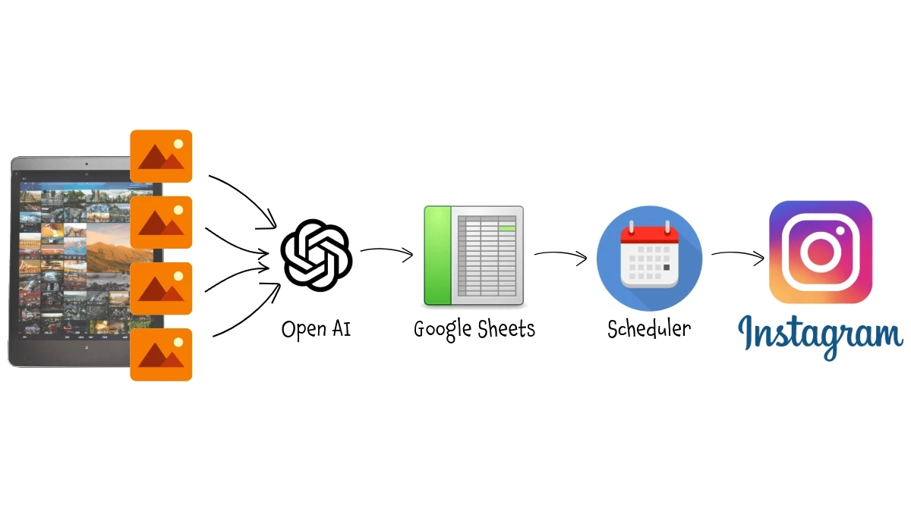
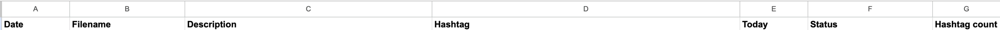
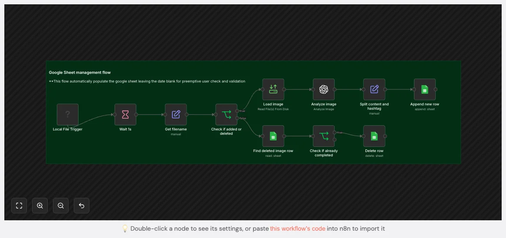
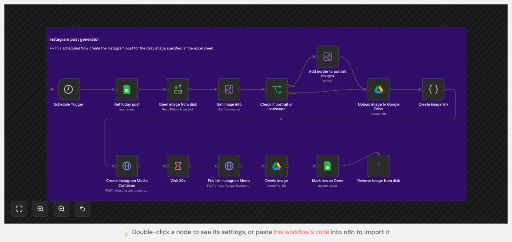

# Automatic Instagram Posting

### (aka: don't have time to manage your social accounts? Let the AI do it for you!)

[](https://smarthometricks.sirri.it/use_cases/automatic-instagram-poster/)

Forget about spending time to manage your IG account (or Facebook page, Linkedin, ...): an AI based workflow will do it for you! This workflow takes the images you’ve edited and prepared for posting on Instagram, analyzes them, suggests the most suitable description and hashtags based on the content of each photo, and posts them on your behalf. You have just to review the description and define the day you want to have each one published.

<sub>***Date*:** *03/01/2025*<br/>***Tag:*** *Open AI, n8n, Facebook REST API, Instagram, Facebook App, Google Drive, Javascript*</sub>

---



Okay, this isn't exactly a topic related to home automation or home management... but it uses some of the technologies and products we've already seen for a different purpose and that's still related to how technology can simplify our daily lives and save us precious time. So, if you also have this need, here's an idea to save a good chunk of time that you can reinvest in other activities while simultaneously maintaining your presence on social media. 

Personally, I have no interest or aspiration to create viral content or to climb the ranks of Facebook, Instagram, TikTok, or other algorithmic platforms through constant posting. However, I do enjoy sharing my photos with friends and those who appreciate my way of seeing the world through the lens of a camera. The problem is: I have very little time to do it... and definitely not the consistency to post daily or at regular intervals. 

With this trick, **you can prepare more than 30 days' worth of content** - or even more - **in just a couple of minutes**, and let this automation handle the rest for you. In this example, I’ll use Instagram, but the same approach works for Facebook, LinkedIn, Slack, and many other social media or sharing tools, making the process easily adaptable to other use cases. 

Let’s see how!


## How It Works:  
- Edit, prepare and select the photos as usual and copy them into a predefined folder.  
- Automatically, a process processes the images and thanks to AI populates a spreadsheet with the suggested content for the post (caption, hashtags).  
- Access this spreadsheet to review the content, make any necessary edits to the description, hashtags, etc., and choose a publication date.  
- On the designated day, a second process automatically posts the photo with the defined description and updates the spreadsheet to mark that task completed.  


# Step 1: Install and configure n8n
For this process, again, I used **n8n**. If you don't already have n8n installed, read the accordion below.

<details>
<summary>Set up n8n</summary>

**n8n** is an open-source workflow automation tool that allows you to connect various applications and services to automate repetitive tasks without manual intervention. It provides a visual interface where you can design workflows by linking different nodes that represent actions, triggers, or data processing steps. 

I installed it in a Proxmox LXC by using the helper script provided by [Community-Scripts](https://community-scripts.github.io/ProxmoxVE): this is a very useful Community with many script that will help you many times: if you like them, consider donating to support Angie, tteckster's wife - the founder and best supporter of the community - too early passed away.

</details>


The installation and configuration are very simple; once completed, I mounted a network share from the NAS on the local path `/nas/Instagram`, which I will use as an exchange directory.


# Step 2: Set up the OpenAI API

The post preparation workflow uses a **GPT LLM** to turn your photos into captions and hashtags. If you don't already have an OpenAI API key, read the accordion below.

<details>
<summary>Set up the OpenAI API</summary>

We will use a **GPT LLM** to process unstructured data. You can choose other AI LLMs, but regardless of which one you use, to call it from another piece of software (like n8n) you need an authorised API key. Here are the steps to create one with OpenAI:

### 1. Create an OpenAI Account
- **Sign Up or Log In**: If you don't already have an OpenAI account, go to [OpenAI's website](https://platform.openai.com/signup) and sign up. If you already have an account, simply log in at [OpenAI Login](https://platform.openai.com/login).

### 2. Access the API Dashboard
- **Go to the API section**: After logging in, navigate to the OpenAI API dashboard. You can find this by going to [OpenAI Platform Dashboard](https://platform.openai.com/account/api-keys).

### 3. Generate an API Key
- **Create a New API Key**:
   - Once you're in the API keys section, click on **"Create new secret key"** or **"Create new API key"**.
   - OpenAI will generate a new API key for you. This key is the API token you'll use to authenticate requests to the OpenAI API.
- **Copy the Key**: After the key is generated, **copy it immediately** because it will not be shown again for security reasons.

### 4. Store the API Key Securely
- **Secure Storage**: Store the API key in a safe place, like a password manager.

### 5. Monitor Usage and Billing
1. **Monitor API Usage**: OpenAI provides detailed usage analytics on your dashboard. You can monitor the number of tokens you've used and manage your spending.
2. **Manage Quotas**: If needed, you can set limits or alerts for your API usage to avoid unexpected charges.

</details>


# Step 3: Prepare a support spreadsheet
I used a **Google Sheets** file to support the process. This allows me to easily access the content for review before it gets published.

The file, which I named `Instagram posts`, has the following structure:



## Description:
- **Date** : the planned date for that post; column type: `DateTime`, format: `dd/MM/yyyy`. You can set the format you prefer but you have to check the following part accordingly.
- **Filename**, **Description**, **Hashtag** : self-explanatory
- **Today**: I faced issues filtering by the Date field using the **Google Sheet API**  in the workflow below. After reading several forums, many suggested using a calculated field as a filter. To avoid creating a formula and pre-populating it for all rows in the column, I created a macro using **Apps Scripts** that automatically populates the `Today` column based on changes to the `Date` column:

```js
function onEdit(e) {
  var range = e.range;
  var sheet = range.getSheet();
  var row = range.getRow();
  if (range.getColumn() === 1) {
   //Today
    var formula = `=A${row} = TODAY()`;
    sheet.getRange(row, 5).setFormula(formula);
  }
  else if (range.getColumn() === 4) {
   //Hashtag count
    var formula = `=LEN(D${row})-LEN(SUBSTITUTE(D${row};"#";""))`;
    sheet.getRange(row, 7).setFormula(formula);
  }
}
``` 
- **Status**: this will be updated by the workflow responsible for making the post, setting it to `Done` along with the date and time of publication.
- **Hashtag count**: indicate the number of hashtags used to avoid exceeding the maximum limit of 30 (as of the time of writing) set by Instagram. As with the "Today" field, the formula is injected by the script above.


# Step 4: Setup and configure Instagram API
To automatically post on Instagram, it is necessary to use the **Facebook Graph API**, which must be configured by defining an **Application** and setting up its behavior and permissions. This step is specific to Instagram (and Facebook with slight modifications), but it is likely that similar steps will be required for other social platforms. Check the developer guides for specific social networks to learn how to configure the APIs for integrating custom apps.

## Prerequisite
Make sure you have a business account for Instagram; otherwise, log in to Instagram and select *Switch to a Business Account.*

## 1. Create a Facebook page
- If you don't already have a facebook page for this business, create one: It is not necessary to maintain, update, share or promote it... it only serves as a support for publishing on Instagram and no content will be published there. It should technically be optional, but I found that creating it makes the subsequent configuration easier and more straightforward.
- Link the page to your Instagram account: since the procedure may vary, I suggest searching on a search engine for *"link an Instagram account to a Facebook page"* and following the instructions in the official documentation, which will certainly be up-to-date.

## 2. Create a Facebook App
- Go to [https://developers.facebook.com/apps](https://developers.facebook.com/apps) and create a new app.
- When asked what your app will do, select "Other"
- Croose "Business" app type, since the publish functionality is not available to private customers. 
- Provide a name, contact email address, and select your business profile from the dropdown list.
- Complete the steps and enter your Facebook password when prompted.
  
## 3. Configure App
- Go to [https://app.freeprivacypolicy.com](https://app.freeprivacypolicy.com/) and create a privacy policy for your app
- Save it and let it readable from internet, so you can for example store in Google Drive and generate a public share link.
- Go to basic app settings and past the link in the privacy policy url, than save changes
- From the dashboard or from the side menu, under "Add product", choose **Facebook Login for Business** and follow the steps.
- Then add also **Instagram** product and follow the configuration steps: after logged in with your instagram account, you will then see your `[Instagram_Account_ID]`: take note of it since you will need to configure the publishing workflow.
- Take the app live using the toggle at the top of the page.
- In the app dashboard, under the "Tools" menu, select "GraphAPI Explorer"
- Select the right "Meta App" on the right, than "User Token"
- Under "Permissions" select `pages_show_list`, `business_management`, `instagram_basic`, `instagram_content_publish`, `instagram_manage_comments`, `instagram_manage_insights` (the last two shouldn't be necessary just for posting, but I got an error without them). You can add more permission If you plan to extend the functionalities of your app.

## 4. Get Page Access Token
- Now in the same page, click on "Generate Access Token": you will be asked to login and specify the FB page and linked Instagram account: that's why creating a page simplify the process... because you can also choose to give access to all current and future pages, but if no one has your IG account linked, the configuration would be more tricky.
- At the end copy the generated Access Token

## 5. Extend the lifespan of the Access Token
- In the app dashboard, under the "Tools" menu, select "Access Token Debugger"
- Paste the copied access token into the debugger field, then click on "Debug"
- Take a look at the screen: the token will expire in about one hour
- Click "Extend Token" than again on "Debug" button to extend the token for three months
- If you see the "Extend Token" button again, repeat these steps
- Else copy the last token, go back on "Graph Explorer", paste over the previous one and click again on "Generate"; go back to the debugger and redo the process: after the first debug you should see "Never" as expire date
- Copy this `[Access_Token]` that you will use later to configure the publishing workflow. 
  


# Step 5: Define the process of preparing the post

This **n8n workflow** automates the definition of the description and hashtags and prepare the posts. It uses AI to analyze the pictures in the shared folder to determine the best description and hashtag based on the defined prompt and populate the just defined spreadsheet.

Here's a step-by-step breakdown:



> **n8n Workflow: automatic-instagram-poster**
>
> [Download workflow JSON](./automatic-instagram-poster-n8n-1.json) and import it into your n8n instance.


### **Workflow Description**
1. **Trigger**:
   - A **Local File Trigger** monitors the folder `/nas/Instagram/` for changes (specifically, when files are added or deleted).
   - Since we are talking about a network folder, with some possible delays, check both `Await Write Finish` and `Use Polling`
   - Events like `add` or `unlink` (file addition or deletion) initiate the workflow.

2. **Debounce**:
   - A **Wait Node** delays the workflow for 1 second to ensure all file operations are stable before proceeding.

3. **Extract Filename**:
   - A **Set Node** extracts the filename from the file path, in order to reuse within the next nodes without appliyng always the same Javascript function.

4. **Determine Action**:
   - An **If Node** checks whether the file was added (`add`) or deleted (`unlink`).


#### **File Added**:
1. **Load Image**:
   - The workflow reads the binary added image file from disk.

2. **Analyze Image**:
   - The image is analyzed using OpenAI’s GPT model to generate:
     - A quote or caption relevant to the image.
     - 15–30 hashtags for Instagram posts.
    
    Here is the used prompt:
    ``` 
    Analyze the image and select a quote, aphorism, poem excerpt, 
    or a statement by a famous person, in Italian or English, 
    that best represents it. Preferably, the quote should relate specifically 
    to the subject of the photo. Indicate the author and provide only the quote, 
    without explanation. Additionally, identify 15 to 30 hashtags 
    (preferably in English or Italian) for an Instagram post.
    ``` 
   ! Image analysis is a rather resource-intensive activity in terms of tokens: processing a photo with the specified dimensions using this prompt and **GPT-4O** as the model costs approximately **1300-1500 tokens per call**, which translates to about **€0.01** per photo. To save costs, you can set `detail = low` to process a photo at just 512x512 pixels, though this comes with the risk of reduced detail and lower output quality. 

3. **Prepare Content**:
   - The analysis results are split into:
     - Description (quote/caption).
     - Hashtags.

4. **Append to Google Sheet**:
   - The image filename, description, and hashtags are appended to the previously defined Google Sheet. The `Date` column is not set: since It's the trigger for the publishing flows, the image and content will not be published until you will review it and define a publishing date.
  


#### **File Deleted**:
1. **Locate Row**:
   - The workflow searches the Google Sheet for the row corresponding to the deleted file’s filename.

2. **Check Completion**:
   - It verifies whether the file has already been handled or marked as completed.

3. **Delete Row**:
   - If that image has never been posted, the corresponding row in the Google Sheet is deleted.


# Step 6: Define the automatic posting process

This **n8n workflow** automates the process of creating and publishing daily Instagram posts. It uses image analyzer to handle both portrait and landscape images without cropping and at the end it ensures unnecessary files are deleted from both the local disk cloud ones.

Here's a detailed breakdown:




> **n8n Workflow: automatic-instagram-poster**
>
> [Download workflow JSON](./automatic-instagram-poster-n8n-2.json) and import it into your n8n instance.


### **Workflow Description**

1. **Schedule Trigger**: 
   - Activates the workflow daily at 9 AM.

2. **Get Today Post (Google Sheets)**
   - Fetches the row marked as "Today" (`Today` column = `TRUE`) from the previously defined Google sheet.
   - It returns only first row since making two simultaneous posts don't give you any benefit.

3. **Open Image from Disk**
   - Reads the image file associated with today's post from the NAS shared folder mounted in n8n server.

4. **Get Image Info**, **Check if Portrait or Landscape**
   - Analyzes the image dimensions to check its orientation (portrait or landscape).
   - If portrait, proceeds to add borders to make it square.

5. **Add Border to Portrait Images**
   - Adds borders to portrait images to make them square for Instagram and avoid cropping of 3:2 or 4:3 format pictures.

6. **Upload Image to Google Drive**, **Create Image Link**
   - Facebook Graph API doesn't allow binary image data, but only urls, so we need to:
     - Upload the processed image to Google Drive for hosting.
     - Generate a publicly accessible link for the image hosted on Google Drive, by using the Unique ID of the just published file.

7.  **Create Instagram Media Container (HTTP Request)**
   - Sends the image link and caption to Instagram's API to create a media container.
   - Replace `[Instagram_Account_ID]` with the ID of your IG account you copied from Step 4.3
   - Replace  `[Access_Token]` with the token generated at the Step 4.5 (Remember to keep the string `Bearer ` before the token)
   - Combine the description and hashtags from the Google Sheet as the caption for the picture.

8.  **Wait 30s**
    - Ensures the media container is ready before publishing.

9.  **Publish Instagram Media (HTTP Request)**
    - ublishes the media container created in the previous step.
    - Requires the `creation_id` from the media container.

10. **Delete Image**, **Remove Image from Disk**
    - Deletes the image from Google Drive after publishing.
    - Removes the image file from the local disk to clean up.

11. **Mark Row as Done (Google Sheets)**
    - Updates the Google Sheet to mark the post as completed, by flagging the `Status` column with `Done` plus the timestamp of the operation for providing a complete information.


# Step 7: Let's try it!
Now let's try the entire process:

## 1. Select the photos
I usually edit photos in Lightroom, and the ones I want to publish are exported to the network share configured earlier and accessible by n8n. Following my usual workflow for Instagram, I export the photos in JPEG format, maximum quality, with a short side resolution of 1080px, 240 dpi, and sharpening set for screen.

## 2. The post definition process prepare the content
This is handled "under the hood" by the first defined workflow and triggered by the export on the defined folder, so you actually don't need to do anything.

## 3. Review post content
- Access to the Google sheet and you will find it automatically populated by AI
- Review the suggested description and hashtags and modify them as you wish 
- Set the desired publishing date for each image (I assumed that the flow will process only a single image a day)

## 4. Wait for it!
At the scheduled time of the set day, the second process will automatically publish the post on Instagram, remove the useless picture both from local drive and Google Drive, and update the spreadsheet.


# Step 8: Enjoy
If this trick has been useful to you, keep scrolling down and consider supporting me by clicking that beautiful blue button! 😅

---

Even if I'll try to keep all this pages updated, products change over time, technologies evolve... so some use cases may no longer be necessary, some syntax may change, some technologies or products may no longer be available.

Remember to make a backup before modifying configuration files and consult the official documentation if any concept is unclear or unfamiliar.

*Use this guide under your own responsibility.*

If this pages have been helpful, you can

<a href="https://www.buymeacoffee.com/moreno.sirri" target="_blank"></a>

<sub>This work and all the contents of this website are licensed under a **Creative Commons Attribution-NonCommercial-ShareAlike 4.0 International License (CC BY-NC-SA 4.0)**.
You can distribute, remix, adapt, and build upon the material in any medium or format, <u>for noncommercial purposes only by giving credit to the creator</u>. Modified or adapted material must be licensed under identical terms.
You can find the full license terms [here](https://creativecommons.org/licenses/by-nc-sa/4.0/?ref=chooser-v1)</sub>
