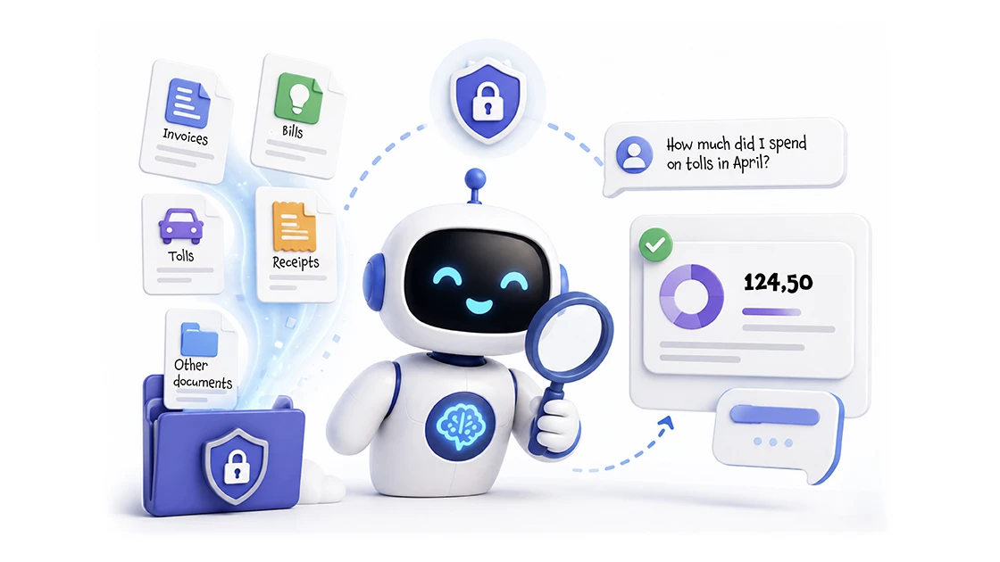
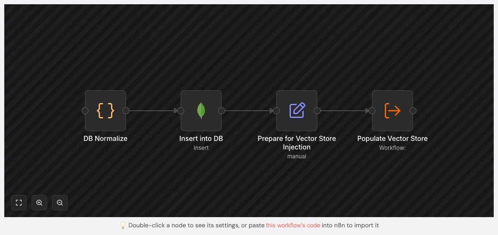
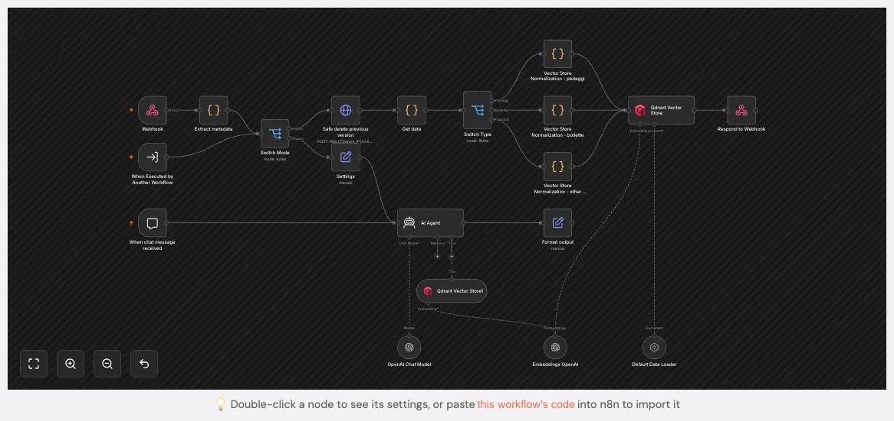

# Query your bills and documents with a private RAG knowledge base

### (aka stop digging through folders to find out how much you spent on gas last year)

After the AI Bill Assistant files my bills and the Claude Code skill do the same for sporadic documents, the numbers were still stuck in folders, even if in a structured format. So I built a private RAG knowledge base, with an AI Agent that answers any question about all my documents in natural language.

<sub>***Date*:** *15/08/2026*<br/>***Tag:*** *Open AI, n8n, RAG, Qdrant, Vector Store, Chatbot, REST API, Claude AI, Mongo DB, OCR*</sub>

---



I hate recurring manual tasks... I consider them a waste of time, and whenever possible I try to automate them as much as I can. If you read my [AI Bill Assistant](../ai-bill-assistant/) article, you know I already automated the boring part of handling bills: bills arrive by email, an AI extracts the relevant data, the PDFs are renamed and filed on my NAS. 

The same is true for sporadic documents, covered by the recent [Scan and analyze documents with Claude Code](../scan-analyze-documents-claude-code/) article: I drop them in a folder, and a Claude Code skill extracts the structured data.

The problem is that you end up with a folder full of *organized* documents... and still no quick answer to questions like *"how much did we spend on gas last year?"* or *"when does the next electricity bill expire?"* To answer those, I had to open the folders, open the JSON files, and sum the numbers by hand. Again. And again.

So, of course, I automated that too 😅.

How I access the knowledge base is a story for another article: here we'll talk about the implementation details, how to setup the RAG. In the followup article ([Build a personal AI for your home, with a private knowledge base](../personal-ai-private-knowledge-base/)) — I'll show how I actually use it in production, with a **Telegram bot** and a **voice assistant** that lets me ask questions from my phone.


# The key design choice: RAG over structured data, not over raw text

Most RAG tutorials you will find online follow the same recipe: take the raw text of your documents, split it into chunks, embed each chunk, and store the chunks in a vector store. It works, but the raw text of a bill is full of layout noise, disclaimers, and provider boilerplate — chunks that are expensive to embed and poor at retrieval.

I took a different path. The workflows I already described in the [AI Bill Assistant](../ai-bill-assistant/) article **extract structured data from every bill** (amount, reference period, consumption by type, invoice number, dates). So instead of embedding the raw PDF, I embed a **curated, normalized summary** of that structured data, together with a **rich metadata payload**:

- the **`pageContent`** is a short natural-language sentence built from the extracted fields — clean, consistent, and perfectly suited for the embedding model;
- the **metadata** is a compact filterable payload that travels with the vector — in my setup five facets (`id`, `type`, `fornitore`, `targa`, `data`), the ones the workflow actually persists (more on that in Step 7.1).

The result is a knowledge base that answers precisely, and whose chunks are a pleasure to read for the LLM.


# The document types and their sources

For this article I'll take three families as running examples — **Bollette**, **Pedaggi** and **Veicoli**, the ones you'll meet in the detailed input contracts below — but the pattern extends to any document you can structure, and the skill already covers a couple more families than the examples (you'll see them in the next bullet). What differs is *how* each family arrives, and that's exactly the point of this article: they come through two different sources.

- **Automatic — the n8n workflows.** Documents that arrive regularly and predictably (usually by email) get a dedicated workflow: it extracts the structured data and pushes it to the knowledge base every time it saves a document (see the [AI Bill Assistant](../ai-bill-assistant/) trick). This always-on source covers two of the mentioned families: **Bollette** — utility bills (electricity and gas, water, internet and mobile, pay TV) — and **Pedaggi** — highway toll statements with the detail of each trip (entry/exit stations, date, amount).
- **On demand — the Claude Code skill.** Documents that arrive sporadically and with no fixed layout don't justify a workflow. When one shows up, I hand the PDF to the **Claude Code skill** — the one I covered in the [Scan and analyze documents with Claude Code](../scan-analyze-documents-claude-code/) article — and its **ingest extension** (Step 6) injects the structured record through the same channel the workflows use. This as-needed source covers **Veicoli** — vehicle documents (workshop service records, inspections, vehicle tax, purchase) — **Assicurazioni** — insurance policies (home, motor, medical) — and **Acquisti** — purchase receipts and invoices, ideal when you need a warranty — plus any generic, unstructured document (contracts, warranties, ...).

> [!NOTE]
> The only ones I deliberately keep out are those with **sensitive data** — medical exams, medical invoices, and anything similar — until I can run a **fully local end-to-end AI** on my hardware. Until then, they simply don't belong in a knowledge base whose chunks travel to a hosted model.

Whether the payload comes from a workflow or from the skill, the knowledge base doesn't care: it's the same JSON contract, handled by the same single workflow (next section).


# How It Works

At a high level, documents arrive from the **two sources** described above. The origin doesn't matter, though: whether a document comes from an n8n workflow or from the skill, it's treated in exactly the same way and handled by a **single n8n workflow**. That workflow has **two modes**, selected by the `mode` field of the payload:

- **Ingest** — stores a document: normalize it into `pageContent` + `metadata`, embed it, and store it in a **Qdrant** collection. The payload comes either from a workflow that saves documents (see Step 5) or from the Claude Code skill described in Step 6.
- **Inquiry** — the orchestrator agent sends a `prompt` and a `sessionId`. The workflow runs an **AI Agent** that uses the vector store as a retrieval tool and returns the answer as a single `output` field.

One important detail: **this workflow is never triggered by a chat.** The **Chat Trigger** node is there **only for debugging** from the n8n editor. In production, the activator is either another workflow that executes this one and injects the action, or a **webhook** (protected by an API key) that the skill calls with the `Ingest` payload.


# Step 1: Set up OpenAI

We need two different pieces from OpenAI, and they are *separate choices*:

- the **chat model** that the agent uses to *think* and answer — I use **`gpt-4o`**;
- the **embedding model** that turns text into vectors — I use **`text-embedding-3-small`**, which is cheap and more than good enough for a personal-scale corpus.

If you don't already have an OpenAI API key, read the accordion below.

<details>
<summary>Set up the OpenAI API</summary>

We will use a **GPT LLM** to process unstructured data. You can choose other AI LLMs, but regardless of which one you use, to call it from another piece of software (like n8n) you need an authorised API key. Here are the steps to create one with OpenAI:

### 1. Create an OpenAI Account
- **Sign Up or Log In**: If you don't already have an OpenAI account, go to [OpenAI's website](https://platform.openai.com/signup) and sign up. If you already have an account, simply log in at [OpenAI Login](https://platform.openai.com/login).

### 2. Access the API Dashboard
- **Go to the API section**: After logging in, navigate to the OpenAI API dashboard. You can find this by going to [OpenAI Platform Dashboard](https://platform.openai.com/account/api-keys).

### 3. Generate an API Key
- **Create a New API Key**:
   - Once you're in the API keys section, click on **"Create new secret key"** or **"Create new API key"**.
   - OpenAI will generate a new API key for you. This key is the API token you'll use to authenticate requests to the OpenAI API.
- **Copy the Key**: After the key is generated, **copy it immediately** because it will not be shown again for security reasons.

### 4. Store the API Key Securely
- **Secure Storage**: Store the API key in a safe place, like a password manager.

### 5. Monitor Usage and Billing
1. **Monitor API Usage**: OpenAI provides detailed usage analytics on your dashboard. You can monitor the number of tokens you've used and manage your spending.
2. **Manage Quotas**: If needed, you can set limits or alerts for your API usage to avoid unexpected charges.

</details>


# Step 2: Set up n8n

As with the other complex automations you will find on this site, I used **n8n**:

<details>
<summary>Set up n8n</summary>

**n8n** is an open-source workflow automation tool that allows you to connect various applications and services to automate repetitive tasks without manual intervention. It provides a visual interface where you can design workflows by linking different nodes that represent actions, triggers, or data processing steps. 

I installed it in a Proxmox LXC by using the helper script provided by [Community-Scripts](https://community-scripts.github.io/ProxmoxVE): this is a very useful Community with many script that will help you many times: if you like them, consider donating to support Angie, tteckster's wife - the founder and best supporter of the community - too early passed away.

</details>


# Step 3: Set up the vector store

If you don't already have a vector store running, read the accordion below.

<details>
<summary>Set up a vector store (Qdrant)</summary>

A **vector store** is the container that holds your documents together with their **embeddings**. An embedding model turns a piece of text into a list of numbers (a vector) that captures its *meaning*: texts that talk about the same thing end up with similar vectors. The store lets you search over them by **similarity** instead of by exact match — that's what powers the *retrieval* half of RAG.

You use it in two moments:

- **Ingest** — each document is embedded with the embedding model and stored, together with its vector and any metadata you want to keep.
- **Inquiry** — the question is embedded with the *same* model, the store returns the most similar vectors, and their text is handed to the LLM to ground the answer.

For the vector store I chose **Qdrant** — open source, lightweight enough to run in a small LXC, and a breeze to install on Proxmox thanks to the usual [Community-Scripts](https://community-scripts.github.io/ProxmoxVE): if you like them, consider donating to support Angie, tteckster's wife — the founder and best supporter of the community — too early passed away.

The pattern doesn't care about the specific store: n8n ships with one out of the box (in-memory or file-backed) that is perfectly adequate at personal scale, and other common open-source options are **Chroma** ([trychroma.com](https://www.trychroma.com/)), **Weaviate** ([weaviate.io](https://weaviate.io/)), **Milvus** ([milvus.io](https://milvus.io/)) and **pgvector** ([github.com/pgvector/pgvector](https://github.com/pgvector/pgvector)) if you already run PostgreSQL. Or, if you'd rather not run anything at all, **Pinecone** ([pinecone.io](https://www.pinecone.io/)) is a fully managed store with a generous free tier. Pick whatever you're comfortable running — the retrieval tool is the only thing that talks to it.

</details>


Create a collection to hold the documents. I named mine **`Documenti`** (Documents) — a single collection for all the document families, filtered by the `type` metadata. The **Qdrant** node in n8n can create the collection automatically on the first insert; if you create it by hand from the dashboard, keep the vector size aligned with your embedding model (`text-embedding-3-small` produces 1536-dimensional vectors).

So the configuration steps for Qdrant are:
- Use case: **Global Search**
- Common Configuration: **Simple Single embedding**
- Dimension: **1536**
- Metric: **Cosine**


# Step 4: Install Claude Code (or opencode) and the skill (optional)

Everything from here on is about n8n; if you only plan to feed the knowledge base with your own workflows, you can skip this step. But if you also want the "on demand" source — dropping any document in and having it structured for you — here's the setup.

**Install the CLI.** The skill runs on [Claude Code](https://docs.anthropic.com/en/docs/claude-code/overview), or on [opencode](https://opencode.ai), its open alternative. Claude Code is available as a native install on macOS; for opencode, follow the installation instructions on its website. Either way, at the end you should be able to start an agent session from a terminal.

**Install the skill.** The `document-ingest` skill is an **extension** of `document-extract`, the skill I covered in the [Scan and analyze documents with Claude Code](../scan-analyze-documents-claude-code/) article: it assumes the base skill is already installed (its [document-extract-skill.zip](/./document-extract-skill.zip) is linked there). Then download [document-ingest-skill.zip](/./document-ingest-skill.zip), unzip it, and place the `document-ingest` folder into your skills directory (`~/.claude/skills/`). Restart the agent session so it picks up the skill.

**Configure it.** Copy `.env.example` to `.env` inside the skill folder and fill in the values: the MongoDB connection string (the same database the workflows write to), the n8n **Ingest** webhook URL and API key (the webhook the workflow of Step 7 exposes), and the Qdrant URL (used by the skill only to verify). That's it.

From then on, in any agent session you can say something like "extract the workshop service record in this PDF and save it", and the skill takes care of the rest of the pipeline. We'll see what happens under the hood in Step 6.

If you use n8n internal vectors, you can skip the Qdrant URL: the skill will still work, but it won't be able to verify that the document actually made it into the knowledge base (you can also remove the verification part from the skill itself). On the other hand, you could use the skill with any other vector store — or even to populate one without n8n at all: keeping the vector store interface only in n8n is a design choice, to avoid duplicating the embedding logic, not a technical limitation.


# Step 5: How the structured data arrives — the automatic way

I said at the beginning of this article that the **Ingest** mode is fed by the same workflows that already save the documents. This is the first source: **documents that have a dedicated workflow**. Here is the concrete example: a piece of the [AI Bill Assistant](../ai-bill-assistant/) workflow (look at the last solution in Step 3.3). Since that article, I made two small changes:

1. instead of writing the extracted JSON to a file on the NAS, the workflow now stores the structured data in a **MongoDB** collection (one per supplier);
2. in addition, the same structured data is pushed to this workflow's **Ingest** mode, so every bill I save ends up in the vector store automatically.

This is the relevant part of the bill workflow (the RAG workflow it calls is the one from Step 7) that replaces the original `Save PDF to NAS share` node:



> **n8n Workflow: bills-documents-rag-knowledge-base**
>
> [Download workflow JSON](./bills-documents-rag-knowledge-base-n8n-1.json) and import it into your n8n instance.


- **DB Normalize** — a **Code** node that reshapes the extraction output (`$json.output`) into the fields of the Ingest contract. In this case it's the electricity + gas bill from `Supplier name` (invoice `XX123456789`), so `supplier` is `"Supplier name"` and `utility_type` is `["electricity", "gas"]`, with the `consumptions` array passed through for the normalizer described in Section 7.1. It returns the normalized `record` for the database and a `record_for_ingest` variant that already carries `type` and `mode`.
- **Insert into DB** — a **MongoDB** node that persists `$json.record` into the `Supplier name` collection. This is the persistence part; nothing more to see here for this article.
- **Prepare for Vector Store Injection** — a **Set** node that makes sure `type: "Bollette"` (Bills) and `mode: "Ingest"` are on the payload, keeping all the other fields (`includeOtherFields`). This is the line that actually "activates" the RAG ingest.
- **Populate Vector Store** — an **Execute Workflow** node that calls the *Documenti RAG* workflow for each item: "When Executed by Another Workflow" catches the call, "Switch Mode" routes it to Ingest, "Switch Type" to the bills normalizer, and the document ends up embedded in Qdrant.

The flow is the same for every document type that has a dedicated workflow: a workflow saves a document, normalizes its structured data, and injects it into the knowledge base. This is also why this RAG workflow has no chat trigger in production — it's always another workflow that puts documents in and takes answers out.

But not every document deserves a dedicated workflow. A workshop service record, an inspection or a receipt arrives sporadically — building an n8n flow for each of them would be overkill. That's where the second source comes in, and it's the subject of the next step.


# Step 6: The other way documents arrive — the ingest skill

Workshop service records, inspections, the annual vehicle tax, an occasional contract... these don't arrive by email with a predictable layout, so there's no workflow extracting them. Before this article, they were exactly the documents I'd end up digging through folders for, one at a time.

That's the second ingestion source, and it's built in **two halves**. The first half — turning the PDF into a validated record and saving it to MongoDB — is the job of the **`document-extract`** skill, and I covered it end to end in the [Scan and Analyze Documents with Claude Code](../scan-analyze-documents-claude-code/) article: native text layer first, **Vision OCR** on macOS for scans, classification, schema validation, and the idempotent upsert that lands the record in the same MongoDB collections the bill workflows write to.

This step is about the **second half**: the **`document-ingest`** skill, a deliberately thin extension of the first one. It takes the record that `document-extract` just wrote to Mongo and pushes it through the very same **Ingest** webhook we've been talking about and that we'll cover in detail in the next step. 

**That's the whole trick**: the knowledge base doesn't care whether the payload came from an n8n workflow or from a skill, because the contract is identical.

> [!NOTE]
> I love a dedicated n8n flow per job, but the return on investment drops fast when a document arrives once a year. A skill is the right granularity for those: the pattern is generic, the scripts are reusable, and adding a new document type is a schema plus a small extractor — not a new workflow.

### The flow

Two skills, one pipeline — the first half comes from the previous article, the second half is this step:

```text
PDF (scan or native)
   │  document-extract (previous article): text layer, or Vision OCR for scans
   ▼
structured record, validated against schemas/*.json
   │  ingest_to_mongo.py — idempotent upsert (document-extract)
   ▼
MongoDB (canonical archive)
   │  document-ingest (this step): push_to_n8n.py — one record at a time
   │                              rebuild_qdrant.py — full re-index (rare)
   │                              verify_qdrant.py — read-only point check
   ▼
n8n "Documenti RAG" → embed + insert in Qdrant (dedup via delete node)
```

### The Ingest contract

Whatever the document type, the skill hands the webhook the same shape — the same `id`/`type`/`mode` envelope we'll meet again in the workflow, plus `pageContent` already rendered from the type's schema template and the full record in `metadata`. A complete example is in Step 7.1, where the vehicle document is the full payload the skill sends.

For the bills of Step 5 the workflow builds the `pageContent` itself from the raw record; for the skill types it arrives ready-made from the schema template, because the skill is the one that knows how to render that document family. Either way, `id` is the Mongo `_id` as a string — the stable key the workflow's delete node uses to avoid duplicates.

### The guardrails

The skill follows the same discipline as the rest of the architecture — three rules that keep it safe:

- **Preview before commit** — nothing is ever written to Mongo (and therefore to Qdrant) without showing you the batch preview first and getting explicit confirmation;
- **Delta only** — day-to-day work touches single records, never a global re-index (that's reserved for first population or infrastructure changes);
- **One way into Qdrant** (optional)— every ingest goes through the n8n webhook; the skill's only direct contact with Qdrant is read-only verification (`verify_qdrant.py`), never writes. And this step is optional since n8n webhooks already return a success/failure response, so the skill can skip the verification if you don't want to expose the Qdrant URL.

### The scripts

Here is the anatomy of what you just installed — the whole zip, nothing else:

```text
document-ingest/
├── SKILL.md                  # the instructions the agent reads
├── .env.example              # MongoDB URI + n8n webhook + Qdrant URL (verification only)
└── scripts/
    ├── push_to_n8n.py        # delta: send a single Mongo record to the webhook
    ├── rebuild_qdrant.py     # re-index: replay the Mongo records through the webhook
    └── verify_qdrant.py      # read-only check that a point is actually in Qdrant
```

It's deliberately thin — the extraction machinery lives in `document-extract` (the previous article), so this zip only adds the ingest stage. Each piece has one job:

- `push_to_n8n.py` — the **delta** script, for day-to-day work: after `document-extract` wrote the record to Mongo, it sends *that single record* to the webhook (`mode: Ingest`), identified by its Mongo `_id` or a JSON filter. Duplicates are impossible anyway: the workflow's delete node replaces the existing point before the insert.
- `rebuild_qdrant.py` — the **re-index** script, for the rare occasions that deserve it (first population, infrastructure changes, a changed embedding model): it reads the records back from Mongo and replays them all through the same webhook.
- `verify_qdrant.py` — the **verification** script: after an ingest, it confirms the point is actually in Qdrant by querying it directly in read-only mode (scroll filtered by the Mongo `_id`), using the `QADRANT_URL`/`QADRANT_API_KEY` from `.env`. This is the only direct contact the skill has with Qdrant — writes always go through the webhook.
- no schemas or routing config of its own — the scripts read `config/collections.yml` and `schemas/*.json` directly from the `document-extract` skill folder (installed as a sibling at `~/.claude/skills/document-extract/`): one contract file, one place to maintain.

### The skill file — SKILL.md is the brain

The folder is just scaffolding; the actual brain is **`SKILL.md`**, the instructions the agent reads to decide how to behave. It's organized in eight numbered sections. Here's the map of the file:

```text
# Skill: Document Ingest — extension of document-extract (RAG ingest via n8n)

## 0. Context
## 1. How to use it (full flow)
## 2. Payload contract towards the webhook
## 3. The two operations
## 4. Verification and auth
## 5. Guardrails
## 6. Known cases / gotchas
## 7. Quick commands
```

Section by section, what each one is for — and what to watch out for:

- **Frontmatter.** Declares *when* the skill applies (saving documents to the RAG knowledge base, ingest/re-ingest in Qdrant) and its relationship with the **document-extract** companion.
- **0 — Context.** The architecture in one paragraph: Mongo is the canonical archive, Qdrant the rebuildable index, and the n8n workflow is *the only ingest point*. It also pins the two things that keep the skill thin: the Italian `snake_case` field names, and the single source of truth — `config/collections.yml` and `schemas/*.json` are read from the sibling `document-extract`, not copied. *Attention: if `document-extract` isn't installed as a sibling, the scripts exit with a clear error.*
- **1 — How to use it.** The full flow in three steps: extraction + Mongo with `document-extract`, then one of the two ingest operations here, then verification.
- **2 — Payload contract.** The `id`/`type`/`mode` envelope (always `Ingest` — there is no `Rebuild`), with `pageContent` already rendered from the schema template for the skill-managed types and the full record in `metadata`; the n8n-managed types (Bollette/Pedaggi) send the raw record instead. *Attention: `id` is the Mongo `_id` as a string at the top level — the delete node matches on it, so it must never be missing.*
- **3 — The two operations.** The delta script (`push_to_n8n.py`) for day-to-day work and the re-index (`rebuild_qdrant.py`) for the rare occasions, plus the dedup mechanism: the workflow's delete node, *not* a point-ID upsert.
- **4 — Verification and auth.** Success = the webhook's *response body*, not the HTTP status (`has_qdrant_content`), the `n8n-api-key` header plus a browser User-Agent (Cloudflare), and the final read-only Qdrant check via `verify_qdrant.py`. *Attention: HTTP 200 ≠ success — a body without documents means the ingest failed.*
- **5 — Guardrails.** The three rules that keep it safe: delta only in routine (no global re-index), writes exclusively through the webhook (Qdrant is touched read-only, never for writes), and preview before any write.
- **6 — Gotchas.** The body check, the Veicoli routing fallback in the workflow, the corrupted `undefined-undefined-<date>` dates (check Mongo with a regex, fix via `document-extract`), and the single-record dedup test.
- **7 — Quick commands.** The copy-paste reference for delta, re-index and verification.


# Step 7: The RAG workflow

Let's look at the workflow. Even if it serves two use cases, it's really small and simple: the interesting part is not the number of nodes, it's the *separation of concerns*: one workflow, two modes.



> **n8n Workflow: bills-documents-rag-knowledge-base**
>
> [Download workflow JSON](./bills-documents-rag-knowledge-base-n8n-2.json) and import it into your n8n instance.


**Workflow description**

- **Webhook** — one of the two production triggers: a **POST** protected by an HTTP header API key (`n8n-api-key`). This is the entry point used by the Claude Code skill of Step 6.
- **When Executed by Another Workflow** — the other production trigger, used by the bill workflows of Step 5. 
Both receive a JSON payload whose `mode` field selects what to do:
  - `Ingest` — store a new document;
  - `Inquiry` — answer a question.
- **Extract metadata** — on the webhook path, it pulls the record out of the webhook body so the rest of the flow sees it as plain JSON (the same shape an Execute Workflow call already has).
- **Switch Mode** — routes the execution based on `$json.mode`: `Ingest` goes to a type selector, `Inquiry` goes to the agent.
- **Safe delete previous version** — an **HTTP Request** node to the vector store endpoint that, before the insert, deletes the existing point whose `metadata.id` matches the incoming `id`. This is the dedup: re-ingesting the same document replaces the old point instead of duplicating it.
- **Get data** — restores the original payload after the delete request (the HTTP response would otherwise replace `$json`).
- **Switch Type** — only on the Ingest path: routes based on `$json.type` to the right normalizer (`Bollette`, `Pedaggi`, or the **Fallback** for everything else, that are all the documents managed by the skill).
- **Vector Store Normalization** — a **Code** node per branch: builds `pageContent` + `metadata` for bills and tolls from the raw record (Section 7.1), while the `other documents` branch passes through the ready-made `pageContent` the skill already rendered.
- **Default Data Loader** — wraps the normalized JSON into a document object and maps a few metadata facets (`id`, `type`, `fornitore`, `targa`, `data`) from the payload.
- **Qdrant Vector Store** (insert mode) — embeds the document and stores it in the single `Documenti` (Documents) collection, using **Embeddings OpenAI** as the embedding model.
- **Respond to Webhook** — returns the ingested documents to the caller. The skill checks this body (not the HTTP status) to confirm success.
- **Settings** — on the Inquiry path, it maps the incoming `prompt` to the agent's `chatInput` and keeps the `sessionId` for conversation continuity.
- **AI Agent** — the brain of the Inquiry path: bound to the **OpenAI Chat Model** (`gpt-4o`) and to a **Qdrant Vector Store** in *retrieve-as-tool* mode.
- **Format output** — returns the agent's answer to the caller as a clean `output` field.
- **When chat message received** — **debug only**: lets me test the Inquiry path from the n8n editor chat panel. It is never used in production.

> [!NOTE]
> A small security note that is actually the n8n default: the workflow-level **Caller Policy** setting is *Workflows from the same owner*, which means this workflow can only be executed by other workflows of the same owner. The webhook is the one external door, and it's locked by the HTTP header API key — without that key there's no way in, not even from other users of the same n8n instance.


## 7.1. The Ingest path — from structured data to vectors

This is the part you can reuse for *anything*. The caller — a workflow or the skill — must send a JSON with `mode: "Ingest"`, a `type`, and the structured fields it already extracted from the document.

### The input contract — Bills

For a utility bill, the payload looks like this — we just saw in Step 5 how I get it: an update to the [AI Bill Assistant](../ai-bill-assistant/) extracts the fields, with info like the bill number, reference period, amounts and consumption:

```json
{
  "mode": "Ingest",
  "type": "Bollette",
  "supplier": "Supplier name",
  "utility_type": ["electricity", "gas"],
  "period_from": "2026-05-01",
  "period_to": "2026-05-31",
  "total_amount": 205.34,
  "invoice_number": "XX123456789",
  "issue_date": "2026-06-18",
  "due_date": "2026-07-08",
  "consumptions": [
    { "type": "electricity", "value": 194, "unit": "kWh", "amount": 181.49 },
    { "type": "gas",         "value": 6,   "unit": "Smc", "amount": 16.85 }
  ]
}
```

### The input contract — Tolls

For a toll statement, the document is a statement with a list of trips, so the payload is slightly different (`trips` is an array):

```json
{
  "mode": "Ingest",
  "type": "Pedaggi",
  "period_from": "2026-06-01",
  "period_to": "2026-06-30",
  "invoice_number": "X12345",
  "issue_date": "2026-07-03",
  "total_amount": 41.70,
  "trips": [
    {
      "exit_date": "2026-06-14",
      "exit_time": "09:12",
      "entry_station": "Mestre",
      "exit_station": "Trieste",
      "amount": 8.90
    }
  ]
}
```

### The input contract — Vehicle documents

For a vehicle document (produced by the skill of Step 6) the payload is the complete contract: the `id`/`type`/`mode` envelope, the `pageContent` already rendered from the schema template, and the full record in `metadata`:

```json
{
  "id": "66f1a9b2c3d4e5f60718293a",
  "type": "Veicoli",
  "mode": "Ingest",
  "pageContent": "Vehicle: Make Model (plate AA000AA) Service type: scheduled maintenance Date: 2026-05-06 Mileage: 145251 km Workshop: Example Workshop s.r.l. Document number: 1234 Total amount: 359.94€",
  "metadata": {
    "id": "66f1a9b2c3d4e5f60718293a",
    "type": "Veicoli",
    "plate": "AA000AA",
    "service_date": "2026-05-06",
    "service_type": "scheduled maintenance",
    "mileage": 145251,
    "workshop": "Example Workshop s.r.l.",
    "document_number": "1234",
    "net_amount": 295.03,
    "vat": 64.91,
    "total_amount": 359.94,
    "payment": "card",
    "items": [
      { "description": "Labour (1.8 h)", "amount": 80.64 },
      { "description": "Oil filter optifit", "amount": 13.98 }
    ],
    "notes": "Warned to replace the front brake pads within 7000 km.",
    "acquired_on": "2026-05-06"
  }
}
```

> [!NOTE]
> As with every code block in this article, the JSON is translated into English for readability. The real field names are Italian — they're part of the data contract with the workflow — so the zips you download contain the actual working copies.

Note the difference from the previous two: the skill types don't rely on a normalizer in the workflow — the `pageContent` is already rendered and handed over ready-made, so the Fallback branch of Switch Type just passes it through. The `id` is the Mongo `_id` as a string — the stable key the delete node matches on — and the schema-driven template keeps every vehicle point readable and consistent.

The other skill-managed types follow the same rule: the envelope is identical, and only the type-specific data changes — the fields and the `pageContent` template that renders them, both defined in the skill's model configuration (`schemas/*.json` in `document-extract`).

### The normalization Code node

Each document type has its own **Code** node that turns the structured JSON into the two fields the vector store needs. This is the one for bills:

```javascript
const d = $input.item.json;

// ── pageContent ───────────────────────────────────────────────
// Natural language text, optimized for embedding.
// Optional fields are included only when present.

const types = (d.utility_type || []).join(' and ');

const consumptions_text = (d.consumptions || [])
  .map(c => `${c.type} ${c.value} ${c.unit} (${c.amount}€)`)
  .join(', ');

const parts = [
  `Utility bill (${types}) from ${d.supplier}.`,
  `Period from ${d.period_from} to ${d.period_to}.`,
  consumptions_text ? `Consumptions: ${consumptions_text}.` : null,
  `Total amount: ${d.total_amount}€.`,
  d.invoice_number ? `Invoice number: ${d.invoice_number}.` : null,
  d.issue_date    ? `Issue date: ${d.issue_date}.`          : null,
  d.due_date      ? `Payment due date: ${d.due_date}.`      : null,
];

const pageContent = parts.filter(Boolean).join(' ');

// ── metadata (Qdrant payload) ─────────────────────────────────
// Only present fields — undefined is excluded by Qdrant anyway,
// but we filter it explicitly for clarity.

const metadata = Object.fromEntries(
  Object.entries({
    ingested_on:    d.ingested_on    || null,
    supplier:       d.supplier       || null,
    utility_type:   d.utility_type   || null,   // array: ["electricity","gas"]
    invoice_number: d.invoice_number || null,
    period_from:    d.period_from    || null,
    period_to:      d.period_to      || null,
    issue_date:     d.issue_date     || null,
    due_date:       d.due_date       || null,
    total_amount:   d.total_amount   ?? null,
    // Flattens consumptions (e.g. consumption_electricity, consumption_gas)
    ...Object.fromEntries(
      (d.consumptions || []).map(c => [
        `consumption_${c.type}`,
        { value: c.value, unit: c.unit, amount: c.amount }
      ])
    )
  }).filter(([, v]) => v !== null)
);

return {
  json: {
    pageContent,
    metadata
  }
};
```

For the tolls, the code follows the same idea but normalizes the trips array, and it collects the unique stations involved into a `cities` array — handy for questions like *"how many times did I drive to Trieste this year?"*:

```javascript
// ── Normalize trips ───────────────────────────────────────────

const trips = ($json.trips || []).map(c => ({
  date:   c.exit_date,
  time:   c.exit_time || null,
  entry:  c.entry_station || null,
  exit:   c.exit_station  || null,
  amount: c.amount
}));

// ── pageContent ───────────────────────────────────────────────

const trips_text = trips.map(c =>
  `${c.date} at ${c.time}: ${c.entry} → ${c.exit} (${c.amount}€)`
).join('; ');

// Unique cities involved — handy for queries like "trips towards Trieste"
const cities = [...new Set(
  trips.flatMap(c => [c.entry, c.exit]).filter(Boolean)
)];

const pageContent = [
  `MooneyGo highway toll statement.`,
  `Period from ${$json.period_from} to ${$json.period_to}.`,
  `Invoice number: ${$json.invoice_number}.`,
  `Issue date: ${$json.issue_date}.`,
  `Total amount: ${$json.total_amount}€.`,
  `Number of trips: ${trips.length}.`,
  `Stations involved: ${cities.join(', ')}.`,
  `Trip detail: ${trips_text}.`
].join(' ');

// ── metadata ──────────────────────────────────────────────────

const metadata = {
  ingested_on:    $json.ingested_on || new Date().toISOString(),
  supplier:       'MooneyGo',
  utility_type:   ['tolls'],
  invoice_number: $json.invoice_number || null,
  period_from:    $json.period_from,
  period_to:      $json.period_to,
  issue_date:     $json.issue_date || null,
  total_amount:   $json.total_amount,
  trips_count:    trips.length,
  cities:         cities   // array of the stations involved
};

return {
  json: {
    pageContent,
    metadata
  }
};
```

### What ends up in Qdrant

For the example bill above, the **Code** node produces this `pageContent`:

```text
Utility bill (electricity and gas) from Supplier name. Period from 2026-05-01 to 2026-05-31. Consumptions: electricity 194 kWh (181.49€), gas 6 Smc (16.85€). Total amount: 205.34€. Invoice number: XX123456789. Issue date: 2026-06-18. Payment due date: 2026-07-08.
```

and this rich metadata object, which the **Default Data Loader** receives:

```json
{
  "ingested_on": "2026-07-03T08:15:00.000Z",
  "supplier": "Supplier name",
  "utility_type": ["electricity", "gas"],
  "invoice_number": "XX123456789",
  "period_from": "2026-05-01",
  "period_to": "2026-05-31",
  "issue_date": "2026-06-18",
  "due_date": "2026-07-08",
  "total_amount": 205.34,
  "consumption_electricity": { "value": 194, "unit": "kWh", "amount": 181.49 },
  "consumption_gas":         { "value": 6,   "unit": "Smc", "amount": 16.85 }
}
```

Notice how the `pageContent` reads like a well-written sentence: that is what gets embedded and matched against the user's question. Of the rich object above, the **Default Data Loader** keeps only the facets it maps — `id`, `type`, `fornitore`, `targa`, `data` — and those are the only ones stored in the document's `metadata`: the rest is used to build `pageContent` and then dropped, it never reaches Qdrant. So the filterable set is exactly the five facets (by type, by supplier, by plate, by date), and those are the ones the agent can be told to use, as you'll see in the next section.

The **Qdrant Vector Store** (insert mode) does the rest: embed with `text-embedding-3-small`, store vector + the mapped metadata in the single `Documenti` collection — regardless of the `type`, the `metadata.type` field keeps families separable for filtering.

## 7.2. The Inquiry path — the RAG agent answers

The caller sends:

```json
{
  "mode": "Inquiry",
  "prompt": "How much did we spend on electricity last year?",
  "sessionId": "6a76559d7d69149e4bc62eecb1f3e8c5"
}
```

### The Settings node

A small **Set** node maps the incoming payload to what the **AI Agent** expects:

- `chatInput` ← `prompt`
- `sessionId` ← `sessionId`

The `sessionId` is what lets you keep **conversation continuity**: by attaching a **memory** to the agent (for example a **Window Buffer Memory**, keyed on the session id), follow-up questions like *"and the year before?"* keep their context. In my architecture the orchestrator agent that will be covered in an upcoming article is the one responsible for passing it.

### The agent and its tool

The **AI Agent** node is bound to:

- the **OpenAI Chat Model** (`gpt-4o`);
- a **Qdrant Vector Store** in *retrieve-as-tool* mode, with this tool description:

```text
Retrieve information from the user's personal documents: bills and home utilities (electricity, gas, water, phone), 
highway toll statements, vehicle documents (servicing, vehicle tax, inspections, insurance), 
insurance policies (home, car, scooter, medical expenses) and purchases (invoices, receipts, warranties). 
Use it to answer questions about consumptions, amounts, reference periods, expiries, warranties and highway trips.
```

The tool description is what the LLM sees to decide *when* to call the tool: this is where the "training" happens. If the question is about a bill, the agent will retrieve the relevant vectors; if it's a general question, it will answer without the tool.

### The system prompt

The system prompt is where the *behaviour* lives:

```text
YOU HAVE ACCESS to a vector store containing documents about:
- Bills and home utilities:
  - Electricity and gas: consumption in kWh and Smc, amounts separated by type
  - Water
  - Phone
  - Highway toll statements — with the detail of each trip
- Vehicle documents: servicing, vehicle tax, inspections, insurance, purchase — with mileage, workshop, amounts and expiries
- Generic documents and contracts
- Insurance policies (home, car, scooter, medical expenses)
- Purchases (invoices, receipts) — one purchase document can produce several records (one purchase item per record), recognizable by the same numero_documento

The documents are filterable via metadata: type, fornitore, targa, data. All the other fields (periods from/to, dates, amounts, cities...) are NOT filters: they are written in the document text, so read them from the retrieved chunks.

RESPONSE RULES:
- Always cite supplier, document type and reference period (if present)
- Always use € for amounts, with 2 decimals
- If asked for totals across multiple documents or types, compute the sum explicitly, showing the contributions
- For tolls, list the individual trips if asked or if they are few (≤5)
- For vehicle documents, indicate plate and mileage when available
- For purchases, indicate product, purchase date and store/supplier; serial number and warranty only if present in the document
- CAUTION MULTI-RECORD: in Purchases, the same numero_documento can appear on multiple records (one item per record, e.g. the Bimby invoice produces 4 records). For a document total use importo_totale ONCE — do NOT sum it for each record; for a single item use its own amount
- If the retrieved data is insufficient or partial, say so explicitly; do not invent suppliers, documents or amounts not present in the data

RULES ON PARTIAL RETRIEVAL AND DETAIL REQUESTS:
- If the question might require more documents than retrieved (complete lists, counts, totals, "all the ...", "how many ..."), do NOT present the list as complete: report the number of documents found and ask the user if they want to narrow the search.
- If the question is ambiguous and the result would change (e.g. period or type missing), ask ONE clarifying question before answering.
- NEVER give a definitive count (e.g. "you did N services") unless you are sure you saw all the relevant documents: if the number could be truncated by the retrieval limit, flag it and propose filtering.
In practice: with Top K=25, if the retrieval returns exactly 25 results for a "how many services" query, the agent must not answer "25" as a total: it must say "I found at least 25, do you want me to narrow it down by period or type?"

CONTEXT INFERENCE — always apply these rules without asking the user for confirmation:
- If the user says "from January", "to March", "last month" etc. without specifying the year, assume the current year ({{ $now.year }})
- If the user says "last year", assume {{ $now.year - 1 }}
- If the user says "last bill" or "most recent bill", look for the one with the most recent periodo_al
- If the user says "last service" or "last inspection", look for the one with the most recent data_intervento
- If the user asks for the next expiry (inspection/vehicle tax/insurance), look for the document with the closest future data_scadenza
- If the user says "last purchase" or "most recent purchase", look for the one with the most recent data_acquisto
- If the user asks for a product warranty or "when does the warranty expire", look in Purchases for the record with the closest future periodo_garanzia_fino_al
- If the user mentions a product by name or model (e.g. "the Bimby", "the iPhone", "the washing machine"), search Purchases by description; if the name alone is not enough, filter by supplier or search by period (reading it in the document text)
- If the user says "bills" or "expenses" without specifying the type, consider all utilities
- If the user mentions only the supplier, consider all the utilities of that supplier
- If the user mentions only the type (e.g. "gas"), consider all suppliers providing that service
- If the user mentions a plate, filter on the vehicle documents of that plate

ANSWER FORMAT:
- For questions about a single document: answer discursively
- For comparisons or lists: use a table or bullet list
- Always answer in Italian
```

A few things worth pointing out:

- **The answers are grounded**: the agent is forced to always cite supplier, document type and reference period, and to say explicitly when the retrieved data is insufficient. This is what keeps it honest — no hallucinated sums.
- **The retrieval limit is acknowledged**: the "RULES ON PARTIAL RETRIEVAL" block exists because the vector store's **Top K** (default 4) can cut the results on questions that need complete lists. In my setup I raised **Top K** to 25, and the prompt even carries a concrete example: if a "how many services" query returns exactly 25 points, the agent must report "at least 25" and offer to narrow down — never answer "25" as if it were the total.
- **Multi-record purchases are handled explicitly**: a purchase invoice can produce several records sharing the same `numero_documento` (one item per record). The prompt tells the agent to use the document's `importo_totale` only once — otherwise a 4-item invoice would be summed four times. It's the same *one document, many records* rule you saw in the skill article.
- **Context inference is explicit**: expressions like `{{ $now.year }}` are evaluated by n8n at runtime, so "last year" always resolves to the correct year without the user having to specify it. Rules like "most recent bill" work because the reference periods, service dates, purchase dates and warranty expiries are rendered into the `pageContent` text, which the agent reads from the retrieved chunks.
- **Formatting is part of the prompt**: discursive answer for a single document, table or bullet list for comparisons and lists.
- I prefer to keep the system prompt in the same language as the documents, so the agent can reason in that language: for this reason, the prompt in the workflow is in Italian and I translate it here for the benefit of the reader (notice the last line of the prompt — *"Always answer in Italian"*). If you want to use this architecture for your own documents, you can translate the system prompt into your own language.

### The output contract

The **Format output** node returns the agent's answer to the calling workflow as:

```json
{
  "output": "In 2025 you spent € 712.34 in total on electricity, across 6 bills from supplier Accendi Coop."
}
```

One field, no noise: whoever called the workflow — the orchestrator agent, a Telegram bot, a dashboard — knows exactly where to read the answer.


# Step 8: Let's try it!

Here are a few real-style conversations translated into English:

> *— "How much did we spend on electricity last year?"*  
> — "In 2025 you spent € 712.34 in total on electricity, across 6 bills from supplier Accendi Coop. The biggest contribution was in December (€ 152.10)."

> *— "What was the highest gas bill this year?"*  
> — "The highest gas bill is February 2026, € 198.76, with a consumption of 84 Smc (supplier Accendi Coop, period 01/02/2026 – 28/02/2026)."

> *— "How many times did I take the motorway through Trieste this year?"*  
> — "In 2026 there are 4 MooneyGo trips with exit at Trieste: 2 in June and 2 in July, for a total of € 35.60."

> *— "And last year?"*  
> — "Compared to 2025, when the trips towards Trieste were 7 for a total of € 61.20, this year (4 trips) you drove less."

> *— "When does the inspection of my car expire?"*  
> — "The inspection of AA000AA expires on 31/10/2026: the last one was done on 05/11/2024 at Example Workshop s.r.l. (145,251 km). The annual vehicle tax, also loaded this year, has no expiry: it's already paid for 2026."

The last exchange is the reason the `sessionId` exists: "and last year?" would mean nothing without the context of the previous question. The retrieval tool + a small memory window is what makes the conversation flow. And the vehicle answer works because the skill extracted and loaded those documents — the "second source" of Step 6 paying off.


# Step 9: Possible additional extensions

- **Add a fully local pipeline for sensitive documents.** Medical exams, medical invoices and similar stay out of the knowledge base until I can run embedding *and* chat model locally, end-to-end. That's the line I chose for my privacy, and I mention it because the architecture already supports it: swap the hosted model with a local one and those document types can join the others unchanged.
- **Chunk raw text when structured data isn't available.** Not every document will be extracted into clean fields. For those, a classic fallback works: extract the text, split it on paragraph boundaries, embed the chunks. The Qdrant collection doesn't care whether the `pageContent` came from a normalization node or from a PDF extractor. This is useful for documents like contracts, warranties, receipts, and medical exams where the structured data is not available or not worth the effort to extract.
- **Let the caller pass filters.** The stored facets (`type`, `fornitore`, `targa`, `data`) already support precise Qdrant filters, so a future version could accept a `filters` field in the Inquiry payload to constrain the search (by supplier, by plate, by date, by document type) before the agent even reads the chunks.


# Step 10: How to use it?

This a step ahead of the journey started with **AI Bill Assistant** and then **Scan and analyze documents with Claude Code**, but the journey is not over yet:
- with the first trick I stopped caring about *saving* bills: no more mail to open, no more folder to browse, no more PDF to save and organize.
- with the second I stopped caring about *analyzing* every other type of document: no more manual reading, no more spreadsheets to fill.
- with this trick I stopped caring about *reading* them too: no more folder to browse, no more file to search and long content to read... just ask a question and get the answer.

But as I mentioned, the Chat node used in this workflow is just for debug: so how do I actually ask questions in production? Could I have added a Telegram trigger right here and closed the journey in one article? Honestly, yes — it would have answered the bills use case. But I have something more complete in store — a [single conversational interface that knows everything about your home](../personal-ai-private-knowledge-base/). The real end is the best part of the journey.


# Step 11: Enjoy

If this trick has been useful to you, keep scrolling down and consider supporting me by clicking that beautiful blue button! 😅

---

Even if I'll try to keep all this pages updated, products change over time, technologies evolve... so some use cases may no longer be necessary, some syntax may change, some technologies or products may no longer be available.

Remember to make a backup before modifying configuration files and consult the official documentation if any concept is unclear or unfamiliar.

*Use this guide under your own responsibility.*

If this pages have been helpful, you can

<a href="https://www.buymeacoffee.com/moreno.sirri" target="_blank"></a>

<sub>This work and all the contents of this website are licensed under a **Creative Commons Attribution-NonCommercial-ShareAlike 4.0 International License (CC BY-NC-SA 4.0)**.
You can distribute, remix, adapt, and build upon the material in any medium or format, <u>for noncommercial purposes only by giving credit to the creator</u>. Modified or adapted material must be licensed under identical terms.
You can find the full license terms [here](https://creativecommons.org/licenses/by-nc-sa/4.0/?ref=chooser-v1)</sub>
