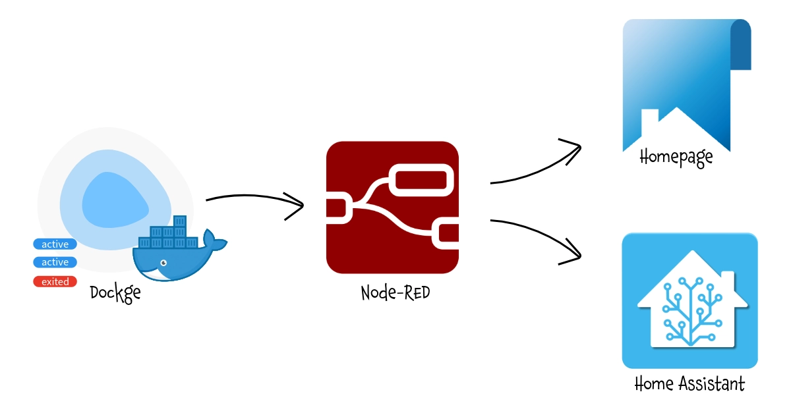
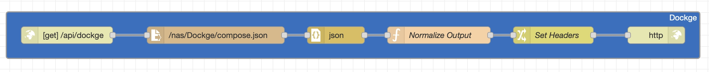
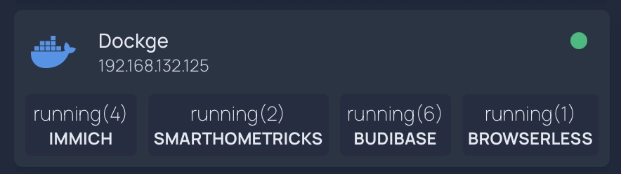
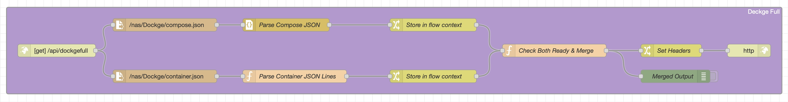

This workaround allows **Homepage** to display real-time status information from **Dockge** container stacks, despite the absence of an official API, enabling centralized monitoring of your Docker containers.<br/>
It uses `Docker's native JSON export`, `Node-RED` for API transformation, and `Homepage's custom API widget` with minimal system overhead.

===

# Expose Dockge data to Homepage

**Dockge** is a modern, web-based **Docker Compose** management tool that provides a user-friendly interface for deploying and managing containerized applications. It simplifies stack management with features like interactive compose file editing, real-time logs, and terminal access.
One limitation of Dockge is the absence of an official API to expose container information to external services like **Homepage**. Unlike other container management tools, you can't directly query Dockge to check which containers are running, stopped, or view their status. This makes it challenging to integrate Dockge with your Homepage dashboard for a unified monitoring experience (or **Home Assistant** for multiple needs).

However, there's a workaround that leverages Docker's native capabilities combined with **Node-RED** to create a custom API endpoint. This solution periodically exports container data to JSON files and serves them through a simple API that Homepage ans Home Assistant can consume.





<br/><br/>

## Prerequisites

Before implementing this solution, ensure you have:
- Dockge running on bare metal or in a Proxmox LXC container
- Node-RED installed and accessible
- Access to the host system to create mount points and configure cron jobs
- Homepage dashboard already set up

## Step 1: Create a Shared Folder

First, you need to establish a shared location where Docker can write container data and Node-RED can read it. In the examples below, I defined an `IoT_Shared` Shared Folder on my NAS as a common repository for multiple services.

### For Bare Metal Installation

Create a directory on your host system:

```bash
sudo mkdir -p /mnt/iot_shared/Dockge
sudo chmod 755 /mnt/iot_shared/Dockge
```

### For Proxmox LXC

If you're running Dockge in a Proxmox LXC container, you'll need to create the folder on the Proxmox host and mount it into the container.

On the Proxmox host:

```bash
mkdir -p /mnt/iot_shared/Dockge
chmod 755 /mnt/iot_shared/Dockge
```

Then edit your LXC configuration file (typically located at `/etc/pve/lxc/[CTID].conf`) and add the mount point:

```
mp0: /mnt/iot_shared/Dockge,mp=/mnt/iot_shared/Dockge
```

Restart the LXC container for the changes to take effect:

```bash
pct stop [CTID]
pct start [CTID]
```

<br/><br/>

## Step 2: Configure Cron Jobs

Now you need to set up automated tasks that export Docker container and compose information to JSON files every minute.

Access your Dockge host (or LXC container) and edit the crontab:

```bash
crontab -e
```

Add the following two lines:

```bash
* * * * * docker compose ls -a --format json > /mnt/iot_shared/Dockge/compose.json
* * * * * docker container ls -a --format json > /mnt/iot_shared/Dockge/container.json
```

These cron jobs will:
- Export all Docker Compose stacks information to `compose.json`
- Export all container details to `container.json`
- Run every minute to keep the data fresh

**Notes:** 
- The `-a` flag ensures that both running and stopped containers/stacks are included in the output.
- If you only need basic stack status for Homepage and Home Assistant (as shown in the main tutorial), you only need the first cron job for `compose.json`. The second cron job for container.json is only required if you want to implement the advanced "Bonus" API with full container details described at the end of this article.

Save and exit the crontab editor. The cron jobs will start running automatically.


<br/><br/>

## Step 3: Create the Node-RED API Endpoint



Node-RED will act as a bridge between the JSON files and Homepage by creating a custom API endpoint.

Open your Node-RED interface and import the following JSON: [Dockge](Dockge.json)


**Important:** After importing, you must update the file path in the "file in" node to match your actual mount point. Double-click the "file in" node and change the filename from `/nas/Dockge/compose.json` to `/mnt/iot_shared/Dockge/compose.json` (or wherever you mounted your shared folder).

### Understanding the Flow

This Node-RED flow consists of six nodes that work together:

1. **HTTP In Node** - Creates a GET endpoint at `/api/dockge` that listens for incoming requests
2. **File In Node** - Reads the `compose.json` file from the shared folder
3. **JSON Node** - Parses the raw file content into a JavaScript object
4. **Function Node** - Transforms the Docker Compose data into a simplified format that Homepage can understand. It extracts the `Name` and `Status` fields from each stack and creates a simple key-value object
5. **Change Node** - Sets the proper HTTP headers to indicate JSON content
6. **HTTP Response Node** - Returns the processed data to the requester

The function node's transformation is crucial: it converts Docker's verbose JSON output into a clean object where each stack name is a key and its status is the value. For example:

```json
{
  "immich": "running(3)",
  "smarthometricks": "running(2)",
  "budibase": "exited(0)"
}
```

Deploy the flow by clicking the "Deploy" button in the top-right corner of Node-RED.


<br/><br/>

## Step 4: Configure Homepage Widget



Finally, add the custom widget to your Homepage configuration. Edit your `services.yaml` file and add the following configuration:

```yaml
- Dockge:
    href: http://[Dockge_IP:port]
    ping: http://[Dockge_IP:port]
    statusStyle: "dot"
    icon: docker
    description: ""
    widget:
      type: customapi
      url: http://[NodeRED_IP:port]/api/dockge
      refreshInterval: 10000
      method: GET
      mappings:
        - field: immich
          label: Immich
        - field: smarthometricks
          label: SmartHomeTricks  
        - field: budibase
          label: Budibase
        - field: browserless
          label: Browserless
```

Each mapping corresponds to a Docker Compose stack name (the `field` value) and how it should be displayed in Homepage (the `label` value). Add or remove mappings based on your actual stacks.

## Testing the Setup

To verify everything is working correctly:

1. Check that the JSON files are being created:
   ```bash
   ls -lh /mnt/iot_shared/Dockge/
   cat /mnt/iot_shared/Dockge/compose.json
   ```

2. Test the Node-RED API endpoint directly in your browser:
   ```
   http://[NodeRED_IP:port]/api/dockge
   ```
   
   You should see a JSON response with your stack names and statuses.

3. Refresh your Homepage dashboard and check the Dockge widget. It should display the status of each mapped container stack with color-coded indicators (green for running, red for stopped).

## Troubleshooting

**Cron jobs not running:** Verify the cron service is active with `systemctl status cron` and check the system logs with `grep CRON /var/log/syslog`.

**Empty JSON files:** Ensure the Docker commands work manually and that the user running cron has permission to execute Docker commands. You may need to add the user to the docker group.

**Node-RED can't read files:** Check the file path in the "file in" node and verify Node-RED has read permissions for the shared folder.

**Homepage not showing data:** Verify the Node-RED URL is correct and accessible from your Homepage instance. Check the browser console for errors.

## Conclusion

While Dockge doesn't provide a native API, this workaround effectively bridges the gap by leveraging Docker's built-in JSON export capabilities. The solution is lightweight, requires minimal resources, and updates frequently enough for effective monitoring. With this setup, you can now monitor your Dockge container stacks directly from your Homepage dashboard alongside your other services.

<br/><br/>

## Step 5: Expose Data to Home Assistant (optional)

You can also expose the Dockge container status to Home Assistant using RESTful sensors. This allows you to create automations based on container states or display the information in your Home Assistant dashboard.

### Configure RESTful Sensor

Add the following to your Home Assistant `configuration.yaml` file:

```yaml
rest:
  - resource: http://[NodeRED_IP:port]/api/dockge
    scan_interval: 30
    sensor:
      - name: "Dockge Immich"
        value_template: "{{ value_json.immich }}"
        icon: mdi:image-multiple
        
      - name: "Dockge SmartHomeTricks"
        value_template: "{{ value_json.smarthometricks }}"
        icon: mdi:home-automation
        
      - name: "Dockge Budibase"
        value_template: "{{ value_json.budibase }}"
        icon: mdi:database
        
      - name: "Dockge Browserless"
        value_template: "{{ value_json.browserless }}"
        icon: mdi:web
```

### Understanding the Sensor States

Each sensor will display the container status as returned by Docker Compose. Common values include:

- `running(X)` - Container is running (X = number of containers in the stack)
- `exited(0)` - Container stopped normally
- `exited(1)` - Container stopped with an error
- `created` - Container created but not started
- `restarting` - Container is restarting

### Using Sensors in Automations

After restarting Home Assistant, you can use these sensors in automations, display them in a Dashboard or whatever you want

<br/><br/>


## Step 6: Full Container Details (Bonus)

For users who need more detailed information beyond simple status checks, there's an enhanced Node-RED flow that combines both compose and container data into a comprehensive API response. This provides granular details about each container including ports, networks, mounts, and resource usage.

### Prerequisite:
Ensure you have generated also the `container.json` file in Step 2. 


### Enhanced Node-RED Flow



Import this advanced flow into Node-RED ([DockgeFull](DockgeFull.json)) then update the file paths in both "file in" nodes to match your mount points (change `/nas/Dockge/` to `/mnt/iot_shared/Dockge/`).

### How this Detailed Flow Works

This workflow merge :

1. **Dual File Reading** - When the `/api/dockgefull` endpoint is called, it simultaneously reads both `compose.json` and `container.json` files
2. **Parallel Processing** - Both files are processed independently:
   - The compose data is parsed as standard JSON
   - The container data requires special handling because Docker outputs JSON lines format (one JSON object per line, not an array)
3. **Flow Context Storage** - Each parsed dataset is stored in Node-RED's flow context, making it available across different parts of the flow
4. **Intelligent Merge Logic** - The "Check Both Ready & Merge" function node waits until both datasets are available, then performs the merge by:
   - Extracting the Docker Compose project name from container labels (`com.docker.compose.project`)
   - Matching containers to their parent compose projects
   - Creating a hierarchical structure with projects as parents and their containers as children
5. **Rich Data Output** - For each project, the API returns comprehensive information including project status, config file locations, container count, and detailed container data (ID, name, image, state, ports, networks, mounts, commands, creation time, and runtime duration)

### Example API Response

The `/api/dockgefull` endpoint returns a structured JSON response like this:

```json
{
  "timestamp": "2025-11-03T14:30:00.000Z",
  "totalProjects": 3,
  "totalContainers": 8,
  "projects": [
    {
      "projectName": "immich",
      "projectStatus": "running(3)",
      "configFiles": "/opt/stacks/immich/compose.yaml",
      "containerCount": 3,
      "containers": [
        {
          "id": "a1b2c3d4e5f6",
          "name": "immich-server",
          "image": "ghcr.io/immich-app/immich-server:latest",
          "state": "running",
          "status": "Up 2 days",
          "ports": "0.0.0.0:2283->3001/tcp",
          "created": "2025-11-01 10:15:30 +0000 UTC",
          "runningFor": "2 days ago",
          "networks": "immich_default",
          "mounts": "immich-data,/photos",
          "command": "/bin/sh -c start.sh"
        }
      ]
    }
  ]
}
```

### Use Cases for this API

This comprehensive endpoint is particularly useful for:

- **Custom Monitoring Dashboards** - Build detailed visualizations showing container health, port mappings, and resource usage
- **Alerting Systems** - Monitor specific containers within multi-container stacks and alert based on individual container states
- **Capacity Planning** - Track container counts per project and identify resource-intensive stacks
- **Documentation** - Automatically generate documentation of your Docker infrastructure
- **Debugging** - Quickly access detailed container information including mount points, networks, and commands without SSH access

### Performance Considerations

The advanced flow processes more data than the basic version, but the impact is minimal:
- Both JSON files are read simultaneously, not sequentially
- Flow context prevents redundant file reads if multiple requests arrive quickly
- The merge operation is efficient even with dozens of projects and hundreds of containers
- Response time typically remains under 200ms even on modest hardware

This API provides a near-complete view of your Dockge infrastructure, bridging the gap until Dockge implements its own native API.

<br/><br/>

# Step 7: Enjoy
Even if I'll try to keep all this pages updated, products change over time, technologies evolve... so some use cases may no longer be necessary, some syntax may change, some technologies or products may no longer be available. Remember to make a backup before modifying configuration files and consult the official documentation if any concept is unclear or unfamiliar. <br/>
*Use this guide under your own responsibility.*<br/>

<div class="myWrapper" style="text-align: center;" markdown="1">
If this trick has been helpful, you can  <br/>

<a href="https://www.buymeacoffee.com/moreno.sirri" target="_blank"></a>
</div>

<br/>
<sub>This work and all the contents of this website are licensed under a **Creative Commons Attribution-NonCommercial-ShareAlike 4.0 International License (CC BY-NC-SA 4.0)**.
You can distribute, remix, adapt, and build upon the material in any medium or format, <u>for noncommercial purposes only by giving credit to the creator</u>. Modified or adapted material must be licensed under identical terms.
You can find the full license terms [here](https://creativecommons.org/licenses/by-nc-sa/4.0/?ref=chooser-v1)</sub>