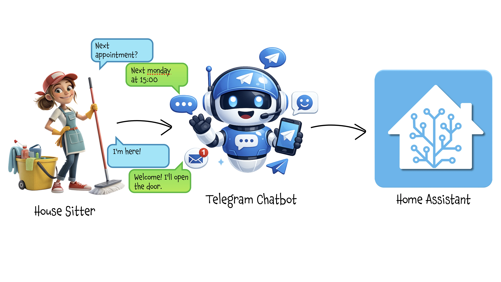
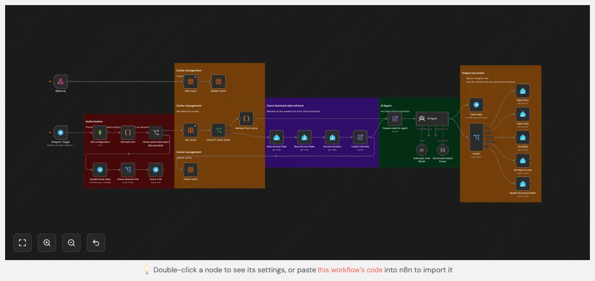

# House Sitter Chatbot

### (aka let your virtual butler chat with the housesitter and manage access to your home)

Forget having to be available when the house sitter arrives to open the gate and front door for her/him… a virtual butler will welcome her/him in your place, managing security and protecting you from unwanted access or entry outside the agreed schedule.

<sub>***Date*:** *10/05/2026*<br/>***Tag:*** *Claude AI, Telegram, Chatbot, Home Assistant, n8n, Mongo DB, REST API*</sub>

---



# Telegram Bot for House Sitter Access: A Smart Alternative to Home Assistant Apps

This trick is the natural evolution of the [house sitter access control package](../../sensors/ha-housesitter-package) I covered in the previous article. 

Managing house sitter access through Home Assistant is powerful, but it comes with a real-world friction. 
Your house sitter needs to install an app, create an account, understand a smart home interface, and maintain access credentials. 
If your Home Assistant isn't publicly exposed, they'll also need VPN configuration on their phone. 

For temporary help like house sitters, cleaners, or pet sitters, this overhead often isn't worth it.

Yes, you can always let them calls/message you when they arrive and you can open the gate for them, but what if you're not available at that moment?

There's a better way: give them a Telegram chatbot instead.

## Why Telegram Over Home Assistant Apps?

The Home Assistant dashboard approach has some limitations:

1. **App Installation Required**: House sitters must download the Home Assistant Companion App and configure it with the account you create for them
2. **Ongoing Maintenance**: Even with kiosk mode and restricted permissions, you need to verify UI limitations haven't changed with updates
3. **Network Complexity**: Without public exposure, you need VPN setup on their device—hardly user-friendly for someone who just needs to feed your cat
4. **Learning Curve**: Not everyone is comfortable navigating smart home interfaces, even simplified ones
5. **Account Management**: Creating, maintaining, and eventually deleting user accounts adds administrative overhead

The Telegram Bot Approach Solves All of This:

- **Zero Installation**: Almost everyone already has Telegram
- **Familiar Interface**: It's just messaging—no learning curve
- **Natural Language**: "I'm here" instead of navigating UI buttons
- **Works Anywhere**: No VPN, no special network configuration
- **No Account Management**: Authorization happens through Telegram's built-in authentication
- **Easy Revocation**: Just remove them from the bot's allowed users list

## Prerequisites

This article builds on an existing Home Assistant package for managing scheduled house sitter access. That package creates some Home Assistant helpers:
- `input_boolean.housesitter_access_enabled` - Whether access is currently active
- `input_datetime.next_housesitter_access` - Next scheduled access datetime
- `input_number.tempo_massimo_accesso_housesitter` - Access duration in hours
- Template sensor calculating whether we're in an active access window

If you haven't set this up yet, check out [my previous article on automated house sitter access control](../../sensors/ha-housesitter-package) first.

## Architecture Overview

The bot works as a bridge between Telegram and your Home Assistant:

```
Telegram Message → N8N Workflow → AI Agent → Home Assistant Action
                        ↓
                  MongoDB Config
                        ↓
                   Data Cache
```

**Key Components:**

1. **Telegram Bot**: Your house sitter chats with it naturally
2. **N8N**: Orchestrates the workflow and handles authorization
3. **MongoDB**: Stores authorized users and chat configurations (optional)
4. **AI Agent (Claude Sonnet 4.5)**: Interprets natural language and makes access decisions
5. **Data Cache**: Avoids hammering Home Assistant with repeated state queries
6. **Home Assistant**: Executes physical actions (unlock gate, open door, etc.)


# Step 1: Setting Up the Telegram Bot

If you don't already have a bot ready to use for this use case, the accordion below walks you through it.

<details>
<summary>Set up the Telegram bot</summary>

Creating a **Telegram Bot** is really simple:

- Open a chat with the user **@BotFather** and type `/newbot`
- Follow the instructions: you will be asked to define a **Bot name** and a **username**
- At the end, BotFather will show you the **HTTP API Token** (`[Telegram_Token]`): save it securely, we'll use it later.

</details>


# Step 2: Configure MongoDB for Authorization

Create a MongoDB database with a `bots` collection. Store authorized users and chats:

```json
{
  "bot": "<your_bot_name>",
  "allowed_users": [
    {
      "user_id": 123456789,
      "ruolo": "owner",
      "description": "Homeowner"
    },
    {
      "user_id": 234567890,
      "ruolo": "owner",
      "description": "Homeowner's wife"
    },
    {
      "user_id": 987654321,
      "ruolo": "sitter",
      "description": "House sitter"
    }
  ],
  "allowed_chats": [
    {
      "chat_id": -1001234567890,
      "description": "House sitting group chat"
    }
  ]
}
```

**User Roles:**
- `owner`: Can always open gates/doors, configure access schedules and durations
- `sitter`: Can only open gates/doors during scheduled access windows

If you don't have a MongoDB instance, you can hardcode allowed users/chats in the N8N workflow, but using a database allows dynamic updates without redeploying.


# Step 3: Add the Cache Refresh Automation

This is the **only extension** needed in Home Assistant; you can add it to your existing housesitter package. 
Since the N8N workflow relies on cached data in order to reduce API calls, this automation notifies N8N whenever access settings change:

```yaml
automation:
  - id: refresh_chatbot_cache
    alias: Notify n8n when House Sitter access settings change
    trigger:
      - trigger: state
        entity_id:
          - input_boolean.housesitter_access_enabled
          - input_datetime.next_housesitter_access
          - input_number.tempo_massimo_accesso_housesitter
    action:
      - action: rest_command.fetch_chatbot_cache_refresh
        data: {}

rest_command:
  fetch_chatbot_cache_refresh:
    url: "https://your-n8n-instance.com/webhook/YOUR-WEBHOOK-ID"
    method: GET
    headers:
      Content-Type: application/json
      n8n-API-Key: !secret n8n-API-Key
    timeout: 10
```

Replace the URL with your N8N webhook endpoint and secure it with an API key stored in Home Assistant secrets.


# Step 4: Build the N8N Workflow




> **n8n Workflow: housesitter-chatbot**
>
> [Download workflow JSON](./housesitter-chatbot-n8n-1.json) and import it into your n8n instance.


The workflow handles everything from message receipt to action execution. Let's walk through each major section.

## Phase 1: Authentication & Authorization

**Telegram Trigger** → **Get Configuration** → **Get Auth Info** → **Check Authorized Users**

When a message arrives:

1. **`Telegram Trigger`** receives the message with user and chat metadata
2. **`Get Configuration`** fetches allowed users/chats from MongoDB: if you don't have MongoDB, you can hardcode this in a JavaScript node or `Set` node.
3. **`Get Auth Info`** (JavaScript code node) matches the sender against allowed users:

```javascript
const inputchat = $('Telegram Trigger').first().json.message.chat;
const inputuser = $('Telegram Trigger').first().json.message.from;
const config = $input.first().json;

const allowedChat = config.allowed_chats.find(
  chat => Number(chat.chat_id) === Number(inputchat.id)
);

const allowedUser = config.allowed_users.find(
  user => Number(user.user_id) === Number(inputuser.id)
);

const authorized = !!allowedChat && !!allowedUser;
```

Both chat AND user must be authorized. If not, the bot sends an "unauthorized" message and optionally leaves the chat.


## Phase 2: Smart Caching

To avoid repeated Home Assistant API calls (which consume resources and slow response time), we cache the access state:

- **Cache Hit**: Parse cached JSON containing access state, datetime, duration, etc.
- **Cache Miss**: Query Home Assistant for current state of all three entities, then cache the results

The **`Webhook`** + **`Delete Cache`** flow (triggered by the Home Assistant automation above) clears the cache whenever access settings change, forcing a fresh fetch on the next message.

The **`Insert Cache`** node (Data Table) stores the combined state for future requests.
Instead of a traditional key-value store, we use a single-row table with JSON columns. This allows us to store complex structured data (like the entire access state) without needing multiple nodes or complex logic to manage keys.

So the Data Table schema becomes really simple:


and here is the content of the `data` field:
```json
{"active":false,"planned_datetime":"2026-05-12 15:00:00","duration":"4","planned":true,"ongoing":false}
```
that is the `{{ $json.toJsonString() }}` generated by the **`Collect HA Data`** node, which combines all three Home Assistant entities into a single JSON structure.

**Data tables** are a powerful feature in n8n that allow you to store and manipulate structured data without needing an external database. 
This approach simplifies our architecture while still providing the benefits of caching. It has some limitations (e.g. no TTL or expiration logic), but for our use case, it works perfectly since we control when the cache is cleared via the webhook trigger from Home Assistant.

I could also use MongoDB for caching (since I already used it in this workflow), but I wanted to demonstrate how to leverage n8n's built-in features to keep the architecture simple and self-contained.


## Phase 3: Data Preparation

**Collect HA Data** → **Prepare Data for Agent**

- The three Home Assistant API calls return separate pieces of information about access state, schedule, and duration. 
- The **`Collect HA Data`** node merges these into a single JSON object that the AI agent can easily consume.

   Key calculated fields:
   - `planned`: Is the scheduled datetime in the future?
   - `ongoing`: Are we currently within the access window (between start time and start time + duration)?

- The **`Prepare data for agent`** node combine this access state with the incoming message and user info to create a comprehensive input for the AI agent:

```json
{
  "access": {
    "active": true,
    "planned_datetime": "2026-05-10 14:00:00",
    "duration": "4",
    "planned": false,
    "ongoing": true
  },
  "user": {
    "name": "Mary Poppins",
    "role": "sitter"
  },
  "message": "I'm here! Can you open the gate?"
}
```


## Phase 4: AI Decision-Making

**AI Agent** (with **Anthropic Claude Sonnet 4.5** + **Structured Output Parser**)

This is where the magic happens. The AI agent receives:

1. **System Prompt**: Rules for authorization, natural language interpretation, and response formatting
2. **User Data**: The JSON structure above containing access state, user info, and the message

The system prompt teaches the agent:

**Authorization Logic:**
- Owners can always open gates/doors and configure schedules (set a new access time or change duration)
- Sitters can only open gates/doors when `access.ongoing = true`
- Natural language patterns to recognize ("I'm here", "open the gate", "I'm leaving", etc.)

**Output Format:**
```json
{
  "messaggio": "Welcome Mary Poppins! I open the gate for you! 🏠",
  "azione_richiesta": "cancello",
  "valore": null
}
```

Possible actions (`azione_richiesta`): 
- `"cancello"` (gate) -> opens the gate
- `"porta"` (door) -> opens the door
- `"arrivederci"` (goodbye/exit) -> runs the goodbye script that closes everything behind the sitter (shutters, lights, etc.), lower the thermostat, and locks the doors
- `"durata"` (set duration - owner only) -> updates the access duration to the new value specified in `valore`
- `"appuntamento"` (set schedule - owner only) -> updates the access schedule / set a new access time to the datetime specified in `valore`
- `null` (no action) -> no action taken

**The Structured Output Parser** enforces JSON schema validation, ensuring the AI always returns parseable, consistent output. Here is the schema definition:

```json
{
  "type": "object",
  "properties": {
    "messaggio": {
      "type": "string",
      "description": "The friendly message to send back to the user"
    },
    "azione_richiesta": {
      "type": ["string", "null"],
      "enum": ["cancello", "porta", "arrivederci", "durata", "appuntamento", null],
      "description": "The action to perform in Home Assistant, or null if no action is needed"
    },
    "valore": {
      "type": ["string", "null"],
      "description": "Additional value needed for certain actions (e.g., new duration or schedule), or null if not applicable"
    }
  },
  "required": ["messaggio", "azione_richiesta"]
}
```

Here is the fully optimized system prompt (translated into English, although in the workflow you will find it in Italian):

````md
Manage home access via Telegram. Interpret user messages, verify permissions based on the user's role and the current access status, and prepare friendly responses with the actions to be executed.

## Input JSON
{
  "access": {
    "active": boolean,           // access enabled
    "planned_datetime": string,  // "YYYY-MM-DD HH:MM:SS"
    "duration": string,          // hours (e.g. "4")
    "planned": boolean,          // future appointment scheduled
    "ongoing": boolean           // access window currently open
  },
  "user": {
    "name": string,              // e.g. "Mary Poppins", "Moreno"
    "role": string               // "owner" or "sitter"
  },
  "message": string              // user message
}

## Authorization Rules

**Owner**:

* Can ALWAYS open the gate/door and leave
* Can set the duration (3-10 hours)
* Can schedule appointments (time between 7:00 and 20:00, future dates only)

**Sitter (house sitter)**:

* Can open the gate/door ONLY if `access.ongoing = true`
* If `ongoing = false`: politely deny access and explain when access will be available
* CANNOT modify the duration or appointments

## Required Output JSON

**Basic format:**

```json
{
  "messaggio": "response text",
  "azione_richiesta": "cancello" | "porta" | "arrivederci" | null
}
```

**Extended format (only when the owner is configuring settings):**

```json
{
  "messaggio": "response text",
  "azione_richiesta": "durata" | "appuntamento",
  "valore": "3-10" | "YYYY-MM-DD HH:MM:SS"
}
```

### Actions

* `"cancello"`: open the entrance gate
* `"porta"`: open the main door
* `"arrivederci"`: user is leaving (closing routine)
* `"durata"`: owner sets a new duration (value: `"3"` to `"10"`)
* `"appuntamento"`: owner sets a date/time (value: `"YYYY-MM-DD HH:MM:SS"`)
* `null`: no physical action

## Decision Logic

### Opening Requests (gate/door/arrival)

* **Owner**: always `"cancello"` or `"porta"`
* **Sitter + ongoing=true**: `"cancello"` or `"porta"`
* **Sitter + ongoing=false + planned=true**: `null`, explain the scheduled time
* **Sitter + ongoing=false + planned=false**: `null`, suggest contacting the owner

### Leaving Requests

* **Owner**: always `"arrivederci"`
* **Sitter + ongoing=true**: `"arrivederci"`
* **Sitter + ongoing=false**: `null`, say goodbye without performing any action

### Duration Configuration (owner only)

* Validate range 3-10 hours
* If valid: `"durata"` + `"valore": "N"`
* If invalid: `null`, explain the limits
* If requested by a sitter: `null`, politely deny

### Appointment Configuration (owner only)

* Parse natural language expressions: "tomorrow", "next Monday", "May 15 at 14:00"
* Validate: future date + time between 7:00 and 20:00
* If valid: `"appuntamento"` + `"valore": "YYYY-MM-DD HH:MM:SS"`
* If invalid: `null`, explain the error
* If requested by a sitter: `null`, politely deny

### Status Questions / Last Access

* Always `null` (informational only, no action)
* If `planned=false` and a past `planned_datetime` is available: show the last scheduled access
* Format dates in Italian style: DD/MM/YYYY alle HH:MM

## Style Rules

1. **Always use the user's name** in responses
2. **Friendly tone**: polite with the sitter, informal with the owner
3. **Appropriate emojis**: 🚪🏠✅⏰🔒👋😊⚠️📋
4. **Italian date format**: "05/05/2026 alle 15:00"
5. **Concise responses**: clear and direct
6. **Explain refusals**: always provide a reason when denying a request
7. **Valid JSON**: use `null`, not `"null"`

## Critical Examples

**1. Sitter arrives early:**

```json
// Input
{"access": {"ongoing": false, "planned": true, "planned_datetime": "2026-05-10 14:00:00"}, "user": {"name": "Mary Poppins", "role": "sitter"}, "message": "I'm here"}

// Output
{"messaggio": "Hi Mary Poppins! Your access is from 14:00. I can't open the gate right now ⏰", "azione_richiesta": null}
```

**2. Sitter during active window:**

```json
// Input
{"access": {"ongoing": true}, "user": {"name": "Mary Poppins", "role": "sitter"}, "message": "open the gate"}

// Output
{"messaggio": "Gate opened! ✅", "azione_richiesta": "cancello"}
```

**3. Owner sets duration:**

```json
// Input
{"user": {"name": "Moreno", "role": "owner"}, "message": "set duration to 6 hours"}

// Output
{"messaggio": "Perfect Moreno! Duration set to 6 hours ✅", "azione_richiesta": "durata", "valore": "6"}
```

**4. Owner schedules an appointment:**

```json
// Input (today is 10/05/2026)
{"user": {"name": "Moreno", "role": "owner"}, "message": "new appointment tomorrow at 14:30"}

// Output
{"messaggio": "Perfect Moreno! Appointment scheduled for 11/05/2026 at 14:30 ✅", "azione_richiesta": "appuntamento", "valore": "2026-05-11 14:30:00"}
```

**5. Last access request with past date:**

```json
// Input
{"access": {"planned": false, "planned_datetime": "2026-05-05 15:00:00", "duration": "4"}, "user": {"name": "Mary Poppins", "role": "sitter"}, "message": "when was the last time?"}

// Output
{"messaggio": "The last scheduled access was on 05/05/2026 at 15:00 with a duration of 4 hours 📋", "azione_richiesta": null}
```

**6. Sitter attempts configuration:**

```json
// Input
{"user": {"name": "Mary Poppins", "role": "sitter"}, "message": "can you set it to 5 hours?"}

// Output
{"messaggio": "Sorry Mary Poppins, only the owner can modify the duration 🔒", "azione_richiesta": null}
```

**7. Owner arrives:**

```json
// Input
{"user": {"name": "Moreno", "role": "owner"}, "message": "I'm here"}

// Output
{"messaggio": "Hi Moreno! Opening gate 🚪", "azione_richiesta": "cancello"}
```

## Important Validations

* **Duration**: integers only, from 3 to 10
* **Appointment time**: only between 7:00 and 20:00 (reject 6:59 or 20:01)
* **Appointment date**: future dates only (compare with NOW)
* **Output**: ALWAYS valid JSON, never free text
* **null vs "null"**: use `null` as a value, not a string

````


## Phase 5: Action Execution

**Send Reply** + **Switch** → Home Assistant Actions

The workflow splits:

1. **Send Reply**: Always sends the friendly message back to Telegram
2. **Switch**: Routes to appropriate Home Assistant action based on `azione_richiesta`

**Switch Outputs:**
- `cancello` → **Open Gate** (unlocks `lock.ingresso_lock`)
- `porta` → **Open Door** (opens `lock.porta`)
- `arrivederci` → **Goodbye** (runs `script.arrivederci` - house exit routine)
- `appuntamento` → **Set Next Access** (updates `input_datetime.next_housesitter_access`)
- `durata` → **Update Access Duration** (updates `input_number.tempo_massimo_accesso_housesitter`)


## Real-World Conversation Examples

### Sitter arrives during access window

```
Mary Poppins: Hi! I'm here 😊
Bot: Hi Mary Poppins! Opening gate. Welcome! 🏠
[Gate unlocks automatically]
```

### Sitter arrives early

```
Mary Poppins: Hi! I'm here
Bot: Hi Mary Poppins! Your access is from 14:00. I can't open the gate right now ⏰
```

### Owner remote access

```
Owner: Open the gate
Bot: Hi Moreno! Opening gate 🚪
[Gate unlocks immediately, regardless of schedule]
```

### Owner schedules new access

```
Owner: New appointment tomorrow at 15:30
Bot: Perfect Moreno! Appointment scheduled for 11/05/2026 at 15:30 ✅
[Home Assistant schedule updated automatically]
```

### Sitter tries to configure (Denied)

```
Mary Poppins: Can you set it to 6 hours?
Bot: Sorry Mary Poppins, only the owner can modify the duration 🔒
```

## The power of natural language understanding

The AI agent handles linguistic variations without rigid command syntax:

**Gate Opening Requests** (all work):
- "I'm here"
- "Open the gate"
- "Can you let me in?"
- "I'm at the door"
- "Please open the gate"

**Departure Notifications**:
- "I'm leaving"
- "Done for the day"
- "I'm exiting"
- "Goodbye"

**Schedule Queries**:
- "When can I come?"
- "What time is my access?"
- "Can I come in?"

The prompt includes critical examples showing the AI how to handle edge cases: early arrivals, late departures, communication-only messages, and configuration requests from unauthorized roles.

## Security considerations

1. **Two-Factor Authorization**: Both user ID and chat ID must be in the allow list
2. **Role-Based Access Control**: Sitter role is tightly restricted to access windows
3. **API Key Protection**: N8N webhook requires authentication header
4. **Telegram's Security**: Leverages Telegram's built-in user authentication
5. **Audit Trail**: N8N logs all interactions for review
6. **Easy Revocation**: Remove user from MongoDB, access immediately revoked


## Advantages over app-based access

| Aspect | Home Assistant App | Telegram Bot |
|--------|-------------------|--------------|
| Setup Time | 10-20 minutes | < 1 minute (just add to bot) |
| User Training | Required | None (everyone knows messaging) |
| Network Requirements | Public IP/Endpoint or VPN | Just internet |
| Maintenance | Ongoing (updates, permissions) | Set and forget |
| Flexibility | Limited to defined UI | Natural language requests |
| Revocation | Delete account, verify removal | Remove from list |

## Extending the system

**Multi-Language Support**: Adjust the prompt to detect language and respond accordingly

**Multiple House Sitters**: Create separate MongoDB entries with different roles

**Notification Integrations**: Add N8N nodes to send notifications on specific actions (gate opened, schedule changed, etc.)

**Access Logging**: Store all interactions in a database for audit purposes

**Photo Verification**: Add Telegram photo handling to request/store entry/exit photos (also automatically triggered by Home Assistant cameras)

**Location Verification**: Use Telegram's location sharing to confirm sitter is physically present (house sitter smartphone configuration required)


# Step 5: Enjoy
The Telegram bot approach transforms house sitter access from a technical configuration challenge into a simple messaging experience. Your house sitter opens Telegram, says "I'm here," and the gate opens. No app to install, no credentials to remember, no UI to navigate.

For homeowners, it means one less account to manage, one less potential security exposure, and one less thing to troubleshoot when your house sitter can't figure out how to open the gate.

The combination of N8N's workflow orchestration, Claude's natural language understanding, and Telegram's ubiquity creates a system that's both more powerful and easier to use than traditional approaches. It's smart home automation that doesn't feel like dealing with technology—and that's exactly what automation should be.

If this trick has been useful to you, keep scrolling down and consider supporting me by clicking that beautiful blue button! 😅

---

Even if I'll try to keep all this pages updated, products change over time, technologies evolve... so some use cases may no longer be necessary, some syntax may change, some technologies or products may no longer be available.

Remember to make a backup before modifying configuration files and consult the official documentation if any concept is unclear or unfamiliar.

*Use this guide under your own responsibility.*

If this pages have been helpful, you can

<a href="https://www.buymeacoffee.com/moreno.sirri" target="_blank"></a>

<sub>This work and all the contents of this website are licensed under a **Creative Commons Attribution-NonCommercial-ShareAlike 4.0 International License (CC BY-NC-SA 4.0)**.
You can distribute, remix, adapt, and build upon the material in any medium or format, <u>for noncommercial purposes only by giving credit to the creator</u>. Modified or adapted material must be licensed under identical terms.
You can find the full license terms [here](https://creativecommons.org/licenses/by-nc-sa/4.0/?ref=chooser-v1)</sub>
