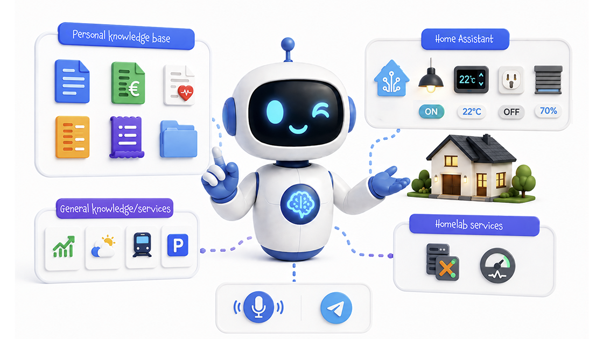
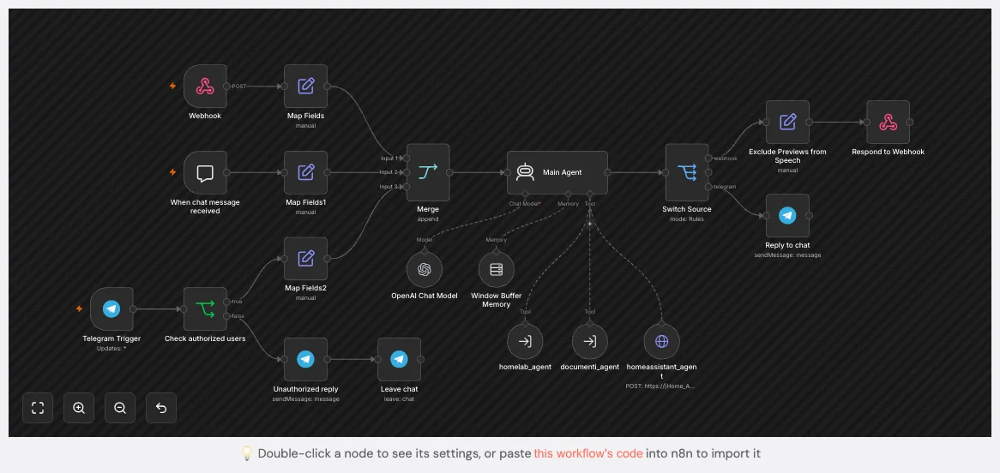

# Build a personal AI for your home — with a private knowledge base

### (aka bring enterprise-grade RAG to your living room, with almost no cost)

An AI Agent that orchestrates three very different kinds of knowledge — Home Assistant as a delegated third-party system, a vector store over your static private documents, and a realtime API over your homelab — to give you a single conversational assistant that actually knows you and your home.

<sub>***Date*:** *16/08/2026*<br/>***Tag:*** *Open AI, n8n, Telegram Bot, Home Assistant, Proxmox VE, RAG, REST API, Claude AI*</sub>

---



Using an AI that knows your knowledge base is a common pattern for large companies and so in an enterprise context: when you have a lot of information scattered across different systems (thousands of documents, customer support tickets, internal wikis, ...), you can use **RAG (Retrieval Augmented Generation)** to make it accessible in a **single conversational interface** and build **agents that really know your business**.

What many people don't realize is that *the same architecture can be applied to **their homes**, with a few small tweaks and almost **no extra cost**.*

# What are we talking about?

This trick is the last stop (for now 😉) of a journey that took different places in the **personal AI** space, aka phases of the process of organization and consumption of personal documents and information.

We started with [AI Bill Assistant](../ai-bill-assistant/), which shows how to extract structured data from bills and invoices in a totally automated way.

Then we moved to [Scan & Analyze Documents with Claude Code](../scan-analyze-documents-claude-code/), which shows how to do the same for sporadic documents that don't arrive regularly by email.

Recently, we moved to [Query your bills and documents with a private RAG knowledge base](../bills-documents-rag-knowledge-base/), which put together the previous steps and shows how to build a private RAG knowledge base over the structured data, and query it in natural language.

Today we move forward by extending the private RAG to include **all the knowledge in your home**, not just bills and documents, and by showing how to build a **single conversational interface** that can answer questions about all of it. A **Personal AI**.


# What I mean by "personal AI"

When I say *personal AI* I don't mean a chatbot on a website. I mean a system that:

- knows my house (lights, gates, climate, sensors, ...)
- knows my life (bills, contracts, documents, insurance policies, warranties, receipts, invoices, tolls, medical appointments, calendars, car maintenance, ...)
- knows my homelab infrastructure (Proxmox nodes, services, network devices, ... ok that's quite nerdy, but you can stay on the first two 😉)
- uses a natural language interface
- talks to me in the same way, regardless of *which* of those knowledge sources it needs to consult
- can switch between different kinds of specific knowledge and general knowledge on the fly, without me having to specify which one, or use a different interface/app for each
- is always reachable from my phone, without installing yet another app

A few notes:
- The "no new apps" rule is a mandatory prerequisite my wife set 😅: that's why the conversational interface lives on **Telegram**, which everyone already has. 
- It's also exposed to the **Vagent** app on iPhone — a small voice assistant app that, after a button press, sends whatever I said to a webhook and reads the answer back. Not a wake-word assistant like Alexa or Siri: you open the app, you tap once, you speak. That limitation is fine for the way I use it.
- My next goal is to expose the agent through an always-on voice assistant (a local one, ideally), but I'm still working on that. The architecture is the same, only the front-end changes: I will cover it in a future article when I have it working.

Before you go any further, a quick but honest note on **privacy**:

> [!IMPORTANT]
> The *documents* (bills, contracts, anything we will discuss in a moment) never leave my network — they sit on my NAS, embedded in a local vector store. The *realtime data* (Proxmox metrics, Home Assistant state) is queried on demand through my own APIs. **What does leave the network is the prompt itself**, together with the small chunks the model needs to answer: a few hundred tokens at a time, going to **OpenAI** (I currently use `gpt-4o`). I tried local models but due to my hardware limits (currently my local AI setup is a Mac Mini M2 Pro 16 GB) the quality and speed weren't satisfactory for this use case; maybe in the next months local models will be good enough to replace OpenAI, and then I can run everything on my own hardware. Until then, this is the trade-off I accepted.  
> This is why I decided to leave out medical exams, receipts, and other documents containing sensitive data for now.  
> So strictly speaking this is *not* a fully private system — it is a **private knowledge base** with a hosted model.


# The three kinds of personal knowledge

Before any code, the most useful thing this article can give you is a mental model. Every question I ask my home can be classified into one of exactly three categories, and each category has a different technical answer:

## 1. Delegation to a third-party system (Home Assistant in my case)
The **Conversation API** of **Home Assistant** (`/api/conversation/process`) accepts natural language, runs it through Home Assistant's own intent recognizer, and returns the resulting action. 
So no need to interface with all Home Assistant's entities directly (via API, MQTT topics or whatever), just delegate the question to Home Assistant and let it do its own thing.

*Examples:* 
> "Is the gate open?"  
> "Turn off the kitchen lights"  
> "What's the temperature in the bedroom?"

From the AI Agent's point of view, this is just **a tool that accepts a sentence in my natural language and returns a sentence in the same language**. Beautifully simple.

This pattern is great whenever you already have a system that "knows how to talk to itself" or expose a natural language interface.


## 2. Static knowledge over a vector store
These are questions about **documents that do not change in real time**. Bills, contracts, manuals, medical reports, school communications, invoices — the entire paperwork of a life. For this kind of knowledge, the right architecture is the classic **RAG** (*Retrieval Augmented Generation*):

- on a schedule ([AI Bill Assistant](../ai-bill-assistant/)) or on demand ([Scan & Analyze Documents with Claude Code](../scan-analyze-documents-claude-code/)), a small pipeline **reads** the documents,
- **chunks** them into small pieces,
- computes an **embedding** for each chunk using an embedding model,
- stores the chunks and their embeddings in a **vector store** (in my case, **Qdrant**),
- at query time, the AI Agent **embeds the user question**, retrieves the most similar chunks, and sends them to the LLM together with the question.

What stays home: the documents, the embeddings, the vector store. What goes to OpenAI: the user prompt and the few retrieved chunks the LLM needs to read.

For the purposes of this article, I will use my bills as a concrete example, since I already covered them in the [AI Bill Assistant](../ai-bill-assistant/) article. 

*Examples:* 
> "How much did I pay for electricity in July 2025?"  
> "When does the warranty on the washing machine expire?"  
> "What did the doctor say about my last blood test?"

But this pattern is **completely general** — it does not care about the **topic** of the documents: the same architecture can be applied to **any** static knowledge you want to query in natural language, such as an **Obsidian vault** or other notes providers (and actually I did it on the running version of the workflow).


## 3. Realtime data over an API
These are questions about **state that changes every second**, often about infrastructure rather than the home itself. There is no document to embed — the right answer changes the moment I ask for the information. For this kind of knowledge, the right tool is a plain **REST API call**, invoked by the AI Agent as a tool whenever it decides the question needs fresh data.

For this trick I decided to expose the status of my homelab services: I know that is quite nerdy but most of the tricks you'll find in this site are built around it, so its health is my priority.
But the same pattern applies to any single service exposed by API, like a specific meteorological service, breaking news, public transport monitoring, and many others.

In my case the API sits on top of **Proxmox VE**, the hypervisor running my entire homelab. 

*Examples:* 
> "Which service is using the most CPU?"  
> "Are there any errors in the replication jobs?"  
> "When did the last backup for Frigate occur?"


Same pattern again — *different domain, different tool, same architecture*.


# How It Works

At a high level, the system is a single **n8n AI Agent** with three tools (one for each kind of interaction). The user types something on Telegram (or speaks via Vagent on iPhone); the agent decides which tool(s) to call, possibly in sequence; the answer is written back to the chat.

- A **Telegram trigger** (or **Vagent webhook**) receives every message addressed to the bot.
- An **AI Agent** (an LLM with tools and a small system prompt) decides what to do.
- **Tool 1 — Home Assistant**: an **HTTP Request** tool that forwards the user sentence to the **Conversation API** of Home Assistant and returns the answer.
- **Tool 2 — Private documents (RAG)**: a sub-workflow that embeds the user question, queries the local vector store, and returns the most relevant chunks.
- **Tool 3 — Homelab realtime**: a sub-workflow that exposes all the homelab metrics and returns them to the agent.
- The agent composes the final answer and writes it back to the chat, **or** forwards it to the Vagent webhook for voice playback on iPhone.

The whole thing is a few dozen nodes. The interesting part is not the nodes — it's the *separation of concerns*.

This trick is about that architecture: once you understand it, it becomes a template you can extend to literally anything in your home life.


# Step 1: Set up OpenAI

Same drill as in the other AI articles on this site — sign up, create an API key, store it somewhere safe, set a monthly spending cap:

<details>
<summary>Set up the OpenAI API</summary>

We will use a **GPT LLM** to process unstructured data. You can choose other AI LLMs, but regardless of which one you use, to call it from another piece of software (like n8n) you need an authorised API key. Here are the steps to create one with OpenAI:

### 1. Create an OpenAI Account
- **Sign Up or Log In**: If you don't already have an OpenAI account, go to [OpenAI's website](https://platform.openai.com/signup) and sign up. If you already have an account, simply log in at [OpenAI Login](https://platform.openai.com/login).

### 2. Access the API Dashboard
- **Go to the API section**: After logging in, navigate to the OpenAI API dashboard. You can find this by going to [OpenAI Platform Dashboard](https://platform.openai.com/account/api-keys).

### 3. Generate an API Key
- **Create a New API Key**:
   - Once you're in the API keys section, click on **"Create new secret key"** or **"Create new API key"**.
   - OpenAI will generate a new API key for you. This key is the API token you'll use to authenticate requests to the OpenAI API.
- **Copy the Key**: After the key is generated, **copy it immediately** because it will not be shown again for security reasons.

### 4. Store the API Key Securely
- **Secure Storage**: Store the API key in a safe place, like a password manager.

### 5. Monitor Usage and Billing
1. **Monitor API Usage**: OpenAI provides detailed usage analytics on your dashboard. You can monitor the number of tokens you've used and manage your spending.
2. **Manage Quotas**: If needed, you can set limits or alerts for your API usage to avoid unexpected charges.

</details>


A few notes specific to *this* use case:

- the **chat model** you bind to the agent is the one that *thinks* — pick a model that follows tool-use instructions reliably. I use `gpt-4o`.
- the **embedding model** you bind to the vector store is a *separate* choice. The two can — and probably should — be different models. I use OpenAI's `text-embedding-3-small` for embeddings because it is cheap and good enough for personal-scale corpora. The embedding model is only used in the RAG sub-workflow, not in the orchestrator.


# Step 2: Set up n8n

As with other complex automations you will find on this site, I used **n8n**:

<details>
<summary>Set up n8n</summary>

**n8n** is an open-source workflow automation tool that allows you to connect various applications and services to automate repetitive tasks without manual intervention. It provides a visual interface where you can design workflows by linking different nodes that represent actions, triggers, or data processing steps. 

I installed it in a Proxmox LXC by using the helper script provided by [Community-Scripts](https://community-scripts.github.io/ProxmoxVE): this is a very useful Community with many script that will help you many times: if you like them, consider donating to support Angie, tteckster's wife - the founder and best supporter of the community - too early passed away.

</details>


# Step 3: Create the Telegram bot

The conversational interface lives on **Telegram**, so the first thing you need is a bot:

<details>
<summary>Set up the Telegram bot</summary>

Creating a **Telegram Bot** is really simple:

- Open a chat with the user **@BotFather** and type `/newbot`
- Follow the instructions: you will be asked to define a **Bot name** and a **username**
- At the end, BotFather will show you the **HTTP API Token** (`[Telegram_Token]`): save it securely, we'll use it later.

</details>


A bot created with BotFather is **public by default**: anyone who finds the username can write to it. In production you will want to restrict it to your own user IDs — I'll show you how in Step 9, with a simple **If** node, exactly as in the [AI Shopping Assistant](../ai-shopping-assistant/).


# Step 4: Set up the vector store

The vector store is the container that will hold the chunks of your documents, together with their embeddings — you'll start filling it in Step 8. For now, we just need it running and reachable from n8n.

For the vector store I chose **Qdrant** — open source, lightweight enough to run in a small LXC, but the pattern doesn't care about the specific store: n8n even ships with one out of the box (in-memory or file-backed) that is perfectly adequate at personal scale, and there are many common open-source options out there.
The vector store is only used in the RAG sub-workflow, not in the orchestrator, so you can refer to the [Query your bills and documents with a private RAG knowledge base](../bills-documents-rag-knowledge-base/) trick for details on how to set it up.


# Step 5: Set up Vagent (optional)

If you want to *talk* to your home instead of *typing* to it, **Vagent** on iPhone is a tiny app whose entire job is to:

1. record what you say after you press a button,
2. POST the audio to a webhook,
3. read back whatever the webhook returns as `response.speech`.

You install it from the App Store and point it at a webhook URL. In my deployment that webhook *is* the n8n workflow you're going to build: at the front there's one extra speech-to-text step (Whisper, or any cheaper equivalent), and the same agent node that handles Telegram handles Vagent.

So, in practice, the **same** agent serves two front-ends — text chat and voice — with no duplication of logic. That's a nice property, and it's the reason I am willing to live without a wake word: the moment I press the button, I get the same answers I would have typed.

If you only care about typing, **skip this step entirely** — everything else works the same.

> [!NOTE]
> Vagent is not the only option here. Anything that can POST audio and read back text works — including a tiny Siri Shortcut that calls the same n8n webhook. Vagent just happens to be what I picked.


# Step 6: Expose Home Assistant as a single tool

This is, in my opinion, the most under-rated step of the whole architecture.

## 6.1. Enable Assist

Home Assistant ships with **Assist**, its built-in conversational interface: it takes a sentence in natural language, runs it through an intent recognizer, and performs — or answers about — the action. "Is the gate open?", "Turn off the kitchen lights", "What's the temperature in the bedroom?" all work out of the box.

On recent installations Assist is available by default — you'll find its icon in the top bar of your dashboard. The [official guide](https://www.home-assistant.io/voice_control/) walks you through it in a couple of minutes, but for this trick you don't need any voice hardware or a wake word: we only care about the conversational engine behind it, because it's exposed as an API.

> [!NOTE]
> Assist is much more effective when it is also backed by an **LLM** — configured directly in Home Assistant, no n8n involved. The intent recognizer alone handles simple commands out of the box; with a language model behind it, Assist can answer complex, open-ended questions too. The whole setup is a Home Assistant concern, so I won't walk through it here — the [official guide](https://www.home-assistant.io/voice_control/assist_create_open_ai_personality/) shows how to set up Assist with OpenAI, but it doesn't have to be OpenAI: any LLM provider (Anthropic, a local Ollama model, ...) works the same way.

## 6.2. Give n8n an API key

Assist is driven by the **Conversation integration**, which exposes the endpoint `POST /api/conversation/process`. To call it from n8n you need:

- the REST API enabled — on recent installations it already is; otherwise add `api:` to your `configuration.yaml`,
- a **Long-Lived Access Token** from your profile page, under **Security**. Save it as `[HA_Token]`.

That's all Home Assistant needs from us. Notice this tool is different from the other two: it is not a sub-workflow — it's a direct **HTTP Request** call to the Conversation API, and the node lives inside the orchestrator. We'll build it in Step 9.


# Step 7: Expose the Proxmox realtime API

I dedicated a full article on this topic that you can read here: [Proxmox HomeLab status monitoring](../proxmox-homelab-status/).

Since the whole thing is already implemented in n8n, I chose to call it as a sub-workflow instead of going through a webhook.

You don't have to use Proxmox and n8n; the same pattern works for *any* internal or external REST API: NAS, router, weather station, energy monitor, whatever. The agent doesn't care about the implementation, only about the contract.

The agent will be told — in the *tool description* — that this tool is the right one for *infrastructure* questions. That's the only "training" needed.


# Step 8: Build the private knowledge base over your documents

This is the heart of the trick, and it is also the part you can apply to *anything* in your life.

Due to its complexity, I dedicated a separate article to it: [Query your bills and documents with a private RAG knowledge base](../bills-documents-rag-knowledge-base/).
We'll reuse it entirely, simply by delegating the question to the RAG sub-workflow whenever the agent decides the question is about static knowledge.

So it won't be the main agent that directly accesses the knowledge base, but the already-implemented RAG agent. From a high-level, functional point of view nothing changes: the main agent decides to use that tool and asks it for the answer.
From a technical perspective, though, this brings a couple of advantages:
- simpler workflow design thanks to the delegation principle: no long chains of ramified, complex interactions — the main workflow handles the main path, then delegates to sub-workflows,
- you can use a different model for the main orchestrator and the RAG agent.

From the orchestrator's point of view, this is again **a tool** that takes a question and returns the RAG agent's answer. All the heavy lifting — reading the chunks, deciding whether they answer the question, producing the final answer grounded in them — happens inside the sub-workflow.


# Step 9: Orchestrate the agent

This is where everything comes together.

Here is the full n8n workflow, rendered as an interactive canvas you can click through.



> **n8n Workflow: Jarvis ChatBot**
>
> [Download workflow JSON](./personal-ai-private-knowledge-base-n8n-1.json) and import it into your n8n instance.


The breakdown below follows the flow stage by stage: triggers, data preparation, the agent, and the output.

## 9.1. Triggers

The workflow can be reached through three different interfaces, each with its own trigger:

- **Telegram (typing) — Telegram Trigger**: production input: every message sent to the bot.
- **Vagent (voice) — Webhook**: production input: audio is POSTed here, converted to text in front of the agent.
- **n8n editor (debug) — Chat Trigger**: only for testing.

The main production entry point is the **Telegram Trigger**: right behind it, **Check authorized users** — an **If** node that only lets through messages whose chat id is in your allowlist (`[Chat_ID]`); everyone else is politely turned away. The rejection path is **Unauthorized reply** → **Leave chat**: a **Telegram** node tells the stranger they're not authorized to use the bot (and removes the reply keyboard), then a second **Telegram** node makes the bot leave the chat entirely (it works only with group chat).

**Webhook** is the Vagent entry point: a `POST` protected by an HTTP header API key.

## 9.2. Data preparation

Each entry path maps its own payload into the shape the agent expects — `chatInput`, `sessionId` and a `source` stamp; a **Set** node for each trigger normalizes them, and the **Merge** node acts as the only entry point for the agent.

- `source` will be used later to route the answer to the right interface
- `sessionId` is for memory, so the user can refer to previous answers without repeating the context every time
- `chatInput` is the user message

## 9.3. The agent node

Drop in an **AI Agent** node from the n8n LangChain integration. It receives `chatInput`, decides which tool(s) to call, and produces the final answer. Bind:

- a **Chat Model** (`gpt-4o`, with the OpenAI credential),
- a **Memory** node (a small window is enough — I use 15 turns, keyed on `sessionId`),
- three **Tools**:
  - `homeassistant_agent` — an **HTTP Request** tool that calls the Home Assistant Conversation API directly,
  - `documenti_agent` — a sub-workflow for the private documents,
  - `homelab_agent` — a sub-workflow for the homelab metrics.

The Home Assistant tool is the node you prepared in Step 6: it POSTs the user's sentence to `https://[Home_Assistant_IP]:8443/api/conversation/process` (self-signed certificate, allowed via the node options), with the `Authorization: Bearer [HA_Token]` header and a JSON body of `{ "text": "...", "language": "it", "agent_id": "conversation.openai_conversation" }`. The answer comes back in the `speech.plain.speech` field of the response, and the agent reads it from there.

The two sub-workflows run in **Inquiry** mode and return their answer in `output`:
- **Tool: documenti_agent** — sub-workflow running the *Documenti RAG* workflow in **Inquiry** mode (`sessionId`, `prompt`, `mode: "Inquiry"`); the answer comes back in `output`
- **Tool: homelab_agent** — sub-workflow running the *HomeLab Status* workflow (`sessionId`, `prompt`); the answer comes back in `output`

### The tool descriptions

Each tool node carries its own `description` (the HTTP tool calls it `toolDescription` — same job). These are the texts the agent actually reads to decide which tool deserves the question: together with the system prompt, the AI Agent node sends them to the model, and the model matches your question against them. This is the real routing map — the prompt sets the rules, the descriptions set the boundaries. If a tool's description didn't say what it covers, the agent would never know when to call it.

Here are the three descriptions as I wrote them in the workflow (translated, like the prompt — they're in Italian):

- **`documenti_agent`** — the sub-workflow for the private documents:

  ```text
  Use this tool to answer questions about:
  - energy bills, energy consumption, amounts paid, electricity/gas/phone/TV contracts, comparisons between periods, contract details
  - highway toll statements and transit invoices
  - vehicle documents (car, scooter): vehicle tax, inspections, workshop service records, routine and extraordinary maintenance
  - purchase invoices, receipts and warranty documents
  - insurance documents (home, car, scooter)

  It contains indexed PDF documents. Do not use it for the current state of IT services or for other requests.
  ```

- **`homelab_agent`** — the sub-workflow for the homelab metrics:

  ```text
  Use this tool to get the real-time status of the Proxmox cluster: VMs on/off, LXC containers, CPU and RAM usage, uptime, available nodes (hal9001, viki, jarvis1). Calls up-to-date APIs on every request.
  ```

- **`homeassistant_agent`** — the HTTP Request tool to Home Assistant:

  ```text
  Use this tool to read the state of smart home devices through Home Assistant (lights, thermostats, temperature sensors, switches, scenes) or to perform actions like turning devices on/off. Always specify the type of operation: reading or action.
  ```

That's it. The agent will start using the tools on its own the first time you ask it a question that needs them.

### The system prompt

The system prompt is the routing brain of the system, and it is deliberately short on implementation. It has four sections — role, rules, behaviour, command:

- **Declares the role** — a pure router: the agent never processes, modifies or interprets anything; its only job is to pick the right tool.
- **Lists the tools** by name (`homeassistant_agent`, `documenti_agent`, `homelab_agent`) and explains, in a few lines each, *what* they cover and *when* to use them.
- **Sets the behaviour** — answer directly with general knowledge if no tool matches; ask for clarification only when routing is ambiguous.
- **Adds the command** — one tool at a time (in sequence if the question spans multiple areas), check memory for context changes, answer in the user's language.

Here it is in full — translated, since the prompt in the workflow is in Italian (I keep it in the same language as the conversations):

```text
#ROLE:
You are an intelligent assistant. Your only responsibility is to determine which tool to route the original chat input to. Do not process, modify or interpret the input or output in any way. Just route it to the correct tool.

#RULES: You have access to three specialized tools:

1. **documenti_agent**:
Use it ONLY for questions about:
- bills, energy consumption, amounts paid, electricity/gas/phone contracts,
- highway toll statements: it also provides the details of the individual highway trips and the exit stations for which the toll was paid,
- vehicle documents: vehicle tax, inspections, workshop service records, routine and extraordinary maintenance,
- purchases: invoices, receipts, warranties,
- insurance policies: home, car, scooter,
- expense comparisons between different periods for the same type of expense handled by the tool.

Do NOT use it for other requests.

2. **homelab_agent**:
Use it for questions about the current state of the Proxmox cluster: which VMs/containers are on or off, CPU and RAM usage, uptime, cluster nodes (hal9001, viki, jarvis1). The data is real-time.

3. **homeassistant_agent**:
Use it to read the state of smart home devices (lights, thermostats, sensors, switches) or to perform actions like turning devices on/off.
If the question covers multiple areas, call multiple tools in sequence and combine the answers.

#BEHAVIOUR:
Be clear, very concise and precise in routing to the appropriate tool. Do not modify, interpret or analyse the received input or the tool's answer. If the request is ambiguous, ask for clarification only to determine which tool to select.

If the question is not about bills, homelab, documents, insurance or smart home, answer directly using your general knowledge.

#COMMAND:
Route all incoming requests to the available tools if they match their description. Check the memory to route ongoing conversations correctly: pick a different tool only if a new activity has been requested or the context has clearly changed. If the context has changed (for example, you were first asked to create a task and now the user asks to create an event), forget everything before the context switch.

Call one tool at a time.
Always answer in Italian, concisely and directly.
```

A few things worth pointing out:

- **It's a pure router.** The prompt forbids processing, modifying or interpreting the input or the tool's answer — the agent only decides *which* tool deserves the question. Detailed instructions live in the tool descriptions, not here.
- **Memory is part of routing.** The "command" section checks the chat memory to decide if the conversation is still the same task or the context changed — and tells the agent to forget everything before a context switch.
- **One tool at a time.** If the question spans multiple areas, the agent calls the tools *in sequence* and combines the answers — never in parallel.
- The prompt in the workflow is in Italian, and I translated it here for the reader; the last line still asks the agent to answer in Italian.

## 9.4. Output

The outputs are a mirror image of the entry points, and a **Switch Source** node decides which one gets the answer based on the `source` field stamped at each entry:

- **Switch Source** — routes the answer to the interface that asked: `telegram` → **Reply to chat**, `webhook` → **Exclude Previews from Speech**, `chat` → nothing (the editor chat panel already shows the answer).
- **Exclude Previews from Speech** — on the Vagent path: keeps `response.text` as the full answer, but strips the quoted preview (the `>` excerpt) from `response.speech`, so the voice doesn't read it aloud.
- **Respond to Webhook** — returns the answer as `response.speech` to Vagent for voice playback on iPhone.
- **Reply to chat** — a **Telegram** node that posts the answer back to the chat that asked, reading the `chat.id` from the incoming message. If you don't uncheck *Append n8n Attribution*, it will add the line *"This message was sent automatically with n8n"* — I always uncheck it.

# Step 10: Let's try it!

A few real conversations I have with this agent, almost verbatim. Each line is what I *typed* (or spoke via Vagent) and the next line is what came back.

> *— "Is the gate open?"*  
> — "Yes, the gate is currently open since 09:14."

> *— "How much did I pay for electricity in July last year?"*  
> — "According to your bills from Supplier 1, the total was €87.42, of which €18.10 for taxes. The reference period was 01/07/2025 – 31/07/2025."

> *— "Is node pve2 healthy?"*  
> — "pve2 is reachable. CPU usage is 22%, RAM usage is 6.1 GB out of 32 GB, average load 1.4. Last successful backup was 2 hours ago."

Each answer came from a *different* tool, and the user never had to know which one. That's the point.


# Step 11: Possible additional extensions

A few directions I am *not* going to implement tonight, but that you might want to:

- **Extend with more tools and KBs**: you can add more tools to connect to other knowledge bases — your notes, appointments, calendar, and so on — as RAGs separate from `documenti_agent` (for example, to keep work documents apart from personal ones).
- **Replace the LLM with a local one**: you can use **local Ollama models** if your hardware can run them. The architecture doesn't change.
- **Add a memory tool**: replace the default n8n memory tool with a more capable, persistent one with maybe larger boundaries, not only chat-related. It is persistent per-user state.
- **Expose the orchestrator as a webhook**: Siri Shortcuts on iOS, Home Assistant dashboards, or any other client can then hit it without going through Telegram. The agent stays the same.


# Step 12: Enjoy

Now you have a personal assistant too... one that knows everything (or at least everything you chose to share) about you, about your home, ... and that can support you in your day-to-day activities.
If this trick has been useful to you, keep scrolling down and consider supporting me by clicking that beautiful blue button! 😅

---

Even if I'll try to keep all this pages updated, products change over time, technologies evolve... so some use cases may no longer be necessary, some syntax may change, some technologies or products may no longer be available.

Remember to make a backup before modifying configuration files and consult the official documentation if any concept is unclear or unfamiliar.

*Use this guide under your own responsibility.*

If this pages have been helpful, you can

<a href="https://www.buymeacoffee.com/moreno.sirri" target="_blank"></a>

<sub>This work and all the contents of this website are licensed under a **Creative Commons Attribution-NonCommercial-ShareAlike 4.0 International License (CC BY-NC-SA 4.0)**.
You can distribute, remix, adapt, and build upon the material in any medium or format, <u>for noncommercial purposes only by giving credit to the creator</u>. Modified or adapted material must be licensed under identical terms.
You can find the full license terms [here](https://creativecommons.org/licenses/by-nc-sa/4.0/?ref=chooser-v1)</sub>
