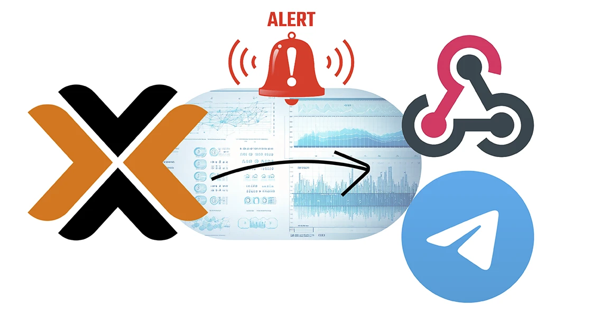
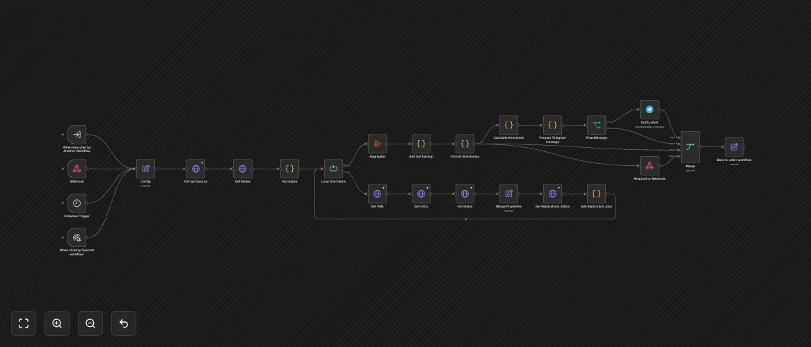

# Proxmox HomeLab status monitoring

### (aka realtime cluster status and smart alerts straight to Telegram, no dashboard required)

[](https://smarthometricks.sirri.it/use_cases/proxmox-homelab-status/)

I keep an eye on my whole Proxmox cluster without staring at dashboards: an n8n workflow reads the Proxmox API natively, walks nodes, VMs and LXC containers one by one, checks everything and messages me on Telegram if there are any issues.

<sub>***Date*:** *09/08/2026*<br/>***Tag:*** *Proxmox VE, n8n, Telegram Bot, REST API, Javascript, n8n-demo*</sub>

---



I already covered how I monitor Proxmox in [Proxmox resources monitoring](../proxmox-resources-monitoring/): back then I built a Node-RED flow that reads the Proxmox APIs and exposes every LXC and VM sensor to Home Assistant via MQTT Discovery, where I configured alarms and notifications.

It works, and it is still in place. But as my cluster grew I realized I wanted two things that setup was not giving me:

- **Alerts with zero noise.** I do not want to stare at a dashboard, and I definitely do not want the same "RAM at 91%" message every ten minutes. I want to be told once when a problem starts, and once when it recovers.
- **The data exposed to other systems.** My personal AI agent — or anything else — should be able to ask "what is running right now?" and get a realtime answer.

I could have extended the Node-RED flow to do that and get the data from MQTT, but I wanted to try something different, so I rebuilt the whole thing **natively in n8n**: it talks to the Proxmox API v2 directly, no Node-RED, no MQTT, no Home Assistant in the middle. Telegram straight from the workflow, plus an on-demand webhook that returns the full cluster snapshot. Same data source as before, completely different plumbing.
Since I was there, I also added the replication data (when I first wrote that trick, I didn't have a High Availability setup).
I also added **Proxmox Backup Server** as a data source: in [Proxmox and Synology Backup status](../proxmox-synology-backup/) I got that info from Gotify alerts, but now it is part of the snapshot via direct PBS API.

## How It Works

- Every **10 minutes** (or on demand, via webhook) the workflow reads the entire cluster: nodes, VMs, LXC containers, per-node status and replication jobs.
- It also asks **Proxmox Backup Server** for the last backup timestamp of each guest.
- It walks the nodes **one by one**, attaching to each VM and container its matching replication job definitions.
- Everything is **aggregated into a single snapshot**, with the raw timestamps also exposed in human-readable form, and returned to the caller (the webhook or the parent workflow).
- In parallel, the snapshot is checked against the **thresholds** you define in a single Config node; only **new or recovered** alerts produce a Telegram message, deduplicated between runs.

Let's go step by step.


## Step 1: What you need

Four things:

- **n8n**, running on a Proxmox LXC as usual:

  <details>
<summary>Set up n8n</summary>

**n8n** is an open-source workflow automation tool that allows you to connect various applications and services to automate repetitive tasks without manual intervention. It provides a visual interface where you can design workflows by linking different nodes that represent actions, triggers, or data processing steps. 

I installed it in a Proxmox LXC by using the helper script provided by [Community-Scripts](https://community-scripts.github.io/ProxmoxVE): this is a very useful Community with many script that will help you many times: if you like them, consider donating to support Angie, tteckster's wife - the founder and best supporter of the community - too early passed away.

</details>


- **A Proxmox API token** with read-only privileges. In the Proxmox web UI go to *Datacenter → Permissions → API Tokens → Add*, pick a user, give the token a name and a read-only role (`PVEAuditor` covers everything this workflow reads). Write down the secret — it is shown only once. The token is used as `PVEAPIToken=user@pam!tokenid=secret` in the `Authorization` header.

- **A Proxmox Backup Server** with an API token for the datastore you use. In the PBS web UI go to *Datastore → Permissions → API Tokens → Add* and grant `Datastore.Read` (or `DatastoreBackup`) on your datastore. It is used as `PBSAPIToken=user@realm!tokenid=secret` in the `Authorization` header of the **Get last backup** node.

- **A Telegram bot** to receive the alerts:

  <details>
<summary>Set up the Telegram bot</summary>

Creating a **Telegram Bot** is really simple:

- Open a chat with the user **@BotFather** and type `/newbot`
- Follow the instructions: you will be asked to define a **Bot name** and a **username**
- At the end, BotFather will show you the **HTTP API Token** (`[Telegram_Token]`): save it securely, we'll use it later.

</details>


  You will also need the **chat ID** where the alerts should be sent — that's the `[Chat_ID]` placeholder in the workflow.


## Step 2: Import the workflow

Here is the full workflow, exported as JSON. Grab it from the demo below and import it into your n8n instance with *Import from File* — the nodes will appear exactly as in the demo.



> **n8n Workflow: HomeLab Status**
>
> [Download workflow JSON](./proxmox-homelab-status-n8n-1.json) and import it into your n8n instance.


**Workflow Description**

1. **Triggers** — the flow can start four different ways, all converging on the Config node:
   - **Schedule Trigger** (every 10 minutes): the alerting loop;
   - **Webhook** (protected by a header credential): the on-demand API;
   - **When Executed by Another Workflow**: lets a parent workflow call it as a sub-workflow, for example in case of an AI Agent Tool (I will cover it in a future trick);
   - **When clicking 'Execute workflow'**: manual testing from the editor.
2. **Config** — a single Set node holding every knob of the flow: `ProxmoxNode`, `PBSNode`, `PBSDatastore`, `TelegramChatID` and all the thresholds. More on it in the next step.
3. **Get last backup** → `https://{PBSNode}/api2/json/admin/datastore/{PBSDatastore}/groups`: the Proxmox Backup Server datastore groups with their `last-backup` timestamp.
4. **Get Nodes** → `/cluster/config/nodes`: the list of nodes (names, node ids, quorum votes, ring0 addresses).
5. **Normalize** — a Code node that unwraps the `data` array returned by Proxmox, so each node becomes its own item.
6. **Loop Over Items** — iterates over the nodes; output 0 is the "done" branch that goes to **Aggregate**, output 1 is the per-node body:
   - **Get VMs** → `/nodes/{node}/qemu`
   - **Get LXCs** → `/nodes/{node}/lxc`
   - **Get status** → `/nodes/{node}/status` (memory, swap, load average, CPU info, rootfs)
   - **Merge Properties** — a Set node that combines the node metadata (name, nodeid, quorum votes, ring0 address) with the VMs/LXCs arrays and the node status object.
   - **Get Replications Status** → `/nodes/{node}/replication` (per-node replication state)
   - **Add Replication Jobs** — a Code node that attaches to each VM and container its matching replication job definitions, filtering the replication list by `guest == vmid`.
7. **Aggregate** — collects the per-node items into a single `cluster` array.
8. **Add last backup** — a Code node that looks up the PBS datastore groups by guest id and attaches a `last_backup` timestamp to every VM and container.
9. **Format timestamps** — a Code node that adds human-readable versions of the raw timestamps (`last_backup_h`, `last_sync_h`, `last_try_h`, `next_sync_h`, `uptime_t`) so both the API output and the Telegram alerts are easy to read.
10. Once the snapshot is ready, three branches leave from **Format timestamps**:
    - **Respond to Webhook** — returns the snapshot to the webhook caller;
    - the alerting chain: **Calculate thresholds → Prepare Telegram message → If hasMessage → Notify Alert**;
    - **Merge → Back to caller workflow** — recombines the branches and explicitly re-emits the formatted cluster, so when the flow is used as a sub-workflow the parent always receives the snapshot data instead of whatever node ran last (e.g. Telegram).

All the HTTP nodes that query Proxmox use the same **Header Auth** credential and have **Allow Unauthorized Certificates** enabled, because the Proxmox web server uses a self-signed certificate. They also continue on error, so a single unreachable node does not kill the whole run.


## Step 3: Configure it

Open the **Config** node and replace the placeholders:

| Assignment | Value | Meaning |
|---|---|---|
| `ProxmoxNode` | `[Proxmox_Node]` | host:port of any node of the cluster, e.g. `proxmox.lan:8006` |
| `PBSNode` | `[PBS_Node]` | host:port of your Proxmox Backup Server, e.g. `pbs.lan:8007` |
| `PBSDatastore` | `[PBS_Datastore]` | the name of the PBS datastore that stores your backups |
| `TelegramChatID` | `[Chat_ID]` | the Telegram chat or group that receives the alerts |

The other assignments are the thresholds that the alerting logic compares against:

| Assignment | Default | Meaning |
|---|---|---|
| `Thresholds.Host.RAMPct` | `90` | host RAM usage percentage |
| `Thresholds.Host.SwapPct` | `20` | host swap usage percentage |
| `Thresholds.Host.LoadPct` | `80` | host load average as percentage of cores |
| `Thresholds.Host.RootfsPct` | `85` | host root filesystem usage percentage |
| `Thresholds.Guest.RAMPct` | `85` | VM/LXC RAM usage percentage |
| `Thresholds.Guest.SwapPct` | `20` | VM/LXC swap usage percentage |
| `Thresholds.Guest.SwapMB` | `50` | VM/LXC swap, absolute MB (avoids false positives) |
| `Thresholds.Guest.DiskPct` | `85` | VM/LXC disk usage percentage |
| `Thresholds.Guest.CPUPct` | `80` | VM/LXC CPU usage percentage |
| `Thresholds.BackupDays` | `1` | max age of the last backup, in days |
| `Thresholds.FailedReplJobs` | `2` | consecutive failed replication attempts that trigger an alert |

Now create the credentials and assign them:

- **Proxmox** — a *Header Auth* credential with header name `Authorization` and value `PVEAPIToken=user@pam!tokenid=secret` (your token from Step 1). Assign it to all the `Get ...` nodes that query Proxmox. The nodes already have *Allow Unauthorized Certificates* enabled for the self-signed Proxmox certificate — if you prefer, install your CA instead.
- **PBS** — a second *Header Auth* credential, this time with value `PBSAPIToken=user@realm!tokenid=secret` (a token created on your Proxmox Backup Server with `DatastoreBackup` or `Datastore.Read` privileges). Assign it to **Get last backup**.
- **Telegram** — the bot credential from Step 1, already set on the **Notify Alert** node.

Finally, tune the schedule in the **Schedule Trigger**: 10 minutes suits me, every minute is also fine if you want to chase smaller things.


## Step 4: How the smart alerts work

The Code nodes are the heart of the flow.

**Calculate thresholds** reads the thresholds from Config and walks the whole snapshot:

- *Host*: RAM used/total above `Host.RAMPct`, swap above `Host.SwapPct`, 1-minute load average above `Host.LoadPct` percent of the cores, rootfs above `Host.RootfsPct`.
- *Guests* (only the ones `running`): RAM above `Guest.RAMPct`, swap above `Guest.SwapPct` **and** above `Guest.SwapMB` in absolute terms (the double check avoids alerting on a few MB of swap), disk above `Guest.DiskPct`, CPU above `Guest.CPUPct` (with a sanity guard that skips anomalous values like `cpu >= 100` right after a guest crash).
- *Replication* (running guests only): a replication job is flagged when the `error` field is present or when `fail_count` is at least `FailedReplJobs` — i.e. Proxmox itself has already retried the job a couple of times without success.
- *Backup* (running guests only): if `last_backup` is missing the alert says *never executed*; if it is older than `BackupDays` the alert reports how many hours ago it ran.

The output is a simple list of alerts:

```json
{
  "alerts": [
    "🔴 RAM host pve1: 91% used (18.2GB of 20GB)",
    "🔴 CPU ha: 87%",
    "🔴 REPLICA n8n (pve1/111) → viki: 3 failed attempts (111-0)",
    "🟠 BACKUP zigbee2mqtt (pve1/104): last 26h ago"
  ],
  "hasAlerts": true
}
```

*The alert strings in my workflow are actually in Italian — I've translated them here for readability.*

**Prepare Telegram message** is where the no-noise magic lives. It keeps the currently active alerts in the workflow's static data (`$getWorkflowStaticData("global")`), keyed by a *stable* identifier: the alert text with all numbers stripped (so "RAM host pve1: 91% used" and "RAM host pve1: 92% used" are the *same* alert). On every run it compares the current alerts with the active ones and builds a message only in two cases:

- **new** alerts → a "⚠️ *New alerts:*" section;
- **recovered** alerts → a "✅ *Recovered:*" section, with the emoji swapped from red to green.

If nothing changed, the message is `null`, the **If hasMessage** node stops the run and no Telegram message is sent. The result: you get pinged exactly once when a threshold is crossed and exactly once when it goes back under — not every ten minutes.


## Step 5: Feed it to your personal AI

The **When Executed by Another Workflow** trigger combined with the **Merge → Back to caller workflow** tail is what makes this workflow usable as a sub-workflow: however the run started, the parent always receives exactly the `cluster` snapshot as its output — not whatever node happened to run last (e.g. Telegram). So an AI Agent can expose it as a tool with an n8n **Execute Workflow** node and ask "what is running right now?" directly against the snapshot, with no API in the middle.

That's how my personal AI agent gets realtime homelab data (I will cover this part in a future trick). A snippet of what it receives:

```json
{
  "cluster": [
    {
      "name": "pve1",
      "nodeid": 1,
      "quorum_votes": 3,
      "ring0_addr": "192.168.1.10",
      "status": {
        "memory": { "used": 137438953472, "total": 343597383680 },
        "loadavg": [0.42, 0.38, 0.31],
        "rootfs": { "used": 114532461222, "total": 200000000000 }
      },
      "VMs": [
        {
          "vmid": 100,
          "name": "ha",
          "status": "running",
          "cpu": 0.05,
          "mem": 2147483648,
          "maxmem": 4294967296,
          "uptime": 86400,
          "uptime_t": "1g",
          "last_backup": 1786233612,
          "last_backup_h": "09/08/2026, 11:20",
          "replicationjobs": []
        }
      ],
      "LXcs": [
        {
          "vmid": 201,
          "name": "n8n",
          "status": "running",
          "cpu": 0.02,
          "mem": 1073741824,
          "maxmem": 2147483648,
          "uptime": 3456000,
          "uptime_t": "40g",
          "last_backup": 1786233999,
          "last_backup_h": "09/08/2026, 11:26",
          "replicationjobs": [
            {
              "id": "201-0",
              "target": "viki",
              "fail_count": 0,
              "last_sync": 1786230670,
              "last_sync_h": "09/08/2026, 10:31",
              "next_sync_h": "09/08/2026, 12:31"
            }
          ]
        }
      ]
    }
  ]
}
```

If you need to reach the snapshot from outside n8n, the same data is also exposed on demand through the **Webhook** node, protected by an n8n *Header Auth* credential (do not remove it if the webhook is reachable from the outside). In the downloadable JSON its path is set to the `[Webhook_ID]` placeholder: pick your own value after importing, otherwise n8n will generate one for you. Copy the full webhook URL — `https://{your-n8n}/webhook/{your-path}` — and any HTTP client can query it.

One note: the flow walks the nodes sequentially, so on a large cluster the answer takes a couple of seconds — perfectly fine for an on-demand query.


## Step 6: Enjoy

Now your homelab has a realtime status API and a Telegram watchdog that only bothers you when it actually matters.
If this trick has been useful to you, keep scrolling down and consider supporting me by clicking that beautiful blue button! 😅

---

Even if I'll try to keep all this pages updated, products change over time, technologies evolve... so some use cases may no longer be necessary, some syntax may change, some technologies or products may no longer be available.

Remember to make a backup before modifying configuration files and consult the official documentation if any concept is unclear or unfamiliar.

*Use this guide under your own responsibility.*

If this pages have been helpful, you can

<a href="https://www.buymeacoffee.com/moreno.sirri" target="_blank"></a>

<sub>This work and all the contents of this website are licensed under a **Creative Commons Attribution-NonCommercial-ShareAlike 4.0 International License (CC BY-NC-SA 4.0)**.
You can distribute, remix, adapt, and build upon the material in any medium or format, <u>for noncommercial purposes only by giving credit to the creator</u>. Modified or adapted material must be licensed under identical terms.
You can find the full license terms [here](https://creativecommons.org/licenses/by-nc-sa/4.0/?ref=chooser-v1)</sub>
