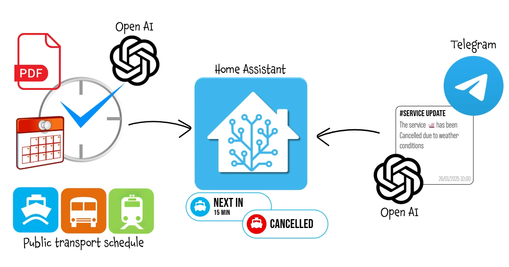
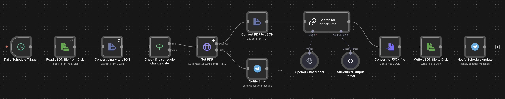
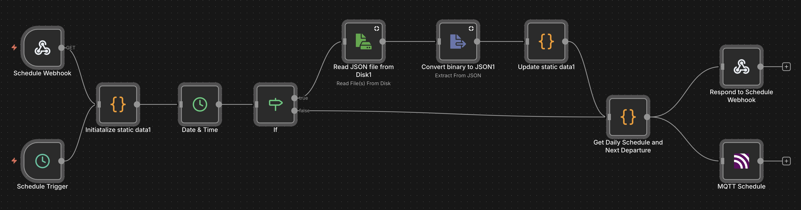
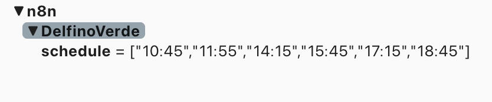
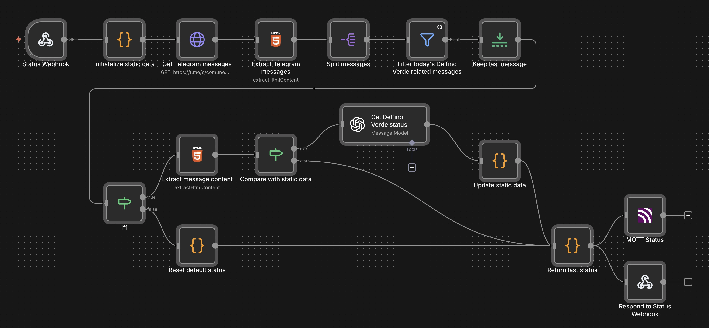
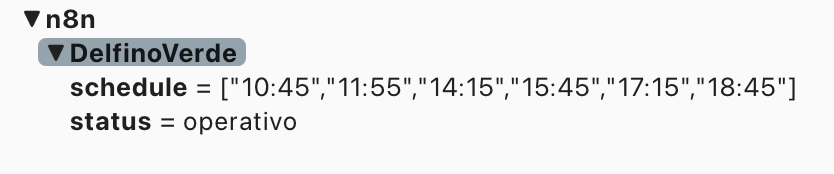

With this workflow, every morning when I need to go to work, a widget on my smart home dashboard shows the waiting time for the next ferry departure, obtained from the official PDF schedule on the operator's website. Additionally, it monitors the municipality's official Telegram channel for any service interruptions due to weather conditions and notifies me both on the dashboard and via the voice assistant.<br/>
The entire process is optimized to minimize the use of AI and REST API calls.<br/>
It uses `n8n`, `Open AI`, `Home Assistant`, `Telegram`, `MQTT`, `REST API`, `Jinja2` and a bit of `javascript` programming.


# Public Transport Next Departure Time and Status

On weekdays when I work on-site instead of remotely, I use home automation to get updated travel times for reaching work, whether by car or scooter, or using public transport (a ferry... Exactly: going to work by boat is the best way to start the day!). And this information, managed by **Home Assistant**, is displayed on a dynamic dashboard available in key areas of the house and accessible via voice assistants.



Getting the travel times for the car is very straightforward using, for example, the [Waze Travel Time integration](https://www.home-assistant.io/integrations/waze_travel_time/) in Home Assistant... It’s so simple that it’s not worth covering here. For public transport, however, there are several ways to retrieve the daily schedule or directly the departure time of the next public transport:

   - #### Specific API
This is the suggested method when the public transport operator directly provides its own set of APIs, but I won't cover it here because it is strictly tied to the specific case. Therefore, the API documentation of the transport operator must be consulted, and a **RESTful sensor** will likely need to be configured according to the official [Home Assistant guide](https://www.home-assistant.io/integrations/sensor.rest/).
   - #### Google Distance Matrix API
This method is perhaps the simplest, most effective, and suitable for almost any purpose, as most public transport is now recognized by Google Maps. 
It is also discussed in great detail in the documentation for the [Google Maps Travel Time integration](https://www.home-assistant.io/integrations/google_travel_time/), including the guide to obtain the API key from Google, so I don't think a further in-depth study is needed.
The guide also includes tips on how to optimize the use of the sensor without exceeding the free API usage quota and incurring charges.
   - #### Webpage scraping
You can use this method If Google Maps doesn't cover your local public transport (for example the ferry I'm using) but it has the drawback that you need to work with **HTML** and **CSS**, and it is especially dependent on the structure of the page. Therefore, if the page changes in the future, the sensor will need to be reconfigured.
   - #### Webpage/PDF scraping with AI
This is the method I will cover here... And not only that! I’ve also included real-time updates on the status of departures and services, as well as optimizations to minimize the use of APIs and AI to what is strictly necessary (resulting in cost reduction).
So let's get started!


!!! In any case, even if it were possible to directly obtain the departure time of the next transport, for services with frequent departure times but schedules that do not change often, it might still make sense to retrieve the daily schedule only once a day. This approach would avoid excessive use of APIs and the risk of hitting limits or paying for exceeding free usage quotas. Using this sensor, you can then access this static information to determine the next departure time.


<br/><br/>

## How It Works:
The workflow is divided in three parts, in order to optimize all the needed resources and minimize the use of **Open AI API** calls:

#### Part 1: Schedule Update
The first part ensures that the available schedule is always up-to-date, notifying of any errors regarding the unavailability of the source document if necessary.

#### Part 2: Current Day Departures and Next Departure
The second part provides the daily schedule and calculates the remaining time until the next departure.

#### Part 3: Service status update
The third part monitors the municipality's Telegram channel for real-time notifications of any service cancellations due to adverse weather and sea conditions.


<br/><br/>

# Step 1: Install and configure n8n
For this process, again, I used **n8n**: n8n is an open-source workflow automation tool that allows you to connect various applications and services to automate repetitive tasks without manual intervention. It provides a visual interface where you can design workflows by linking different nodes that represent actions, triggers, or data processing steps. 

I installed it in a Proxmox LXC by using the helper script provided by <a href="https://community-scripts.github.io/ProxmoxVE">Community-Scripts</a>: this is a very useful Community with many script that will help you many times: if you like them, consider donating to support Angie, tteckster's wife - the founder and best supporter of the community - too early passed away.

<br/><br/>

# Step 2: Set-Up Open AI API
We will use a **GPT LLM** to retrieve all those pieces of information that are unstructured and in a variable format.
I used **Open AI GPT models** but you can choose other AI LLMs: regardless of which LLM you use, to use it from another software, like n8n, it is necessary to use the exposed APIs and to do so, an authorised token must be defined. These are the steps to create it with OpenAI:

### **1. Create an OpenAI Account**
- **Sign Up or Log In**: If you don't already have an OpenAI account, go to [OpenAI's website](https://platform.openai.com/signup) and sign up. If you already have an account, simply log in at [OpenAI Login](https://platform.openai.com/login).

### **2. Access the API Dashboard**
- **Go to the API section**: After logging in, navigate to the OpenAI API dashboard. You can find this by going to [OpenAI Platform Dashboard](https://platform.openai.com/account/api-keys).
   
### **3. Generate an API Key**
- **Create a New API Key**: 
   - Once you're in the API keys section, click on **“Create new secret key”** or **“Create new API key”**.
   - OpenAI will generate a new API key for you. This key is the API token you'll use to authenticate requests to the OpenAI API.
- **Copy the Key**: After the key is generated, **copy it immediately** because it will not be shown again for security reasons.

### **4. Store the API Key Securely**
   - **Secure Storage**: Store the API key in a safe place like in a password manager.

### **5. Monitor Usage and Billing**
1. **Monitor API Usage**: OpenAI provides detailed usage analytics on your dashboard. You can monitor the number of tokens you’ve used and manage your spending.
2. **Manage Quotas**: If needed, you can set limits or alerts for your API usage to avoid unexpected charges.

<br/><br/>


# Step 3: Create Telegram Bot
You need this only inf you want to use Telegram as notification service for both error and update of the schedule; this is not mandatory since you can use the notification service that you prefer... like for example **Ntfy** or **Gotify**. You can also decide to use only **Home Assistant**: in this case you can replace the Telegram message with a **MQTT** message with the error description, then define an Home Assistant sensor that listen to that topic and create an Home Assistant automation to send a notification with the **Companion App** if an error occours. You will find later an example on how to publish a MQTT message with n8n and how to define a MQTT sensor in Home Assistant.
<br/>

Creating a **Telegram Bot** is really really simple:
- Open a chat with the user **@BotFather** and type `/newbot`
- Follow the instructions: you will be asked to define a **Bot name** and **username**
- At the end you will see the **HTTP API Token** (`[Telegram_Token]`): save it securely and we'll use it later to configure the Telegram account for the workflow

<br/><br/>


# Step 4: Schedule Update Workflow
The schedule for my ferry is provided in a PDF on the operator's website. Since the schedule doesn’t change very often, it doesn’t make sense to frequently query the site, repeatedly download the same file, and rely on AI to extract the same information over and over, with the real risk of quickly exceeding the free usage quota and increasing costs. Therefore, the first part of the workflow focuses on optimizing the schedule generation.



Import the flow into n8n using the [Schedule Update](schedule-update.json) JSON provided.

### Step-by-step breakdown:


1. **Daily Schedule Trigger**: 
   - Executes the workflow daily at 4:00 AM.

2. **Retrieve saved Schedule**
   - `Read JSON File from Disk` Reads a previously saved JSON file (`/nas/delfinoverde.json`) containing the last known ferry schedule. I saved it in ashared folder but It's not mandatory since the file is used only by this set of workflows. For the first time, you can provide and empty file with this JSON content:
   ```json
   [{
      "output": {
         "feriali":[],
         "festivi":[],
         "data cambio orario":"2025-01-10"
         }
   }]
   ```
      - `feriali` means "working days" while `festivi` "holidays" and "non-working days"
      - `data cambio orario` is the date of the schedule change (the first time set it to current day in order to trigger the update), in this case between the summer and winter timetable. If you have a single timetable or a different schedule management, you can modify this part (and the ones that are related to this later) according to your needs.
  -  `Convert Binary to JSON` Converts the binary data from the JSON file into a usable JSON format for comparison or validation.

3. **Check If Schedule Change Date**
   - Compares the current date with the "schedule change date" (`data cambio orario`) from the existing data and if true proceeds with downloading the updated schedule

4. **Get Updated Schedule Download the PDF Schedule, Convert PDF to JSON**
   - `Get PDF` downloads the ferry schedule in PDF format from a specified URL while `Convert PDF to JSON` converts the binary data into a usable JSON format for further processing. 
   - In my case this is the direct link to Amazon AWS S3 Share but I don’t have any guarantee that it will always remain the same in the future. The best approach would have been to start from the operator’s website and obtain the PDF link from there (through manual scraping or AI-based scraping, as already done, for example, in the **AI Bill Assistant** trick). Unfortunately, in my case, the website is not “scrapable,” so I had to use the direct link and implement a Telegram notification system for potential errors, allowing me to intervene and retrieve the correct link if necessary. However, I recommend the website approach whenever possible: you can use the example from the [AI Bill Assistant](../ai-bill-assistant/default.md) trick as a reference.
  
5. **Extract Departures Using OpenAI**
   - `Search for departures` uses an **OpenAI GPT-4O-MINI model** to process the text from the PDF and extract:
     - Departures from Muggia, the city where I Live, categorized by working and non-working days.
     - Arrival times in Trieste.
     - The next schedule change date (if specified).
       Here is the used prompt:
    ``` 
    Extract from {{ $json.text }} all the departing from Muggia, 
    dividing by working and no working days and indicating also the arrival time to Trieste. 
    Return also, if specified, the next date when the schedule will change in ISO format
    ``` 
   - `Structured Output Parser` parses the structured output from the OpenAI model to ensure the results are in a proper JSON format, as defined by the schema:
  ```json
  {
    "feriali": [{ "Partenza": "", "Arrivo": "" }],
    "festivi": [{ "Partenza": "", "Arrivo": "" }],
    "data cambio orario": ""
  }
  ```

1. **Convert and Save to JSON File**
   - `Convert to JSON file`: Converts the structured data into a JSON file format.
   - `Write JSON file to Disk`: Saves the updated schedule to `/nas/delfinoverde.json`.


7. **Schedule Update Notification and Error Handling**
   - `Notify Schedule update` sends a Telegram message notifying users that the schedule has been updated.
   - `Notify Error` sends a Telegram message with the description of the error occoured during the PDF downloading or processing (for example in case of missing file)
   - `[Chat_ID]` is the ID of the chat with your Telegram Bot (or a group where the Bot is an administrator): you can retrieve it by adding a Telegram Trigger and posting a test message.

At the end, if everything worked, you will have a `/nas/delfinoverde.json` like the following one... and so you're ready for the next part.
```json
[
    {
        "output": {
            "feriali":[
                {"Partenza":"7:15","Arrivo":"7:45"},
                {"Partenza":"8:25","Arrivo":"8:55"},
                {"Partenza":"9:35","Arrivo":"10:05"},
                {"Partenza":"10:45","Arrivo":"11:15"},
                {"Partenza":"11:55","Arrivo":"12:25"},
                {"Partenza":"14:35","Arrivo":"15:05"},
                {"Partenza":"15:45","Arrivo":"16:15"},
                {"Partenza":"16:55","Arrivo":"17:25"},
                {"Partenza":"18:05","Arrivo":"18:35"},
                {"Partenza":"20:05","Arrivo":"20:35"}
            ],
            "festivi":[
                {"Partenza":"10:45","Arrivo":"11:15"},
                {"Partenza":"11:55","Arrivo":"12:25"},
                {"Partenza":"14:15","Arrivo":"14:45"},
                {"Partenza":"15:45","Arrivo":"16:15"},
                {"Partenza":"17:15","Arrivo":"17:45"},
                {"Partenza":"18:45","Arrivo":"19:15"}
            ],
            "data cambio orario":"2025-03-12"}
    }
]
  ```


<br/><br/>

# Step 5: Current Day Departures and Next Departure
Now that we have a JSON with the current schedule, it would have been enough to expose an API that reads the file and returns the time of the next departure. The following workflow does exactly that, but with two particular considerations:
1. There is no need of re-reading the file every time since it will not change throughout the day. Therefore, the first time it is read, it is saved in a local cache, ensuring data persistence for subsequent calls.
2. RESTful sensors defined in Home Assistant are obviously of the PULL type, meaning they query the API at a defined scan interval to obtain the desired value. Since we are not dealing with schedules that change every minute, setting a very low scan interval would not have made sense. On the other hand, increasing it too much would result in a loss of precision. For this reason, I chose to publish the entire daily schedule to an MQTT topic just once and then let the sensor defined in Home Assistant retrieve that value and calculate the next departure time on demand, thus reducing the load on n8n.


Import the flow into n8n using the [Next Schedule and Departures](next-schedule-departures.json) JSON provided.

### Key Components and Workflow Description

1. **Schedule Trigger, Schedule Webhook**
   - Executes the workflow at a specified time daily (4:10 AM): you have obviously to choose a time slot that is before the first departure.
   - This flows is also exposed by Webhook if you prefer to use the API instead of storing the daily schedule in a specific sensor.

2. **Static Data Initialization**
   - Initializes or retrieves global static data for:
     - `jsonSchedule`: the ferry schedule.
     - `lastExecution`: the timestamp of the last workflow execution.
   - Global static data are needed to retain values between multiple run of the same workflow and so create a sort of local cache for n8n.

3. **Time-Based Logic (`Date & Time` and `If` Nodes)**
   - Calculates the time difference between the current time and `lastExecution`.
   - Evaluates conditions to decide whether to fetch and update the ferry schedule:
     - If the schedule is empty.
     - If more than 4 hours have passed since the last execution: this second condition is useful to limit API calls if you want to return Daily Schedule by API instead of publish on MQTT. But If you use this WebHook also for Next Departure, remove this condition.

4. **Update Static Data**
   - If the `If` node returns true, meaniong that cached data are empty or expired, this part of the flow:
     - Reads the ferry schedule from a JSON file stored on disk.
     - Converts the binary data into JSON for further processing.
     - Updates the global static data with the latest schedule and timestamp.

5. **Determine Next Departure (`Get Daily Schedule and Next Departure`)**
   - This part uses a little javascript since in my opinion it was the most simple and fast way to implement the logic to determine the right daily schedule and next departure time based on the current day and time, considering whether it's a working day, a holiday, or Sunday. Here’s a detailed breakdown:
  
  ```js
  function isWorkingDay() {
    const now = new Date();

    // Check if today is Sunday
    if (now.getDay() === 0) {
        return false;
    }

    // Define national and local holidays (fixed dates)
    const holidays = [
        '01-01', 
        '01-06', 
        '04-25', 
        '05-01', 
        '06-02', 
        '08-15', 
        '11-01',
        '11-03',
        '12-08', 
        '12-25', 
        '12-26'
    ];

    // Check for Easter Monday (variable date)
    const year = now.getFullYear();
    const easterMonday = getEasterMonday(year);

    // Format today's date as MM-DD
    const today = now.toISOString().slice(5, 10);

    // Check if today is a fixed holiday or Easter Monday
    if (holidays.includes(today) || (easterMonday.toISOString().slice(5, 10) === today)) {
        return false;
    }

    return true;
   }

   // Helper function to calculate Easter Monday
   function getEasterMonday(year) {
      const a = year % 19;
      const b = Math.floor(year / 100);
      const c = year % 100;
      const d = Math.floor(b / 4);
      const e = b % 4;
      const f = Math.floor((b + 8) / 25);
      const g = Math.floor((b - f + 1) / 3);
      const h = (19 * a + b - d - g + 15) % 30;
      const i = Math.floor(c / 4);
      const k = c % 4;
      const l = (32 + 2 * e + 2 * i - h - k) % 7;
      const m = Math.floor((a + 11 * h + 22 * l) / 451);
      const month = Math.floor((h + l - 7 * m + 114) / 31);
      const day = ((h + l - 7 * m + 114) % 31) + 1;

      // Return Easter Monday date
      return new Date(year, month - 1, day + 1);
   }

   const workflowStaticData = $getWorkflowStaticData('global');

   const currentSchedule = isWorkingDay() ? workflowStaticData.jsonSchedule.feriali : workflowStaticData.jsonSchedule.festivi;

   const now = new Date();
   const currentTimeInMinutes = now.getHours() * 60 + now.getMinutes();

   // Find the next boat
   const nextBoat = currentSchedule.find(boat => {
      const [hours, minutes] = boat.Partenza.split(":").map(Number);
      const departureTimeInMinutes = hours * 60 + minutes;
      return departureTimeInMinutes > currentTimeInMinutes;
   });

   var next;
   if (!nextBoat) {
      next = "Nessuno";
   }
   else {
      const [nextBoatHours, nextBoatMinutes] = nextBoat.Partenza.split(":").map(Number);
      const nextBoatTimeInMinutes = nextBoatHours * 60 + nextBoatMinutes;
      const minutesToNextBoat = nextBoatTimeInMinutes - currentTimeInMinutes;
      next = minutesToNextBoat;
   }

   return { "Next": {"Prossimo Delfino Verde": next },
            "Schedule" : currentSchedule.map(schedule => schedule.Partenza) }
  ```


      - **`isWorkingDay` Function** determines whether today is a working day.
        - Uses `getDay()` to see if the current day is Sunday (`0`). If so, returns `false`.
        - `holidays` contains the list of national and local holidays in `MM-DD` format, such as `01-01` (New Year's Day) and `12-25` (Christmas).
        - Calculates Easter Monday for the current year using the `getEasterMonday` helper function.
        - If today matches any holiday or Easter Monday, it returns `false`. Otherwise, it returns `true`.

      - **`getEasterMonday` Helper Function** calculates the date of Easter Monday for a given year, by implementing the "Computus" algorithm to determine the date of Easter and the adding one day to the calculated Easter date to find Easter Monday.

      - **Main Logic**:
        - Uses `isWorkingDay` to decide whether to use the `feriali` (working days) or `festivi` (holidays/weekends) schedule from `workflowStaticData.jsonSchedule`.
        - Converts the current hour and minute into total minutes for easier comparisons.
        - Searches the schedule (`currentSchedule`) for the first departure time (`Partenza`) later than the current time.
        - If no boats are left for the day, sets the result to `"Nessuno"`. Otherwise, calculates the time difference (in minutes) between the current time and the next departure.
        - Returns an object with two properties:
          - **`Next`**: Contains the time (in minutes) until the next departure or `"Nessuno"` (no one) if no more departures are available.
          - **`Schedule`**: An array of all departure times (`Partenza`) for the selected schedule.
      - **Example Output**
        - If today is a working day and the current time is 14:30:
        ```json
        {
           "Next": {"Prossimo Delfino Verde": 45},
           "Schedule": ["15:15", "16:00", "16:45", "17:30"]
        }
        ```
        - If today is a holiday and there are no departures left:
        ```json
        {
           "Next": {"Prossimo Delfino Verde": "Nessuno"},
           "Schedule": ["10:00", "12:00", "14:00", "16:00"]
        }
        ```

1. **Respond to Webhook**
   - Returns the next ferry departure time as a JSON response to external webhook requests.

2. **MQTT Integration**
   - Publishes the full daily schedule (for example `["10:45","11:55","14:15","15:45","17:15","18:45"]`) to an MQTT topic (`n8n/DelfinoVerde/schedule`), making the data available to other systems or devices.



<br/><br/>


# Step 6: Status Update on demand
This in my opinion is the most interesting part: what happens if the service is canceled due to adverse weather and sea conditions? 
Another sensor monitors the service status by listening to the municipality's Telegram channel to detect any related announcements.
The peculiarities of this part are as follows:  

- The Telegram channel of the municipality does not only provide information about the status of the maritime transport line but also a wide range of public utility information. Therefore, the first goal was to isolate only the messages I was interested in.  
- Telegram Bots cannot subscribe to public channels, making it impossible to use the publication of a new message in the channel as a trigger for automation. Thus, I had to adopt a different approach: a scheduled execution that uses the web version of the Telegram channel to retrieve all the latest messages at regular intervals.
- Considering the potentially high number of invocations and the fact that I leveraged AI to correctly interpret the messages, I chose to cache as much as possible to avoid unnecessary and costly calls to OpenAI's APIs.
- For the same reason, I adopted a mixed scraping technique: classic HTML scraping and keyword-based filtering to identify relevant messages and to isolate the various parts (header, date and time, body of the message) and limited the use of AI exclusively to text comprehension.

Here is the workflow:



Import the flow into n8n using the [Update On Demand](update-on-demand.json) JSON provided.

### Workflow Steps:

1. **Initialize Static Data**  
   - The workflow initializes global static data with a default message and status. This ensures previous values are stored and accessible across executions.

2. **Retrieve Telegram Messages**  
   - The `Get Telegram Messages` node fetches the content of the Telegram channel (`https://t.me/s/comunemuggia`) using an HTTP request to retrieve the HTML of the channel's web page.

3. **Extract Relevant HTML Content**  
   - The `Extract Telegram Messages` node parses the HTML to extract all messages from the channel. It uses a CSS selector to target Telegram messages (`div.tgme_widget_message_wrap`).

4. **Split Messages**  
   - The `Split Messages` node processes the extracted messages one by one, allowing further operations on individual messages.

5. **Filter Relevant Messages**  
   - The `Filter Today's Delfino Verde Related Messages` node isolates messages that:
     - Contain the current date.
     - Include the keyword "Delfino Verde."
   - This ensures only relevant messages from today about the maritime service are processed.

6. **Keep the Latest Message**  
   - The `Keep Last Message` node ensures that only the most recent relevant message is kept for further analysis.

7. **Analyze Message Content**  
   - The `Extract Message Content` node extracts the text body of the relevant message using a specific CSS selector targeting the message text.

8. **Compare with Static Data**  
   - The workflow checks if the latest message differs from the last processed message stored in static data. If the message has changed or a manual refresh (`ForceRefresh`) is requested, it proceeds with further processing (useful for debugging purposes).

9. **Determine service Status**  
   - The `Get Delfino Verde Status` node uses OpenAI's GPT model to analyze the message text and determine whether the "Delfino Verde" service is operational. The output is a boolean (`true` for operational, `false` otherwise). Here is the prompt used:
   ```
   Analizzando il testo "{{ $json.text }}" determina se il servizio di navigazione 
   chiamato "Delfino Verde" è operativo o meno e restituisci 'operativo': true o false
   ```
   - I usually use prompts written in English, as they are more immediately interpretable for the LLM and cost fewer tokens. However, this time, I found it more effective and obtained better results from Italian, probably because of the association of the terms and their correct interpretation.

10.  **Update Static Data**  
    - The `Update Static Data` node updates the global static data with the latest message and its determined status.

11.  **Handle Default Status**  
    - If no new relevant messages are found, the `Reset Default Status` node ensures the status is reset to the default value (`operativo`).

12.  **Output Status**  
    - Depending on the flow, the determined status is output in multiple ways:
      - **MQTT Status Node**: Publishes the status (`operativo` or `soppresso`) to an MQTT topic for integration with other systems. Check `retain` flag in order to allow the broker to retain the last message in case a subscriber connects after the publication or after a broker restart).
      - **Respond to Status Webhook**: Responds to an incoming webhook request with the current status in JSON format.




<br/><br/>


# Step 7: Define sensors in Home Assistant
We need three sensors (although I later added a fourth one that combines two of them to simplify and make the dashboard display more readable):
   1. The daily schedule that was published on the MQTT topic in Step 5.
   2. The service status, published in Step 6, also via MQTT.  
   3. The time of the next departure based on the value of the first sensor (without having to call the API each time).  
   4. (optional) Combines the next departure and the status into a single sensor to make it easier to read on a dashboard.
   


### 1-2. Daily Schedule and Service Status

- **Sensors definition**:
   ```yaml
   mqtt:
      sensor:
        - name: "Delfino Verde Schedule"
          state_topic: "n8n/DelfinoVerde/schedule"
          force_update: true
        - name: "Delfino Verde Status"
          state_topic: "n8n/DelfinoVerde/status"
          force_update: true
   ```
   - Adjust the MQTT topic according to your specifications.
   - `force_update: true` sends update events even if the value hasn’t changed

- **RESTful command** for on-demand updates:
  ```yaml
   rest_command:
      fetch_delfinoverde_schedule:
         url: "[WebHook_URL]"
         method: GET
         headers:
            Content-Type: application/json
         timeout: 10
      fetch_delfinoverde_status:
         url: "[WebHook_URL]"
         method: GET
         headers:
            Content-Type: application/json
         timeout: 10
   ```
   - Replace `[WebHook_URL]` according to your node specification (each WebHook has its own URL).
   - Even if we enabled the retain for that message, It could be useful to force the refresh, so I defined an optional RESTful command `fetch_delfinoverde_schedule` to trigger a new pubblication by calling the n8n exposed WebHook. You can use it also if you want to keep the update logic only in one place and so replace the Schedule Trigger of Step 5 with an Automation in Home Assistant.
  
- **Automation** for constant on-demand status updates:
  ```yaml
   automation:
      - id: Check_DelfinoVerde_Status
        alias: "Check the status of the 'Delfino Verde' service"
        description: ""
        triggers:
          - trigger: time_pattern
            minutes: "/1"
        condition:
          - condition: state
            entity_id: binary_sensor.ready_to_go_to_work
            state: "on"
        actions:
          - action: rest_command.fetch_delfinoverde_status
            data: {}
        mode: single
   ```
  - This automation call the `fetch_delfinoverde_status` command every minute only if a binary sensor `binary_sensor.ready_to_go_to_work` in `on`. 
  - This sensor determines—based on a series of parameters such as the day of the week, time of day, whether I am working remotely or on vacation—whether it is relevant to monitor the ferry status or not, in order to avoid unnecessary calls, especially to the OpenAI APIs.
  
   
### 3. Next Departure sensor
- For this sensor, I had to translate the simple JavaScript function implemented in the n8n node into a **Jinja template**. Since It's a bit more complex than previous ones and I spent some time on it - especially in converting to date and time formats usable by typed comparison functions - I wrote a dedicated article, which you can find [here](../../_ha-sensors/ha-next-departure-sensor/).
- The `sensor.delfino_verde_schedule` you will find in the first line of the state template is the firse sensor we defined just above.

### 4. Combined Next Departure and Status sensor
- This sensor provides a human-readable version of two other sensors. It works as follows:
  - If the status is "suppressed," it returns that information.
  - If the service is active, it returns the next time interval in minutes for the next departure.
  - If the sensor returns -1, it indicates "none" (`nessuno`)
  
  Essentially, it presents a simplified, easily understandable output based on the current service status and departure times, useful to be printed on a dashboard.

   ```yaml
   template:
     - sensor:
       - unique_id: next_delfino_verde_hrv
         name: "Prossimo Delfino Verde HRV"
         state: >
            
            
            
               {{ status }}
            
               nessuno
            
               {{ nextmin }} min
            
   ```


<br/><br/>

# Step 8: Get notified by the voice assistant if the service has been suppressed
This is an optional but very useful step, as the sooner you receive the notification that the transport service has been canceled, the sooner you can decide on a 'Plan B'. In my case, the most immediate way to receive a notification when I’m at home is through the voice assistant. I use Alexa, and it can be configured as a media player, through this [Alexa Media Player Integration](https://github.com/alandtse/alexa_media_player), to which I refer for installation and setup.

Here is the automation I use:

```yaml
automation:
   - alias: DelfinoVerde Suspended Notification
     id: cca47492-3257-470f-89af-debf2569b6be
     triggers:
       - trigger: state
         entity_id: sensor.delfino_verde_status
         to: soppresso
     condition:
       - condition: state
         entity_id: binary_sensor.at_home
         state: "on"
     actions:
       - action: notify.alexa_media
         data:
           message: "Attenzione: Delfino Verde soppresso"
           target:
             - media_player.echo_dot_cucina
             - media_player.echo_dot_bagno
             - media_player.echo_dot_ingresso
           data:
             type: tts
```
As you can see, it uses a condition to execute the automation only if I am at home, and in that case, it plays the warning message "service canceled" through the Echo Dot devices in the main rooms simultaneously.
<br/><br/>


# Step 9: Enjoy
Even if I'll try to keep all this pages updated, products change over time, technologies evolve... so some use cases may no longer be necessary, some syntax may change, some technologies or products may no longer be available. Remember to make a backup before modifying configuration files and consult the official documentation if any concept is unclear or unfamiliar. <br/>
*Use this guide under your own responsibility.*<br/>

<div class="myWrapper" style="text-align: center;" markdown="1">
If this trick has been helpful, you can  <br/>

<a href="https://www.buymeacoffee.com/moreno.sirri" target="_blank"></a>
</div>

<br/>
<sub>This work and all the contents of this website are licensed under a **Creative Commons Attribution-NonCommercial-ShareAlike 4.0 International License (CC BY-NC-SA 4.0)**.
You can distribute, remix, adapt, and build upon the material in any medium or format, <u>for noncommercial purposes only by giving credit to the creator</u>. Modified or adapted material must be licensed under identical terms.
You can find the full license terms [here](https://creativecommons.org/licenses/by-nc-sa/4.0/?ref=chooser-v1)</sub>
