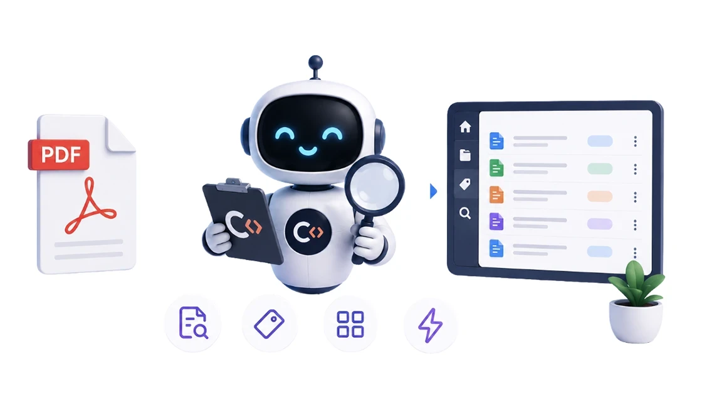

# Scan and analyze documents with Claude Code

A workshop service record, an inspection, the annual vehicle tax, an occasional receipt or contract — sporadic documents with no fixed layout never justified a dedicated n8n workflow. So I built a Claude Code skill instead: it scans and analyzes any document on macOS (native text layer first, Vision OCR for scans), the agent turns it into clean records validated against JSON schemas — one document can even become many records — and saves them, idempotently, to MongoDB. This is the deep dive on that skill.

<sub>***Date*:** *14/08/2026*<br/>***Tag:*** *Claude AI, OCR, Mongo DB, macOS, Vision, Swift*</sub>

---



If you read the [AI Bill Assistant](../ai-bill-assistant/) article, you know I love automating the documents that arrive *regularly*. Bills land in my inbox every month and an n8n workflow extracts and archives them without me lifting a finger.

But there's a whole second family of documents that doesn't work like that: a workshop service record, the annual vehicle tax, a vehicle inspection, insurance policy, an occasional receipt or contract, ... These arrive **sporadically**, from different channels, in layouts that change every time, so building an n8n workflow for each of them would be overkill.

This article is the complementary part of the AI Bill Assistant trick: a **Claude Code skill** that turns a PDF into clean, structured data. It's the "on demand" source of that architecture, the one that feeds everything that doesn't arrive regularly by email.

How these two families of documents — the regular and the sporadic — converge into a single RAG knowledge base is the subject of another article: the [Document RAG knowledge base](../bills-documents-rag-knowledge-base/) 😉


# How It Works

At a high level, the skill is a chain of four small, replaceable pieces, each with a single job:

- **extract** — get the text out of the PDF: the native text layer when the PDF has one (fast), **Vision OCR** on macOS when it's a scan;
- **classify** — understand *what* the document is, so you can read it correctly (a vehicle tax receipt is not a workshop invoice, even if both have numbers and amounts);
- **structure** — turn the text lines into a record with typed fields, validated against a JSON schema;
- **persist** — save the record to **MongoDB**, the canonical archive, with an idempotent upsert so re-running never duplicates anything.

The scripts do the first and the last piece; the two middle ones — understanding *what* a document is and *what its fields mean* — are deliberately left to the **agent**. That's the design bet of this skill: the mechanical work (OCR, exact candidates, validation, dedup) is scripted, while the judgement (which amount is the total, whether this receipt is worth keeping) is done by the reasoning model in the loop.

Everything is orchestrated by an agent session (Claude Code or its open alternative, opencode). I hand it a PDF — or a folder full of them — and say something like *"extract this workshop service record"*. The skill knows the pipeline; the agent does the reasoning; the scripts do the mechanical work.

The result is a record that lives in MongoDB and can later travel into the [Document RAG knowledge base](../bills-documents-rag-knowledge-base/) trick. The record is typed, validated, and idempotent — and if the document contains several meaningful lines, the agent produces **one record per meaningful line**.


# Step 1: Install the CLI and the skill

**Install the CLI.** The skill runs on [Claude Code](https://docs.anthropic.com/en/docs/claude-code/overview), or on [opencode](https://opencode.ai), its open alternative (and my personal preference). Claude Code is available as a native install on macOS; for opencode, follow the installation instructions on its website. Either way, at the end you should be able to start an agent session from a terminal.

**Install the skill.** A Claude Code skill is just a folder with instructions and scripts. Download [document-extract-skill.zip](/./document-extract-skill.zip), unzip it, and place the `document-extract` folder into your skills directory (`~/.claude/skills/`). Restart the agent session so it picks up the skill.

**Configure it.** Copy `.env.example` to `.env` inside the skill folder and fill in the only value you need: the **MongoDB connection string**. That's it — the extraction, classification and OCR layers are macOS-native and have no external dependencies to install.

> [!NOTE]
> The skill is designed to run on macOS because it uses Apple's **PDFKit** and **Vision** frameworks for the extraction layer. The scripts are written in Swift and Python, and the only requirement is having a Mac with macOS 13+ and Python 3.11+ installed. If you want to run it on Linux or Windows, you can replace the extraction layer with any other PDF-to-text and OCR solution that produces the same output format (lines + candidates).  
> If you don't want to store the records in MongoDB, you can replace the `ingest_to_mongo.py` script with any other persistence layer that accepts JSON and supports idempotent upserts, or simply teach the skill to save the records to your filesystem as JSON files.

Here is the anatomy of what you just installed — the map of the pipeline you're about to read:

```text
document-extract/
├── SKILL.md                  # the instructions the agent reads
├── .env.example              # MongoDB connection string
├── scripts/
│   ├── pdf_to_text.swift     # PDF text layer (PDFKit)
│   ├── pdf_to_pages.swift    # PDF pages → images
│   ├── ocr_vision.swift      # OCR on images (Vision)
│   ├── extractor.py          # lines + candidate primitives
│   ├── ingest_to_mongo.py    # validate, route, write
│   ├── ingest_batch.py       # batch: one folder at a time
│   └── ingest_groups.py      # batch: date-grouped folders
├── config/
│   └── collections.yml       # routing + idempotency key
└── schemas/
    ├── common.json           # the envelope, shared by every family
    ├── veicoli.json          # vehicle records
    ├── acquisti.json         # purchase records
    └── assicurazioni.json    # insurance policies
```

Each piece has one job:

- **`SKILL.md`** — the front door: it tells the agent when to use the skill, which script to call for which step, and what output shape to expect. It's the only file the agent actually "reads" as instructions; everything else is a tool it runs or consults.
- **`scripts/`** — the Swift and Python tools. The three `.swift` files are the extraction layer we'll see first (text layer, page rendering, OCR). `extractor.py` holds the primitives the agent calls to turn raw text into lines and candidates. The three `ingest_*.py` scripts write validated records to MongoDB, one at a time or in batch.
- **`config/collections.yml`** — the single source of truth for routing (which document family goes to which database and collection) and for the idempotency key.
- **`schemas/`** — the JSON Schema contract files: the common envelope plus one file per document family.
- **`.env.example`** — the only configuration you fill in: the MongoDB connection string.

Two things worth noting before we go deeper. First, there is **no per-type extractor**: `extractor.py` is generic, and the family-specific knowledge lives in `schemas/` and `collections.yml` — that's what makes a new document family "a schema + a line in the config". Second, **the agent is the orchestrator**: it reads the scripts, runs them, and assembles the record, so the *reading logic* for a specific document lives in the prompt, not in code.

From now on, in any agent session, I can say *"scan this PDF"* and the skill does the rest.


# Step 2: There is no step 2!

But it's too early for the **Enjoy** step, so let's see what happens under the hood: first the file that drives the whole pipeline, then the pipeline itself — to understand how the skill works and how you can extend it to new document families.

## 1. The skill file — SKILL.md is the brain

The folder is just scaffolding; the actual brain is **`SKILL.md`**, the instructions the agent reads to decide how to behave. It's organized in nine numbered sections. Here's the map of the file:

```text
# Skill: Document Extract — OCR and structured data extraction

## 0. Context
## 1. Extraction flow (text layer first, then OCR)
## 2. Common extraction rules
## 3. Supported document types
## 4. Routing and ambiguity
## 5. Saving to MongoDB
## 6. Known cases / gotchas (generic)
## 7. Per-type extraction specifics
## 8. Lessons from the batches (working process)
## 9. Quick commands
```

Section by section, what each one is for — and what to watch out for:

- **Frontmatter.** Declares *when* the skill applies (PDF extraction, OCR, structuring, saving to Mongo) and its relationship with the **document-ingest** companion.
- **0 — Context.** The contract between skill and agent: Italian `snake_case` field names, paths relative to the skill folder (never the working directory), the Python venv, the three contract files. *Attention: `schemas/`, `config/`, `scripts/` are resolved from the skill folder, wherever the session was started.*
- **1 — Extraction flow.** The exact commands, in order — text layer, then page rendering, then OCR — plus the **negative list** of tools that are *not* installed (`pdftotext`, `pypdf`, …). *Attention: `pdf_to_pages.swift` doesn't create the output directory — `mkdir -p` first.*
- **2 — Common rules.** The invariants that keep records consistent: dates are the acceptance/issue date, amounts are the printed values (never recomputed), identifiers come from the body not the filename, empty fields are omitted, the idempotency key comes from the data. *Attention: if the filename contradicts the content (different plate or date), flag it to the user — the record still takes the content.*
- **3 — Supported types & architecture.** The core statement: **the model interprets, the code only produces agnostic material** — no per-type extractors. *Attention: bills, tolls and recurring expenses have dedicated n8n workflows — out of scope.*
- **4 — Routing.** `config/collections.yml` is the only source of truth for database/collection routing. *Attention: unknown type → ask the user, never guess.*
- **5 — Saving to MongoDB.** The idempotent upsert; `_id` is a Mongo ObjectId, the deterministic hash is only the fallback key. *Attention: query records by the idempotency key, not by the hash.*
- **6 — Gotchas.** OCR in Italian (`it-IT`), dirty OCR fixes, multi-page scans must all be OCR'd.
- **7 — Per-type interpretation.** The agent's reading guide per family: the `forma_documento` tables, "year of payment ≠ year due", folder-based classification, one event → several PDFs (never consolidate). *Attention: the MUP trap — complete policies cite the "Modulo Unico Precontrattuale", but they are recordable.*
- **8 — Lessons from the batches.** The working process, including the **guardrail** — no Mongo write without a preview and explicit confirmation. *Attention: this is the rule behind the two-phase workflow below.*
- **9 — Quick commands.** The copy-paste reference for material generation, staging, dry-run and write.

Teaching the agent what to *ignore* is as important as what to extract — the negative tool list in the skill's section 1 and the skip list in its section 7 are exactly that. And the guardrail lives in the skill file, not just in my habits: the skill's section 8 makes "preview + explicit authorization before any Mongo write" an instruction the agent reads in every session. The skill is strict by design, and that's what makes it safe to run against real documents.

## 2. The extraction layer — text layer first, Vision OCR as fallback

The first question for any PDF is: *does it contain real text?* Two-thirds of the documents I feed it do — a PDF generated by a portal or a printer usually carries a native text layer. The rest are scans: pure images of paper, where there is nothing to read until you run OCR.

The skill's strategy is **text layer first, OCR only when needed**. Reading the text layer takes milliseconds; OCR takes minutes and can misread a number. So the pipeline never OCRs a document that doesn't need it.

> [!NOTE]
> Everything you'll read in the next two sections — reading the text layer, rendering pages, running OCR — happens automatically inside the skill. I'm showing you the scripts because it helps to understand how the pieces work, but you never call them by hand: you just say *"scan this PDF"* and the agent runs them for you.

### 1. The fast path: text layer

A tiny Swift script that leans on Apple's **PDFKit** does the job:

```swift
// scripts/pdf_to_text.swift
import PDFKit
import Foundation

let url = URL(fileURLWithPath: CommandLine.arguments[1])
guard let doc = PDFDocument(url: url) else { print("NO_DOC"); exit(1) }
for i in 0..<doc.pageCount {
    if let text = doc.page(at: i)?.string {
        print("--- page \(i+1) ---")
        print(text)
    }
}
```

Run it from the skill folder:

```bash
swift scripts/pdf_to_text.swift document.pdf
```

If you get text out, you're done — no OCR. The text comes out with a `--- page N ---` separator per page, ready for the next stage:

```text
--- page 1 ---
OFFICINA ESEMPIO S.R.L. - Via Roma 1, 34100 TRIESTE
P.IVA 00000000000
FATTURA N. 1234 DEL 06/05/2026
```

### 2. The fallback: render to images, then OCR

When the PDF has no text layer (the script prints nothing), it's a scan. Two steps:

**Render each page to a PNG** — again PDFKit, this time drawing the page at 2x scale for a cleaner OCR result:

```bash
mkdir -p /tmp/pages
swift scripts/pdf_to_pages.swift document.pdf /tmp/pages   # writes /tmp/pages/pageN.png
```

Note the `mkdir -p` is on you: `pdf_to_pages.swift` renders but doesn't create the output directory.

**OCR each page** with Apple's **Vision** framework — the same engine behind Live Text. The request is tuned for Italian documents:

```swift
// scripts/ocr_vision.swift
import Vision
import AppKit
import Foundation

let request = VNRecognizeTextRequest()
request.recognitionLevel = .accurate
request.recognitionLanguages = ["it-IT", "en-US"]
request.usesLanguageCorrection = true
// ...
for observation in results {
    if let top = observation.topCandidates(1).first {
        let box = observation.boundingBox
        print(String(format: "[y=%.3f x=%.3f] %@", 1 - box.origin.y - box.height, box.origin.x, top.string))
    }
}
```

```bash
swift scripts/ocr_vision.swift /tmp/pages/page1.png
```

The output is the same line stream as the text layer, with one addition: each line is **prefixed by its coordinates** (`[y=.. x=..]`, in normalized page space):

```text
[y=0.052 x=0.020] OFFICINA ESEMPIO S.R.L.
[y=0.058 x=0.720] FATTURA
[y=0.096 x=0.110] FATTURA N. 1234 DEL 06/05/2026
```

The y coordinate is inverted so it grows *down* the page — that way lines come out top-to-bottom, and the agent can reconstruct table rows when OCR jumbles a layout.

There's nothing to install for any of this: PDFKit and Vision ship with macOS. The only requirement is being on a Mac.

> [!NOTE]
> Performance varies a lot with the input: a small native PDF extracts in under a second, a large multi-page scan (6+ pages, several MB) takes around two minutes per document, and a batch of ~30 scans runs in about 8-10 minutes. That's the price of accuracy with no GPU or cloud OCR — and for the "one document at a time" use case it's perfectly acceptable.


## 3. Classify before you extract — and let the agent do it

This is the step most naive pipelines skip, and the one that produces the most garbage. The same text stream that contains "amount: 35.96" on a vehicle tax receipt also contains "amount: 359.94" on a workshop invoice — both are numbers, both are amounts, but they mean very different things.

The batch script doesn't try to guess what a document is. It packages each PDF into a **material** — the agnostic text lines, a handful of exact candidates, and the file's path — and hands that to the agent:

```json
{
  "file": "2026-05-06 - Veicolo AA000AA.pdf",
  "folder": "Tagliandi",
  "path": "/Users/me/Archive/Veicoli/Tagliandi/2026-05-06 - Veicolo AA000AA.pdf",
  "type": "Veicoli",
  "lines": ["--- page 1 ---", "Officina Esempio s.r.l.", "…"],
  "candidati": { "date": ["2026-05-06", "…"], "amount": ["359.94", "…"], "plate": ["AA000AA"] }
}
```

Classification is a **reasoning step**: the agent reads the folder and filename for context (the path is the first hint, the filename the fallback), recognizes the document from the text, picks the subtype and the `forma_documento` from the schema's vocabulary, and decides whether the document deserves a record at all. A printout that arrived by mistake, or an informational leaflet that happens to live in the folder, produces nothing — skipping is a decision too, not a failure.

The material JSON is the staging area of the skill: one per PDF, everything the agent needs, nothing it has to guess mechanically. We'll meet it again in the two-phase workflow below, where the review pass lives.

### The vehicle tax case study: classify the *format*, not just the type

The agent doesn't stop at "this is a vehicle tax". There is no such thing as *one* vehicle tax receipt — it arrives through four different channels, each with its own layout and quirks. So the first thing the agent decides is a **`forma_documento`** (document format), and only then does it know what to read:

| `forma_documento` | Channel | Kind of PDF | What to extract |
|---|---|---|---|
| `ricevuta_cbill` | Bank debit receipt | Native | Everything: identifier, amount, region, payment date, fines/interest in the reason, transaction number |
| `ricevuta_bollonet` | Web portal receipt | Native | Identifier, amount, region, expiry date |
| `atto_accertamento_ade` | Tax agency assessment notice | Scan (6+ pages) | Identifier, total amount, act number, due year — and **nothing else**: separate fines/interest/notification lines are noise here |
| `f23_ade` | Bank form F23 | Scan (1-2 pages) | Reference number, year (from the `TIP yyyy` code), total. The identifier is often missing — it's a generic payment |

Two lessons live in that table. First: **read the same document family differently depending on how it arrived**. Second: **know what NOT to extract** — on a 6-page assessment notice, faithfully transcribing every "fine" line pollutes the record with noise that later confuses the knowledge base. Extracting less is a feature.

There's one more vehicle-tax subtlety worth knowing: the year printed on the receipt is the **payment** year, which is not necessarily the **due** year (you can pay a 2020 tax in 2023). The default is the payment year — it's the only fact the document actually states — and a `note` flags the correction if needed.

### The insurance case: the same policy, read differently

Insurance is the same story, one family up: same company, but the `forma_documento` tells the agent what to expect before it reads a single line. An **insurance certificate** for a car pins the coverage window to the number plate and its premium; a **renewal** carries the premium breakdown and the payment details; the generic **insurance conditions** have neither a policy number nor a premium — nothing to structure at all. Same document family, three different reading rules.

**The point of all this:** classification is what lets the skill handle sporadic, unpredictable documents without a per-type extractor — the intelligence lives in the model, not in code.


## 4. From lines to candidates — the agent builds the record

Before we look at it, one honest admission: this candidates layer is **optional**. The material already carries the full text lines, and the agent could read them and pull the values out on its own — no `extractor.py` at all. I added it anyway, for three reasons:

- **Exactness.** A number read by a model is a guess; a number found by a script is a fact. An agent transcribing a long OCR stream can swap digits or round an amount — the candidates are exact hits, pulled from the document and normalized, so the record can never contain a value the document doesn't state.
- **Speed and cost.** A few parsers over the lines take milliseconds and cost nothing; asking the model to read every line and pick every number costs tokens and time — on a six-page scan, a lot of both. Keeping the mechanical lookup in code focuses the model's attention (and the budget) on the parts that actually need judgement.
- **Verifiability.** The candidate list anchors the record to the document: *"is 359.94 really the total?"* is a check you can do by eye, because the value came from the list, not from a paraphrase.

The classified document becomes a record — and there's no per-type extractor to write. A single, generic module — `extractor.py` — has one job: find **exact candidates** in the text, without knowing what any of them means:

- dates, amounts (from the OCR's currency-aware text), plate numbers, VINs, tax codes, IBANs, phone numbers, percentages, integers, numeric sequences;
- every hit is returned with a normalized, exact value — never a transcription the agent would have to type by hand.

A trimmed candidates view for our workshop record looks like this:

```json
{
  "date": ["2026-05-06", "2026-08-14"],
  "amount": ["80.64", "13.98", "295.03", "64.91", "359.94"],
  "integer": ["1234", "145251"],
  "sequence": ["145251"]
}
```

The primitives answer *"what exact values appear in this document?"*. The agent answers *"which of these is the service date, which is the mileage, which is the total?"* — reading the lines for context. The scripts guarantee exactness, the agent guarantees meaning.

The rules the agent applies are what you'd want from a careful human, not a regex grab-bag:

- **Dates** are the document's acceptance/issue date, always ISO (`YYYY-MM-DD`) — never a warranty or contract date;
- **Amounts** are the ones *printed* on the document, not recalculated (line discounts exist);
- **Identifiers** — mileage, document numbers — come from the body of the document, never from the filename;
- **`note`** captures the useful extras: *"advised to replace front brake pads in ~7000 km"* — the kind of thing future queries love;
- **Empty fields are omitted**, never written as `null` or empty strings.

A real extracted record for a workshop service record looks like this:

```json
{
  "type": "Veicoli",
  "plate": "AA000AA",
  "service_date": "2026-05-06",
  "service_type": "scheduled maintenance",
  "mileage": 145251,
  "workshop": "Top Gear Service s.r.l.",
  "supplier": "Top Gear Service s.r.l.",
  "document_number": "1234",
  "net_amount": 295.03,
  "vat": 64.91,
  "total_amount": 359.94,
  "payment": "card",
  "items": [
    { "description": "Labour (1.8 h)", "amount": 80.64 },
    { "description": "Oil filter optifit", "amount": 13.98 }
  ],
  "note": "Advised to replace the front brake pads in about 7000 km."
}
```

> [!NOTE]
> As with every code block in this article, the JSON is translated into English for readability. The real field names are Italian — they're part of the data contract with the workflow — so the zip you download contains the actual working copies.

### One document, many records

"One PDF, one record" is not a law of nature. A single invoice from a shop can list **several different products** — and a knowledge base is far more useful with one record per product than with one fat record that buries each item. The agent produces one record per meaningful line; the idempotency key is what keeps them from colliding, and we'll see exactly how in the idempotency section below.

The workshop case is the same story in reverse: a single visit can spawn a header/order, an invoice, a work order, a test certificate — each a separate file. `ingest_groups.py` groups them by the date prefix in their name, and the main record can be optionally enriched with a related check's results (e.g. the outcome of a hybrid-battery verification). Either direction, the pipeline is one material → one or more records.


## 5. Validate — the schemas are the contract

A record that "looks right" is not enough: the skill validates every record against a **JSON Schema** before it can be written. The contract lives in two files per document family:

- `schemas/common.json` — the envelope shared by every record (the `type`, the acquisition timestamp, the fields that make every document identifiable);
- `schemas/<family>.json` — the family-specific fields, each with its type and meaning, one schema per document family: `veicoli.json` for vehicle records, `acquisti.json` for purchases, `assicurazioni.json` for insurance policies.

Here is a trimmed version of the vehicle schema, just as an example — the pattern is identical for every family:

```json
{
  "$schema": "http://json-schema.org/draft-07/schema#",
  "type": "object",
  "required": ["type", "service_date", "service_type"],
  "properties": {
    "type":           { "type": "string" },
    "supplier":       { "type": "string" },
    "plate":          { "type": "string" },
    "mileage":        { "type": "integer", "minimum": 0 },
    "service_date":   { "type": "string", "format": "date" },
    "service_type":   { "type": "string" },
    "workshop":       { "type": "string" },
    "document_number":{ "type": "string" },
    "net_amount":     { "type": "number", "minimum": 0 },
    "vat":            { "type": "number", "minimum": 0 },
    "total_amount":   { "type": "number", "minimum": 0 },
    "payment":        { "type": "string" },
    "items": {
      "type": "array",
      "items": {
        "type": "object",
        "required": ["description", "amount"],
        "properties": {
          "description": { "type": "string" },
          "amount":      { "type": "number", "minimum": 0 }
        }
      }
    },
    "note":           { "type": "string" }
  },
  "additionalProperties": false
}
```

`additionalProperties: false` is the strict part: a typo'd field name or an invented field fails validation instead of silently ending up in the archive. The validation catches the classic slips — a string where a number belongs, a mileage written with commas, a `null` where the schema expects a value.

The schema has a second, subtler job: it defines the **`pageContent_template`** — the natural-language rendering of a record, used by the companion **document-ingest** skill when a record travels into the RAG knowledge base. The schema is the single source of truth for both validation and that rendering — two skills, one contract between them. How the records travel from Mongo into the knowledge base is covered by the [Document RAG knowledge base](../bills-documents-rag-knowledge-base/) trick.


## 6. The two-phase workflow — stage, review, write

Now the discipline part. Writing to a database is a destructive operation, and this skill handles the user's real documents — so it follows the same guardrail you'll find in the rest of my architecture: **nothing is written without a preview first**.

A naive batch script would extract everything and write it in one pass. This one deliberately splits the job in two:

### 1. Stage — extract without writing

```bash
.venv/bin/python3 scripts/ingest_batch.py <folder> \
  --type Veicoli \
  --subdirs "Bolli" "Tagliandi" \
  --material /tmp/material
```

This scans the folder, extracts or OCRs every PDF, and writes **one material JSON per document** (lines, candidates, path — the packaging we met in the classification section above) into `--material`. Nothing touches the database. `--type` is mandatory: it routes to the right schema and config, and it's how the same batch script stays generic across document families.

### 2. Review — the agent reads the materials, you read the records

The materials are not meant to be edited — they're the input the agent reasons over. The review step is: for each material JSON, the agent interprets it into a proposed record (or several), and *those* JSONs are what you look at. OCR is never perfect, and the agent can't know everything (the correct workshop name, the "this is actually the 2020 tax" note) — so this is the moment to fix a field, merge two items, or drop a record that shouldn't exist. The agent proposes, you dispose.

> [!WARNING]
> Don't re-run `ingest_batch.py --material ...` expecting it to keep your work: the batch script **re-extracts and overwrites the material directory** — it's disposable input, not storage. The intended path is material → agent → reviewed records → and then writing *each reviewed record* with the single-record writer below. No lost work, targeted corrections, idempotent upserts.

### 3. Write — one record at a time

```bash
.venv/bin/python3 scripts/ingest_to_mongo.py record.json --yes   # validate + write
.venv/bin/python3 scripts/ingest_to_mongo.py record.json --dry-run --yes   # validate only
```

The `--dry-run` flag validates without writing — useful during the review pass. The `--yes` skips the confirmation prompt (the agent session isn't an interactive terminal; an `input()` would just crash with an EOFError).

A single document usually means a single JSON, and the daily "one new document" flow is exactly this two-phase rhythm: stage one file, glance at the record, write it. The batch machinery is there for the first-time population and for the periodic cleanup runs.


## 7. Save to MongoDB — the canonical archive

The writer, `ingest_to_mongo.py`, does three things in one go:

1. **validates** the record against the schema of its `type`;
2. **routes** it to the right database and collection, reading `config/collections.yml` (the single source of truth: every family lands in the `Documenti` database — `Veicoli` → `Auto - Scooter` collection, `Assicurazioni` → `Assicurazioni`, `Acquisti` → `Acquisti`);
3. **writes it** with an idempotent upsert.

### The idempotency key

Idempotency is the property that saves you from duplicates: re-running the same extraction must not produce a second record. The skill builds a **key from the document's data**, never from the filename — and, since the key is the discriminating part, it's **declared per type in `config/collections.yml`, not coded in Python**:

- `Veicoli` (vehicle records) tries `(document_number, supplier)` first, then the natural key `(plate, service_date)` — with `service_type` as a tie-breaker when the same plate+date has several documents;
- `Assicurazioni` (insurance policies) keys on `(policy_number, document_format, expiry_date)`;
- `Acquisti` (purchases) keys on `(document_number, supplier, document_format, description)` — the `description` is what tells apart the *records of the same invoice* (see below);
- as a last resort, a deterministic hash of the content as `_id`.

The writer performs an `update_one(key, { "$set": record }, upsert=True)`: if a record with that key already exists it's updated in place, if not it's inserted. Re-processing the same PDF is a no-op update, not a duplicate.

### One document, many records (the key, this time)

This is where multi-record meets idempotency, and the reason the key must be declared *per type*. Take a shop receipt with a few products and an extended warranty paid on the side: the agent produces a record per product, and every one of them shares the same `document_number` and `supplier`. Without `description` in the key, the second product would silently overwrite the first. With it, each line is its own, stable identity:

```json
{ "type": "Acquisti", "document_number": "2026-0031", "supplier": "Negozi Esempio",
  "document_format": "scontrino", "description": "Caffè macchina 15 bar", "amount": 399.00, "purchase_date": "2026-05-20" }
```

Two more rules keep this honest. First, **generic lines group together**: a receipt with four identical "t-shirt" lines becomes one record with `quantity: 4` and the summed amount — the key needs only one `description`. Second, the **total is captured once**: `total_amount` belongs to one record (the main one), not to every line — otherwise a knowledge-base query about what you spent would sum the total four times. Records, not line items, are what get stored.


# Step 3: From here to the RAG knowledge base

Every document in my archive now has the same fate, no matter where it comes from: the bills arrive and get extracted by a workflow, and everything else gets *scanned and analyzed* by this skill. Same endpoint, same contract, same single archive — and later, the same knowledge base.

The part I like most is that the pipeline is mostly **dependencies-free and offline-ready**: PDFKit and Vision are right there in macOS, MongoDB is my own, and the reasoning is done by the agent I already have in my terminal. No new service to deploy, no cloud OCR bill, no account to create. Just "scan this PDF" and the numbers land in the right place, typed, validated, and de-duplicated.

Now that you've read this far, you're probably thinking: "Ok now you have structured data inside a db instead of a folder... and so what?" — the answer is: "That's just the starting point for a **private RAG knowledge base**". And in the [Document RAG knowledge base](../bills-documents-rag-knowledge-base/) trick, I show you how to build one and how to query it with natural language, using the structured data provided by this trick (and maybe some additional enhancements).


# Step 4. Possible additional extensions

The roadmap is mostly about adding more document families and sharpening the existing ones:

- **New document types.** Adding a family is `a schema + a line in config/collections.yml` — no new extractor, no workflow change.
For now I deliberately avoid documents that contain **sensitive data** — medical exams, medical invoices, and anything similar — until I can run a **fully local end-to-end AI** on my hardware.
- **Structured fallback for semi-structured docs.** Today every family gets a typed record or nothing. A hybrid mode — typed fields where they exist, text chunks for the rest — would widen the net without diluting the record.
- **Parallel batch processing.** Multi-page scans dominate batch time; a `--parallel N` flag is on the list for the occasional 30-file cleanup runs. Useful for the first-time population of a large archive, but not for the daily "one new document" flow.


# Step 5: Enjoy

Now it's finally time to enjoy the results. 😊
If this trick has been useful to you, keep scrolling down and consider supporting me by clicking that beautiful blue button! 😅

---

Even if I'll try to keep all this pages updated, products change over time, technologies evolve... so some use cases may no longer be necessary, some syntax may change, some technologies or products may no longer be available.

Remember to make a backup before modifying configuration files and consult the official documentation if any concept is unclear or unfamiliar.

*Use this guide under your own responsibility.*

If this pages have been helpful, you can

<a href="https://www.buymeacoffee.com/moreno.sirri" target="_blank"></a>

<sub>This work and all the contents of this website are licensed under a **Creative Commons Attribution-NonCommercial-ShareAlike 4.0 International License (CC BY-NC-SA 4.0)**.
You can distribute, remix, adapt, and build upon the material in any medium or format, <u>for noncommercial purposes only by giving credit to the creator</u>. Modified or adapted material must be licensed under identical terms.
You can find the full license terms [here](https://creativecommons.org/licenses/by-nc-sa/4.0/?ref=chooser-v1)</sub>
