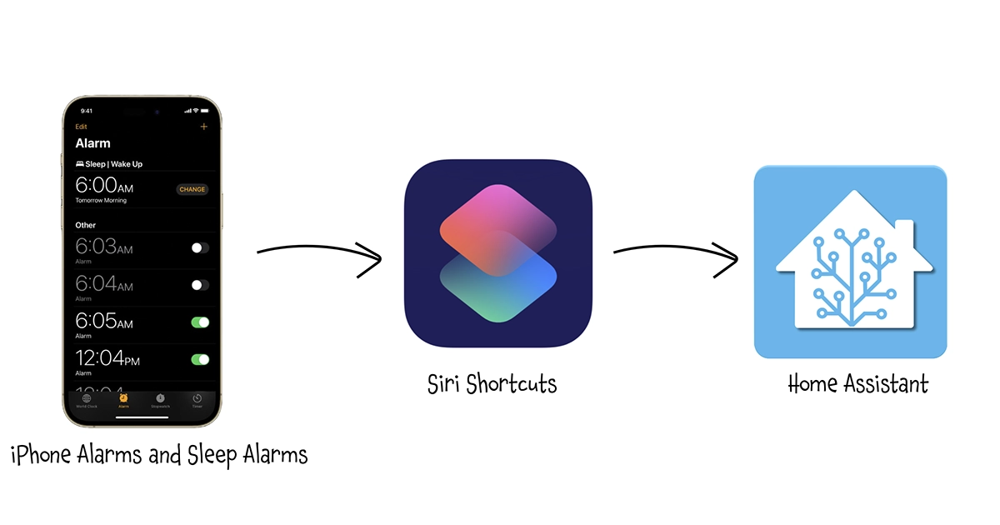
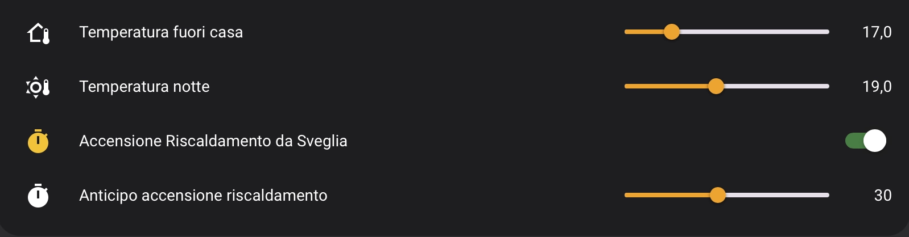

This simple process allows Home Assistant to automatically access the next alarm set on an **iPhone** (both standard alarm and wake-up one), making it available for automations like preheating the house or turning on the water heater in advance.<br/>
It uses only `Siri Shortcuts` and `Home Assistant` with just a bit of `Jinja2`templating.

===

# Expose iOS Alarms to Home Assistant

Many times, it is useful to let our home automation controller know when we are expected to wake up, for example, to turn on the water heater or heating system in advance, ensuring a comfortable environment when we get up. 

If we almost always wake up at the same time, it's simple: we just need to set an `input_datetime` in Home Assistant (or the equivalent in other systems) and use it as a trigger for an automation to run daily at the set time or only on weekdays. But what if our wake-up time varies, such as with shift work or remote working?  

With this workflow, when we go to sleep, our iPhone will automatically communicate the updated alarm time (and its status, of course) to Home Assistant, allowing automations to run at the ideal time for that day. 





<style>
    .scroll-container {
        width: 350px;
        height: 500px;
        overflow-y: scroll; /* Enable vertical scrolling */
        overflow-x: hidden; /* Disable horizontal scrolling */
        margin: auto;
    }

    .scroll-container img {
        width: auto;
        height: auto; /* Image height larger than the container */
    }
     img {
        margin: auto;
    }
</style>

<br/><br/>


# Different Types of Alarms (iOS)
This article covers only iOS alarms since those are the ones I use, but I'm quite sure there is something similar for the Android world as well. 

On iOS, there are three main different types of alarms:

1. **Standard Alarms:**  
   These are the classic alarms you set manually in the Clock app. You pick a time, choose repeat options (daily, weekdays, specific days), and select a sound or vibration pattern. Great for routine wake-ups or reminders!

2. **Bedtime/Wake Up Alarms (Sleep Schedule):**  
   Found under the **Health app** or the **Clock app**, this type is part of the Sleep feature. You can set a consistent sleep and wake-up schedule, track sleep quality, and enable “Wind Down,” which helps you relax before bed by reducing distractions.

3. **Third-Party Alarms:**  
   Apps like **AutoSleep**, **Sleep Cycle** or **Alarmy** offer advanced features, like waking you up during light sleep phases or requiring you to complete tasks to turn off the alarm.

In this trick, I will consider only the first two types, as they are managed directly by iOS. Alarms of the third type are created and handled within specific applications (sometimes, as in the case of AutoSleep, exclusively on the Apple Watch) and — unless explicitly supported — cannot be exported as information.


<br/><br/>

# And if I don't have Home Assistant?
This trick uses **Home Assistant**, as it has been my smart home controller for several years now. And like almost every Home Assistant user, I’ve installed the **Companion App** on my smartphone, so I interface directly with the Companion App via **Siri Shortcuts**. However, if you don’t want to use the Home Assistant Companion App or even if yoou don’t use Home Assistant but other smart home controllers like **Homey** (my favorite after HA), you can use an app like [**easymqtt**](https://www.easymqtt.app) to integrate with Siri Shortcuts and publish **MQTT** directly from your phone, which can be easily mapped as sensors on any home automation controller (including Home Assistant).


<br/><br/>

# Step 1: Configure helpers in Home Assistant
The first step is to configure all the helpers we need in home assistant:

### Alarm switches and time selectors
These are the two switches (`input_boolean`) and two selectors (`input_datetime`) to determine whether the alarms are active or not and to specify the alarm time. For more complete management, I have handled standard alarms (`iphone_moreno_alarm`) separately from wake-up alarms (`iphone_moreno_sleep_alarm`).
These helpers are related to me, as I have defined similar ones for my wife as well.

```yaml
input_boolean:
  iphone_moreno_alarm:
    name: "Sveglia Moreno"
    icon: mdi:alarm
  iphone_moreno_sleep_alarm:
    name: "Sveglia Sonno Moreno"
    icon: mdi:alarm

input_datetime:
  iphone_moreno_alarm:
    name: Sveglia Moreno
    has_time: true
  iphone_moreno_sleep_alarm:
    name: Sveglia Sonno Moreno
    has_time: true
```


### Sensor
This sensor is designed to monitor and return the status of my alarms, by combining values from previously defined helpers:

  - It checks if two specific alarms are enabled or disabled (`input_boolean.iphone_moreno_alarm` and `input_boolean.iphone_moreno_sleep_alarm`).
  - If neither alarm is enabled, the state will be `"spenta"` (it means "off").
  - If at least one alarm is enabled, it checks the set alarm times (`input_datetime.iphone_moreno_alarm` for the first alarm and `input_datetime.iphone_moreno_sleep_alarm` for the second alarm).
  - It sorts and returns the earliest alarm time that is set (or `"spenta"` in case of error)

Here is the sensor definition:

```yaml
template:
  - sensor:
    - name: "Sveglia Moreno"
    state: >-
      
      
      
      

      
        spenta
      
        
        
          {{ times | sort | first }}
        
          spenta
        
      
    attributes:
      Alarm: "{{ states('input_datetime.iphone_moreno_alarm') }}"
      Sleep_Alarm: "{{ states('input_datetime.iphone_moreno_sleep_alarm') }}"
```

<br/><br/>

# Step 2: Configure the Siri Shortcut on the iPhone


## Version 1: Using standard alarms
Clicking the button below the image, you can import the shortcut directly to your iPhone: make sure to then modify the names of the helpers to match those you have used.

Here's a detailed breakdown (sorry for the Italian, but I will explain it step by step):


<div class="scroll-container">
    
</div>
<div style="text-align: center;" markdown="1">
  <a href="https://www.icloud.com/shortcuts/d465a6aa16fb48aa95ee03f29b5a4d8c">
    
  </a>
</div>


1. **Find Active Alarms**:  
   - It searches for all alarms ("Trova Tutto (Sveglie)") on the device.
   - Sorts them by time, with the earliest first.

2. **Iterate Through Alarms**:  
   - The shortcut loops through each found alarm.

3. **Check If Alarm is Enabled**:  
   - If the alarm is active, it proceeds; otherwise, it skips.

4. **Store Enabled Alarms in a List**:  
   - The enabled alarms are added to a list (`Elenco`).

5. **Verify if Any Alarms Exist**:  
   - If the list contains at least one alarm, it proceeds.

6. **Trigger Home Assistant Actions**:  
   - Define a dictionary with the `entity_id` of the `input_boolean.iphone_moreno_alarm`
   - Calls `input_boolean.turn_on`, passing the dictionary as payload to set the alarm as active
   - Extracts the first alarm from the list.  
   - Define a dictionary as the payload for the `input_datetime.set_datetime` service, which is made by the entry `entity_id` (`input_datetime.iphone_moreno_alarm`) and  `time` (the selected alarm time)
   - Sends this alarm time to Home Assistant via `input_datetime.set_datetime` service.

7. **Handle Case with No Alarms**:  
   - If no alarms are found, it sends a command to turn off (`input_boolean.turn_off`) the `input_boolean.iphone_moreno_alarm` in Home Assistant.


## Version 2: Using wake up alarms
Wake Up alarms are exposed by **Health app**, so they are not returned by previous workflow.
For these, we need to slightly modify the workflow. Below is the detailed explanation, but in any case, you can import it by clicking the button below the image.


<div class="scroll-container">
    
</div>
<div style="text-align: center;" markdown="1">
  <a href="https://www.icloud.com/shortcuts/94220d301b5247fba75978815b9f329e">
    
  </a>
</div>

This is shorter and a bit simpler:

1. **Get Wake Up Alarm**:  
   - It toggle twice the next Wake up alarm, in order to restore the original state and at the same time to be able to query the alarm. At the moment, in fact, it is not possible to simply retrieve the time and status of the last alarm without first acting on it.
   - I had to add a delay because I noticed that sometimes it didn’t restore the original state.

2. **Check If Alarm is Enabled**:  
   - If the alarm is active, it proceeds by turning it on also in Home Assistant and sending the time; otherwise, it skips and sends `input_boolean.turn_off` command to Home Assistant for the `input_boolean.iphone_moreno_sleep_alarm`.

3. **Prepare the payload**:
   - The payload for the `input_boolean.turn_on` is the same as before (it changes just the entity_id that now is `input_boolean.iphone_moreno_sleep_alarm`)
   - The payload for the `input_datetime.set_datetime` also is similar, but since the wake up alarm time is expressed in HH:MM, `:00` needs to be added for the seconds component to obtain a valid time format. 

4. **Trigger Home Assistant Actions**:  
   - Same as the prevoius version


<br/><br/>

# Step 3: Automate synchronization
Once the shortcuts are defined, it is now necessary to automate their execution; otherwise, a manual execution would nullify all the work done. Since I use the "Sleep" Focus mode, I update the alarm in Home Assistant when the Focus mode is activated, so I'm quite sure that it has the latest value.
To do this, simply create an automation in the Siri Shortcuts app:


Currently, I use wake-up alarms, so scheduling their synchronization would have been enough… However, for completeness, I created a new shortcut that simply runs the two previous commands, to synchronize both standard and wake-up alarms. This is because (don’t ask me why) automations only allow the execution of a single action... 🤨


<br/><br/>

# Step 4: Use alarms in Home Assistant
How to use this information in Home Assistant depends entirely on your creativity or needs. In the example below, I show my use case: turning on the heating slightly before the alarm time to ensure a comfortable environment. Some might prefer to turn on only the bathroom towel warmer, others the coffee machine, the water heater and so on.

```yaml
- id: set_heater_temperature_before_alarm
  alias: "Set Heater Temperature Before Alarm"
  triggers:
    - trigger: template
      value_template: >-
        
        
        
          {% set sveglia_time = strptime(sveglia, '%H:%M:%S') %}
          {{ now().strftime('%H:%M') == (sveglia_time - timedelta(minutes=anticipo)).strftime('%H:%M') }}
        
          false
        

  condition:
    - condition: state
      entity_id: binary_sensor.notathome
      state: "off"
    - condition: state
      entity_id: input_boolean.anticipo_riscaldamento
      state: "on"
    - condition: state
      entity_id: climate.riscaldamento
      state: "heat"

  actions:
    - action: climate.set_temperature
      target:
        entity_id: climate.riscaldamento
      data:
        temperature: "{{ states('input_number.day_temp') | float }}"

  mode: single
```

The trigger first checks that `sensor.sveglia_moreno` has a valid value (i.e., it is not `spenta` or `unavailable`/`unknown`). If valid, it compares it with the current time minus the advance time set in `input_number.anticipo_riscaldamento`. Execution will occur only if all three of the following conditions are met:  
1. I am at home (`binary_sensor.notathome = off`).  
2. It is winter, or the heating is already on (`climate.riscaldamento = heat`).  
3. The alarm-based heating activation feature is enabled (`input_boolean.anticipo_riscaldamento = on` since I can manually disable it from the dashboard if needed).  

If all conditions are met, it sets the temperature to the predefined daytime value.

Just a couple of notes on why I implemented it this way:  

- All temperatures and switches can be adjusted from the dashboard.  
- In winter, the heating is always set to “heat” and never turns “off.” Instead of working with an "on/off" approach, I chose to manage target temperatures.  
  I’ve set three target temperatures:  
  1. One for nighttime.  
  2. One for when I’m away from home.  
  3. One for when I’m at home, which is the target temperature of the `climate` entity and which the user sets this via the dashboard, smartphone, or voice controls.




In my specific case, considering my lifestyle and the characteristics of my home, I’ve found that maintaining a variable minimum temperature provides an excellent balance between low energy consumption and quick achievement of a comfortable temperature. According to reports from my local energy provider, I consume 30% less compared to similar-sized houses in my area, despite my house having a low energy efficiency rating and my wife loving to stay warm! 🙂

<br/><br/>

# Step 5: Enjoy
Even if I'll try to keep all this pages updated, products change over time, technologies evolve... so some use cases may no longer be necessary, some syntax may change, some technologies or products may no longer be available. Remember to make a backup before modifying configuration files and consult the official documentation if any concept is unclear or unfamiliar. <br/>
*Use this guide under your own responsibility.*<br/>

<div class="myWrapper" style="text-align: center;" markdown="1">
If this trick has been helpful, you can  <br/>

<a href="https://www.buymeacoffee.com/moreno.sirri" target="_blank"></a>
</div>

<br/>
<sub>This work and all the contents of this website are licensed under a **Creative Commons Attribution-NonCommercial-ShareAlike 4.0 International License (CC BY-NC-SA 4.0)**.
You can distribute, remix, adapt, and build upon the material in any medium or format, <u>for noncommercial purposes only by giving credit to the creator</u>. Modified or adapted material must be licensed under identical terms.
You can find the full license terms [here](https://creativecommons.org/licenses/by-nc-sa/4.0/?ref=chooser-v1)</sub>